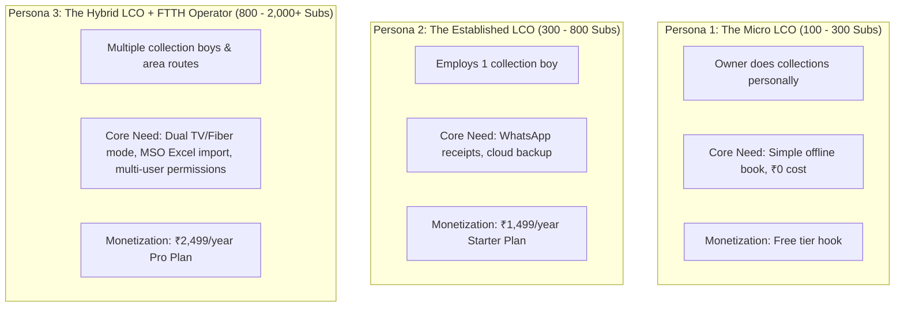

# Customer Research & ICP Synthesis: The Indian Local Operator

*Synthesized using the Corey Haines Customer Research Framework (`customer-research/SKILL.md`).*

---

## 1. Voice of Customer (VOC) & Operational Reality

### The Fundamental Market Truth
The local Indian cable operator (LCO) and small FTTH internet provider **does not live on the internet**. 
* They do not read cold marketing emails (inboxes are dead or unmonitored).
* They do not browse SaaS review platforms (G2, Capterra, Product Hunt, Reddit).
* Their entire business is conducted over **phone calls, WhatsApp chats, and physical doorstep visits**.

### Field Vocabulary & Jargon Dictionary

| Industry Term | English / Literal Meaning | Context & Significance |
| :--- | :--- | :--- |
| **Collection Book / Register** | The collection diary | The thick, tattered notebook carried door-to-door to mark monthly payments with tick marks. |
| **Collection Boy / Line Boy** | Field collection agent | The young field technician who splices cables by day and collects cash door-to-door from the 1st to the 15th. |
| **VC Number / Card Number** | Viewing Card Number | The 10 to 12-digit number assigned to a Set-Top Box (STB). How operators identify subscribers. |
| **Pichla Baqaya (बकाया)** | Previous Dues / Arrears | Money carried forward from previous months when a customer made a partial payment or was out of town. |
| **Parchi / Rasid (पर्ची / रसीद)** | Paper receipt slip | The handwritten slip torn from a carbon-copy receipt book given to the customer upon cash handover. |
| **Hisab Gol Karna (हिसाब गोल करना)** | Skimming cash / Misappropriation | When a line boy takes ₹300 from a customer, writes ₹200 in the book, and pockets ₹100. |
| **Recharge / Portal Renewal** | MSO Wallet Recharge | The monthly payment the LCO makes to Siti/DEN/GTPL to keep their subscriber channels active. |

---

## 2. Jobs to Be Done (JTBD) Framework

```
┌────────────────────────────────────────────────────────────────────────────────────────┐
│                               JOBS TO BE DONE ANALYSIS                                 │
├───────────────────┬────────────────────────────────────────────────────────────────────┤
│ 1. Functional Job │ Reconcile monthly subscriptions street-by-street without losing    │
│                   │ cash, forgetting dues, or spending 4 hours every Sunday night       │
│                   │ cross-referencing messy tick marks in a paper notebook.            │
├───────────────────┼────────────────────────────────────────────────────────────────────┤
│ 2. Emotional Job  │ Freedom from the constant paranoia that line boys are pocketing    │
│                   │ cash or that customers are deceiving them about past payments:     │
│                   │ "Maine toh pichle mahine de diya tha!" ("I paid last month!").     │
├───────────────────┼────────────────────────────────────────────────────────────────────┤
│ 3. Social Job     │ Looking modern, professional, and trustworthy in front of younger  │
│                   │ fiber internet subscribers who expect digital proof over a receipt │
│                   │ scribbled on a piece of paper.                                     │
└───────────────────┴────────────────────────────────────────────────────────────────────┘
```

---

## 3. Trigger Events, Pain Points & Alternatives

### Trigger Events (When Operators Search for an App)
1. **The 1st of the Month Chaos**: The collection cycle starts; sorting through 400 paper pages is overwhelming.
2. **Lost or Damaged Register**: The physical diary is soaked in monsoon rain or lost during a line repair.
3. **Dispute with a Subscriber**: A customer insists they paid last month; without a searchable timestamped ledger, the operator loses money to avoid a fight.
4. **Line Boy Quits**: A collection boy leaves abruptly with the paper register, leaving the owner with no record of who paid what.
5. **Upgrading from Cable TV to Fiber Broadband**: The operator starts selling broadband and finds it impossible to track dual TV+Fiber recharge cycles in a standard single-entry ledger.

### Top Pain Points (Ranked by Intensity)
1. **Cash Reconciliation Bottlenecks (High Intensity)**: Spending late nights matching cash collected by 2–3 line boys against crossed-out scribbles in notebooks.
2. **Untracked Partial Payments (High Intensity)**: Customers paying ₹200 out of ₹350; paper registers fail to clearly show the remaining ₹150 the following month.
3. **Connectivity Drops in the Field (Medium-High Intensity)**: Most modern cloud apps hang or fail to load in narrow alleyways, basement flats, or rural fringes.

### Current Alternatives & Why They Fail

| Alternative | What It Is | Why It Fails for This Operator |
| :--- | :--- | :--- |
| **Paper Collection Diary** | The traditional physical notebook | Cannot be backed up; easy to lose; no search; easily manipulated by line boys; easily ruined by weather. |
| **Generic Khata Apps** *(Khatabook, OkCredit)* | Single-entry credit ledger | Not designed for recurring monthly subscription cycles; cannot handle VC/STB numbers; no area/lane route filters. |
| **Enterprise Cable Software** *(Mobicable, Bix42)* | Full-suite desktop/cloud SaaS | Requires expensive annual upfront commitments; slow or unusable without active 4G/5G; complex training curve. |
| **Desktop Excel** | Spreadsheets on an office PC | Cannot be carried by a collection boy riding a motorbike door-to-door. |

---

## 4. ICP Personas (The Target Spectrum)



### Persona 1: "Ramesh Bhai" – The Micro LCO
* **Profile**: Operates 150 to 250 cable TV connections in a semi-urban colony or large village. Works directly with Siti or GTPL.
* **Daily Routine**: Fixes cable cuts in the morning; visits houses between 5 PM and 8 PM on a motorcycle.
* **Device**: ₹8,000 – ₹12,000 Android smartphone (Realme, Redmi).
* **Software Appetite**: Will not pay initially. Hook him with the **100% Free Forever Tier (up to 100 subs)** and instant offline speed. Once hooked, he upgrades when crossing 100 subscribers or wanting automated backup.

### Persona 2: "Suresh" – The Hybrid Operator (Sweet Spot for 5k Goal)
* **Profile**: 500 connections (350 Cable TV + 150 FTTH Fiber). Employs 1 collection boy.
* **Monthly Revenue**: ₹1,20,000 – ₹1,80,000.
* **Key Frustration**: "My collection boy comes back with ₹14,000 cash and 15 scribbled names on a piece of paper. It takes me 2 hours every night to match it."
* **Willingness to Pay**: ₹1,499/year is an immediate impulse buy. If the app saves him 1 lost subscriber bill per month, it has paid for itself 3x over.

### Persona 3: "Vikram" – The Multi-Area Network Owner
* **Profile**: 1,200 to 2,000 subscribers spread across 4 distinct neighborhoods/wards. Has 2–3 collection boys.
* **Key Frustration**: Staff accountability. Wants collection boys to log payments on the spot without giving them permission to delete subscribers or alter past payment records.
* **Willingness to Pay**: ₹2,499/year (Pro Plan) for multi-staff access and automated monthly reports.
