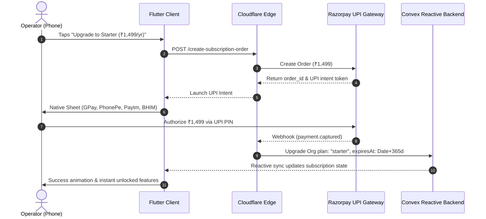

# Pricing Strategy & Financial Modeling: 5,000 Paying Customers

## 1. Pricing Philosophy for Indian Local Operators

### The "Cost of One Lost Bill" Rule
In India, if business software is priced at ₹800–₹1,200/month, small operators immediately reject it as an unnecessary overhead expense. However, if the software is priced at **₹149 to ₹199/month (or ₹1,499/year)**, the psychological calculation inverts:

$$\text{One monthly subscriber fee} \approx ₹300 - ₹500$$
$$\text{Annual software cost} \approx ₹1,499$$

> **The Value Anchor**: If the app prevents an operator or collection boy from missing just **3 to 4 subscriber payments in an entire year**, the software has completely paid for itself. Everything after that is pure recovered profit.

---

## 2. Three-Tier Packaging Structure

```
┌─────────────────────────────────┬─────────────────────────────────┬─────────────────────────────────┐
│           FREE TIER             │          STARTER TIER           │            PRO TIER             │
│       "Micro LCO / Trial"       │         "Apna Operator"         │        "Super Operator"         │
├─────────────────────────────────┼─────────────────────────────────┼─────────────────────────────────┤
│ • ₹0 Forever                    │ • ₹199 / month                  │ • ₹349 / month                  │
│ • Up to 100 Subscribers         │   (or ₹1,499 / year $\approx$ ₹125/mo) │   (or ₹2,499 / year $\approx$ ₹208/mo)│
│ • 100% Offline SQLite Engine    │ • Up to 500 Subscribers         │ • Up to 2,000 Subscribers       │
│ • Single Device                 │ • 1 Collection Boy Login        │ • Unlimited Collection Boys     │
│ • Manual Payment Recording      │ • Automated Cloud Backup        │ • Role Permissions              │
│ • Basic Area Management         │ • 1-Tap WhatsApp Receipts       │   (Prevent line boys deleting)  │
│                                 │ • UPI Payment Links & Due Alerts│ • MSO Bulk Excel/HTML Import    │
│                                 │                                 │ • Monthly P&L & Aging Reports   │
└─────────────────────────────────┴─────────────────────────────────┴─────────────────────────────────┘
```

### Strategic Paywall Triggers (Frictionless In-App Upgrade)
Users are never locked out of their existing data. Instead, they hit organic business growth walls:
1. **The 101st Subscriber**: When adding or importing the 101st connection, a clean bottom sheet opens: *"Aapke 100 free connections poore ho gaye hain. Unlimited access ke liye Starter plan upgrade karein."*
2. **Adding a Line Boy**: When the operator attempts to share access with a field agent on another device.
3. **Automated Cloud Backup**: Prompted after recording 50 successful collections to safeguard against phone loss.

---

## 3. Financial Model to 5,000 Paying Customers

### Target Distribution Mix
* **Total Addressable Market (TAM)**: ~85,000–90,000 active LCOs + ~15,000 local ISPs = ~1,00,000 operators.
* **Target Paying Base**: **5,000 operators** (~5% market share).

### Annual Revenue Projections (INR & USD)

$$\begin{aligned}
\text{Starter Plan (70%):} \quad & 3,500\ \text{operators} \times ₹1,499/\text{yr} = \mathbf{₹52,46,500} \\
\text{Pro Plan (30%):} \quad & 1,500\ \text{operators} \times ₹2,499/\text{yr} = \mathbf{₹37,48,500} \\
\hline
\mathbf{\text{Total Annual Recurring Revenue (ARR):}} \quad & \mathbf{₹89,95,000\ (\sim ₹90\ \text{Lakhs\ INR}\ /\ \sim \$108,000\ \text{USD})}
\end{aligned}$$

*Note*: If 15% of users prefer monthly billing (₹199/mo and ₹349/mo), blended annual revenue rises to **₹98,50,000 – ₹1.05 Crore ARR**.

---

## 4. Cost Structure & Net Margins (Convex + Cloudflare + Flutter)

Because the client application utilizes an **offline-first local SQLite architecture**, cloud server calls are drastically minimized compared to traditional web apps. Server calls only fire during periodic sync flushes and backup snapshots.

### Annual Infrastructure Operating Costs (At 5,000 Active Operators)

```
┌──────────────────────────────────────┬─────────────────────────┬───────────────────────────────┐
│ Expense Category                     │ Monthly Cost (USD)      │ Annual Cost (INR @ ₹83/$)     │
├──────────────────────────────────────┼─────────────────────────┼───────────────────────────────┤
│ Convex Pro Plan (Backend & DB)       │ ~$50 - $80 / mo         │ ~₹50,000 - ₹80,000 / yr       │
│ Cloudflare Workers & KV (Edge Sync)  │ ~$5 / mo                │ ~₹5,000 / yr                  │
│ Razorpay Transaction Fees (2% on UPI)│ Variable (pass-through) │ Deducted at transaction       │
│ Domain, SSL, CDN & Misc Tools        │ ~$15 / mo               │ ~₹15,000 / yr                 │
├──────────────────────────────────────┼─────────────────────────┼───────────────────────────────┤
│ TOTAL OPERATING INFRASTRUCTURE COST  │ ~$70 - $100 / mo        │ ~₹70,000 - ₹1,00,000 / year   │
└──────────────────────────────────────┴─────────────────────────┴───────────────────────────────┘
```

### Net Software Margin

$$\text{Gross Revenue} = ₹89,95,000$$
$$\text{Infrastructure & Payment Gateway Cost} = ₹2,80,000$$
$$\mathbf{\text{Net Software Gross Margin:}} \quad \mathbf{> 96.8\%}$$

---

## 5. Frictionless In-App Payment Flow (Razorpay UPI Intent)

To minimize drop-off, the payment experience must be 1-tap via native Indian UPI apps:


