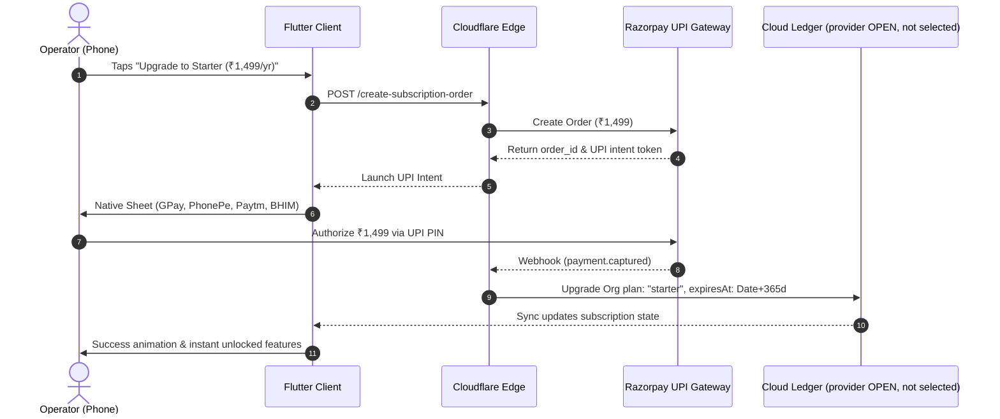

# Pricing Strategy & Financial Modeling: 5,000 Paying Customers

> **Provisional pricing — not an approved public offer.** The direction **retains an
> affordable free entry path**, but the free path's boundary, any subscriber, device, or
> seat limit, and every price and margin figure below are decided with evidence at the
> commercial gate (Gate 13 in
> [`plans/cloud-authoritative-offline-first-saas/plan.md`](plans/cloud-authoritative-offline-first-saas/plan.md)).
> Until that gate closes, **no customer-facing copy may state a tier, a limit, or a
> price**, and no copy may promise "free forever" or unlimited use. A downgrade must still
> leave authorized members able to read and export the records they already have. The
> `findUnsupportedClaims` scanner in `packages/contracts/` and the Play metadata claim
> scanner are the enforcement point.
>
> **Vendor-open / cloud-authoritative pivot notice.** This document's cost model and
> margin are expressed against a **provisional Convex + Cloudflare assumption**. **No
> backend vendor is selected or approved.** The approved product target is an
> offline-capable, **cloud-authoritative, multi-tenant SaaS** in which the cloud ledger is
> the system of record and SQLite becomes a local cache plus a mutation outbox; see
> [`plans/cloud-authoritative-offline-first-saas/plan.md`](plans/cloud-authoritative-offline-first-saas/plan.md)
> (Gate 1 is the vendor decision and is still open).
>
> The **working total (≈ ₹2,80,000/yr) and working margin (> 96.8%)** recorded in §4 below
> are the **single figures shared with `product.md` §7.2** and are used consistently
> across both documents. Both are **provisional** and must be re-derived from the selected
> provider once Gate 1 closes. Nothing in this document is implemented.

## 1. Pricing Philosophy for Indian Local Operators

### The "Cost of One Lost Bill" Rule
In India, if business software is priced at ₹800–₹1,200/month, small operators immediately reject it as an unnecessary overhead expense. However, if the software is priced at **₹149 to ₹199/month (or ₹1,499/year)**, the psychological calculation inverts:

$$\text{One monthly subscriber fee} \approx ₹300 - ₹500$$
$$\text{Annual software cost} \approx ₹1,499$$

> **The Value Anchor**: If the app prevents an operator or collection boy from missing just **3 to 4 subscriber payments in an entire year**, the software has completely paid for itself. Everything after that is pure recovered profit.

---

## 2. Three-Tier Packaging Structure

> **Provisional planning intent — not an approved offer, and not buildable as written.**
> The box below is a sketch retained for the Gate 13 decision. No tier name, price, or
> subscriber limit in it is approved, and none may appear in shipped copy, the listing,
> a receipt, a script, or a paywall surface before that gate closes. Two further limits
> on the sketch:
>
> - **Provider unselected.** Nothing here names a backend or a payment provider, because
>   none is chosen; the payment flow sketch in §5 is the illustrative sketch for that
>   same undecided decision.
> - **Capability rows are not shipped promises.** "Automated Cloud Backup" is a
>   **future** capability. The shipped app has **no cloud backup and no cloud account**,
>   and the privacy page and Play data-safety disclosure describe a local-only app until
>   the matching release ships (§9.1 of the canonical plan). Do not surface a
>   backup entitlement, a backup upsell, or a backup prompt on the strength of this
>   table.

```
┌─────────────────────────────────┬─────────────────────────────────┬─────────────────────────────────┐
│           FREE TIER             │          STARTER TIER           │            PRO TIER             │
│       "Micro LCO / Trial"       │         "Apna Operator"         │        "Super Operator"         │
├─────────────────────────────────┼─────────────────────────────────┼─────────────────────────────────┤
│ • ₹0 Forever                    │ • ₹199 / month                  │ • ₹349 / month                  │
│ • Up to 100 Subscribers         │   (or ₹1,499 / year $\approx$ ₹125/mo) │   (or ₹2,499 / year $\approx$ ₹208/mo)│
│ • 100% Offline SQLite Engine    │ • Up to 500 Subscribers         │ • Up to 2,000 Subscribers       │
│ • Single Device                 │ • 1 Collection Boy Login        │ • Unlimited Collection Boys     │
│ • Manual Payment Recording      │ • Automated Cloud Backup        │ • Role Permissions              │
│ • Basic Area Management         │ • 1-Tap WhatsApp Receipts       │   (Prevent line boys deleting)  │
│                                 │ • UPI Payment Links & Due Alerts│ • MSO Bulk Excel/HTML Import    │
│                                 │                                 │ • Monthly P&L & Aging Reports   │
└─────────────────────────────────┴─────────────────────────────────┴─────────────────────────────────┘
```

### Strategic Paywall Triggers (Frictionless In-App Upgrade)
> **Provisional design sketch, not approved copy, and not the target enforcement model.**
> The trigger copy below names a subscriber cap and a plan, which the commercial gate
> (Gate 13) has not decided and the claim scanners would block today. It is kept to show
> the intended shape; the actual copy, cap, and plan are decided at Gate 13.
>
> Two constraints are not negotiable. First, **the triggers below count state on the
> device**, and the approved target binds entitlements to **server-side plan state**; a
> device-local cap is a transitional placeholder, never the public model. Second, **a
> trigger must never remove access to data the operator already recorded** — a downgrade
> still leaves authorized members able to read and export the records they already
> have. Do not build these triggers before Gate 13; building them needs an explicit,
> separately approved decision.

Users are never locked out of their existing data. Instead, they hit organic business growth walls:
1. **The 101st Subscriber**: When adding or importing the 101st connection, a clean bottom sheet opens: *"Aapke 100 free connections poore ho gaye hain. Unlimited access ke liye Starter plan upgrade karein."*
2. **Adding a Line Boy**: When the operator attempts to share access with a field agent on another device.
3. **Automated Cloud Backup**: Prompted after recording 50 successful collections to safeguard against phone loss.

---

## 3. Financial Model to 5,000 Paying Customers

### Target Distribution Mix
* **Total Addressable Market (TAM)**: ~85,000–90,000 active LCOs + ~15,000 local ISPs = ~1,00,000 operators.
* **Target Paying Base**: **5,000 operators** (~5% market share).

### Annual Revenue Projections (INR & USD)

> **Provisional model, not a forecast.** The mix, prices, and totals below assume the
> undecided §2 tiers. Gate 13 decides the offer from pre-launch evidence; until then no
> figure here may be quoted externally or used as a target.

$$\begin{aligned}
\text{Starter Plan (70%):} \quad & 3,500\ \text{operators} \times ₹1,499/\text{yr} = \mathbf{₹52,46,500} \\
\text{Pro Plan (30%):} \quad & 1,500\ \text{operators} \times ₹2,499/\text{yr} = \mathbf{₹37,48,500} \\
\hline
\mathbf{\text{Total Annual Recurring Revenue (ARR):}} \quad & \mathbf{₹89,95,000\ (\sim ₹90\ \text{Lakhs\ INR}\ /\ \sim \$108,000\ \text{USD})}
\end{aligned}$$

*Note*: If 15% of users prefer monthly billing (₹199/mo and ₹349/mo), blended annual revenue rises to **₹98,50,000 – ₹1.05 Crore ARR**.

---

## 4. Cost Structure & Net Margins (Provisional Vendor Assumption + Cloudflare + Flutter)

> **Provisional.** The ledger backend is not selected. The Convex line below records the
> previously assumed provider only; it is not a selection and not a quote. This is the
> **same working model** used in `product.md` §7.2 (≈ ₹2,80,000/yr total, > 96.8% margin).

Because the client application utilizes an **offline-first local SQLite architecture**, cloud server calls are drastically minimized compared to traditional web apps. Server calls only fire during periodic sync flushes and backup snapshots.

### Annual Infrastructure Operating Costs (At 5,000 Active Operators)

```
┌──────────────────────────────────────┬─────────────────────────┬───────────────────────────────┐
│ Expense Category                     │ Monthly Cost (USD)      │ Annual Cost (INR @ ₹83/$)     │
├──────────────────────────────────────┼─────────────────────────┼───────────────────────────────┤
│ Convex Pro Plan (PROVISIONAL       │ ~$50 - $80 / mo         │ ~₹50,000 - ₹80,000 / yr       │
│ ASSUMPTION, not a selection)      │                         │                               │
│ Cloudflare Workers & KV (Edge Sync)  │ ~$5 / mo                │ ~₹5,000 / yr                  │
│ Razorpay Transaction Fees (2% on UPI)│ Variable (pass-through) │ Deducted at transaction       │
│ (PROVIDER NOT SELECTED)            │                         │                               │
│ Domain, SSL, CDN & Misc Tools        │ ~$15 / mo               │ ~₹15,000 / yr                 │
├──────────────────────────────────────┼─────────────────────────┼───────────────────────────────┤
│ WORKING TOTAL (conservative end)  │ ~$70 - $100 / mo        │ ~₹2,80,000 / yr (working)    │
└──────────────────────────────────────┴─────────────────────────┴───────────────────────────────┘
```

*Note on the totals:* the infrastructure rows above sum to ~₹70,000–₹1,00,000/yr. Adding
the ~₹1,80,000/yr Razorpay pass-through gives a **total infrastructure + payment cost of
~₹2,50,000–₹2,80,000/yr**. The **working figure used for the margin calculation is the
conservative ₹2,80,000/yr**, and that same number appears in `product.md` §7.2. Do not
quote a different total in one document than in the other.

### Net Software Margin (provisional)

$$\text{Gross Revenue} = ₹89,95,000$$
$$\text{Infrastructure & Payment Gateway Cost} = ₹2,80,000$$
$$\mathbf{\text{Net Software Gross Margin:}} \quad \mathbf{> 96.8\%}$$

This margin is **provisional** and vendor-dependent. It must be recomputed against the
provider chosen at Gate 1 of
[`plans/cloud-authoritative-offline-first-saas/plan.md`](plans/cloud-authoritative-offline-first-saas/plan.md).

---

## 5. Frictionless In-App Payment Flow (Razorpay UPI Intent)

> **Provisional sketch, non-normative, with no provider selected.** The flow below uses
> Razorpay as a **working illustration** of a 1-tap UPI checkout. No payment provider has
> been chosen or approved, no price or tier is decided, and this sequence is **not an
> implementation contract**: the ledger participant is explicitly "provider OPEN, not
> selected", and substituting a provider is Gate 1's decision, not this document's.
> Build nothing from it before Gate 13 (commercial binding, in
> [`plans/cloud-authoritative-offline-first-saas/plan.md`](plans/cloud-authoritative-offline-first-saas/plan.md)
> §11) and the cloud stages that precede it. What survives as reusable is the **edge
> gateway and webhook-verification seam**, recorded in
> [`plans/gtm-upi-checkout-edge-pipeline/plan.md`](plans/gtm-upi-checkout-edge-pipeline/plan.md).

To minimize drop-off, the payment experience must be 1-tap via native Indian UPI apps:


```mermaid
sequenceDiagram
    autonumber
    actor Operator as Operator (Phone)
    participant App as Flutter Client
    participant Worker as Cloudflare Edge
    participant Razorpay as Razorpay UPI Gateway
    participant Ledger as Cloud Ledger (provider OPEN, not selected)

    Operator->>App: Taps "Upgrade to Starter (₹1,499/yr)"
    App->>Worker: POST /create-subscription-order
    Worker->>Razorpay: Create Order (₹1,499)
    Razorpay-->>Worker: Return order_id & UPI intent token
    Worker-->>App: Launch UPI Intent
    App->>Operator: Native Sheet (GPay, PhonePe, Paytm, BHIM)
    Operator->>Razorpay: Authorize ₹1,499 via UPI PIN
    Razorpay-->>Worker: Webhook (payment.captured)
    Worker->>Ledger: Upgrade Org plan: "starter", expiresAt: Date+365d
    Ledger-->>App: Sync updates subscription state
    App->>Operator: Success animation & instant unlocked features
```
