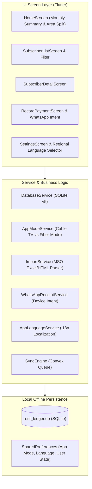
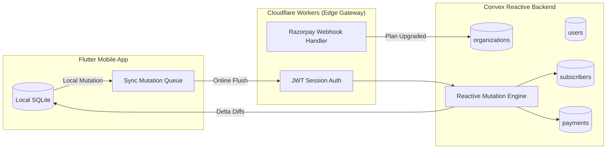

# Product Architecture & Technical Roadmap

## 1. Client-Side Architecture (Flutter & SQLite)

The mobile client is engineered as an **offline-first single-tenant database** that functions continuously regardless of cellular connectivity.



---

## 2. Immediate Client-Side Upgrades

### A. SQLite Database Migration (Version 5)
In the current schema (`lib/services/database_service.dart`), the `subscribers` table does not have a `phone` column. To enable 1-tap WhatsApp receipt delivery, the schema must be updated:

```dart
// Upgrade hook in DatabaseService
if (oldVersion < 5) {
  await db.execute('ALTER TABLE subscribers ADD COLUMN phone TEXT');
  await db.execute('CREATE INDEX idx_subscribers_phone ON subscribers(phone)');
}
```

### B. Zero-Cost WhatsApp Device Intent Engine
Instead of incurring recurring Meta WhatsApp Cloud API costs (₹0.70 – ₹1.20 per template message), the client triggers the native WhatsApp app via platform URI intent:

```dart
import 'package:url_launcher/url_launcher.dart';

class WhatsAppReceiptService {
  static Future<bool> sendReceipt({
    required String phone,
    required String messageText,
  }) async {
    // Clean phone number to 91XXXXXXXXXX
    final cleanPhone = phone.replaceAll(RegExp(r'\D'), '');
    final formattedPhone = cleanPhone.length == 10 ? '91$cleanPhone' : cleanPhone;
    
    final uri = Uri.parse(
      'whatsapp://send?phone=$formattedPhone&text=${Uri.encodeComponent(messageText)}'
    );
    
    if (await canLaunchUrl(uri)) {
      return await launchUrl(uri, mode: LaunchMode.externalApplication);
    } else {
      // Fallback to web link
      final webUri = Uri.parse(
        'https://wa.me/$formattedPhone?text=${Uri.encodeComponent(messageText)}'
      );
      return await launchUrl(webUri, mode: LaunchMode.externalApplication);
    }
  }
}
```

### C. Regional Language Localization (i18n)
Supports the top 5 cable/broadband regional belts: **English (`en`)**, **Hindi (`hi`)**, **Marathi (`mr`)**, **Bengali (`bn`)**, and **Tamil (`ta`)**.
* Managed via `AppLanguageService` backed by `SharedPreferences`.
* Dynamically formats UI labels and WhatsApp receipts in the operator's mother tongue.

---

## 3. Backend Architecture: Convex + TypeScript on Cloudflare



### Convex Schema Blueprint (`convex/schema.ts`)
```typescript
import { defineSchema, defineTable } from "convex/server";
import { v } from "convex/values";

export default defineSchema({
  // Organization / Operator Business Account
  organizations: defineTable({
    name: v.string(),
    ownerPhone: v.string(),
    state: v.string(),
    plan: v.union(v.literal("free"), v.literal("starter"), v.literal("pro")),
    planExpiresAt: v.optional(v.number()),
    maxSubscribers: v.number(),
    upiVpa: v.optional(v.string()),
    createdAt: v.number(),
  }).index("by_phone", ["ownerPhone"]),

  // Staff Members (Admin vs Field Collection Boy)
  users: defineTable({
    orgId: v.id("organizations"),
    name: v.string(),
    phone: v.string(),
    role: v.union(v.literal("admin"), v.literal("collector")),
    isActive: v.boolean(),
  }).index("by_org", ["orgId"]),

  // Areas / Wards / Colonies
  areas: defineTable({
    orgId: v.id("organizations"),
    name: v.string(),
    serverCreatedAt: v.number(),
  }).index("by_org", ["orgId"]),

  // Subscribers
  subscribers: defineTable({
    orgId: v.id("organizations"),
    areaId: v.optional(v.id("areas")),
    localId: v.number(), // maps to local SQLite id
    name: v.string(),
    phone: v.optional(v.string()),
    aliasName: v.optional(v.string()),
    vcNumber: v.optional(v.string()),
    monthlyRent: v.number(),
    previousDue: v.number(),
    serviceType: v.union(v.literal("tv"), v.literal("fiber"), v.literal("both")),
    startYear: v.number(),
    startMonth: v.number(),
    isActive: v.boolean(),
    updatedAt: v.number(),
  })
    .index("by_org", ["orgId"])
    .index("by_org_and_area", ["orgId", "areaId"]),

  // Payments
  payments: defineTable({
    orgId: v.id("organizations"),
    subscriberId: v.id("subscribers"),
    collectedByUserId: v.id("users"),
    year: v.number(),
    month: v.number(),
    amountPaid: v.number(),
    adjustment: v.number(),
    recordedAt: v.number(),
  })
    .index("by_sub", ["subscriberId"])
    .index("by_org_month", ["orgId", "year", "month"]),
});
```

---

## 4. Phased Implementation Roadmap

```
┌─────────────────────────────────┬─────────────────────────────────┬─────────────────────────────────┐
│ PHASE 1: CLIENT POLISH & I18N   │ PHASE 2: CONVEX SYNC & BACKEND  │ PHASE 3: STORE LAUNCH & GTM     │
│ (Immediate / 1–2 Weeks)         │ (Weeks 3–5)                     │ (Weeks 6–8)                     │
├─────────────────────────────────┼─────────────────────────────────┼─────────────────────────────────┤
│ • SQLite v5 migration (`phone`) │ • Initialize Convex TS backend  │ • In-App Paywall (100 sub cap)  │
│ • WhatsApp device intent engine │ • Cloudflare edge worker setup  │ • Razorpay UPI checkout flow    │
│ • Regional language switcher    │ • Offline-to-cloud sync queue   │ • Play Store release & ASO kit  │
│   (EN, HI, MR, BN, TA)          │ • Multi-device staff roles      │ • WhatsApp outbound outreach    │
│ • MSO parser mobile field match │ • Automated cloud backups       │ • Meta Advantage+ ad campaign   │
└─────────────────────────────────┴─────────────────────────────────┴─────────────────────────────────┘
```
