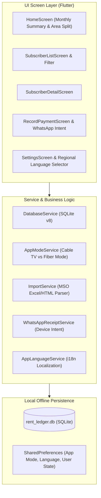

# Product Architecture & Technical Roadmap

> **Status of this document.** Sections 1 and 2 describe the **shipped, current**
> product. Section 3 describes the **approved target architecture, which is not
> implemented**. The staged plan, gates, and unchecked checklist live in
> [`plans/cloud-authoritative-offline-first-saas/plan.md`](plans/cloud-authoritative-offline-first-saas/plan.md).
> Product intent lives in [`../product.md`](../product.md). The overall work order
> (Play launch of the local-only app first, cloud Stage 1 as the first post-launch
> update) is in
> [`plans/play-launch-then-cloud-direction/plan.md`](plans/play-launch-then-cloud-direction/plan.md).

---

## 1. Client-Side Architecture (Flutter & SQLite) — CURRENT, SHIPPED

The mobile client today is an **offline-first, local-authoritative, single-tenant
database** that functions continuously regardless of cellular connectivity. **The device
is the system of record**: there is no account, no cloud ledger, no sync, no roles, and
no server-side authorization. In the target architecture (§3) this same layer gains a
durable outbox and a sync engine, and stops being authoritative.


```mermaid
flowchart TD
    subgraph UI_Layer["UI Screen Layer (Flutter)"]
        A["HomeScreen (Monthly Summary & Area Split)"]
        B["SubscriberListScreen & Filter"]
        C["SubscriberDetailScreen"]
        D["RecordPaymentScreen & WhatsApp Intent"]
        E["SettingsScreen & Regional Language Selector"]
    end

    subgraph Service_Layer["Service & Business Logic"]
        F["DatabaseService (SQLite v8)"]
        G["AppModeService (Cable TV vs Fiber Mode)"]
        H["ImportService (MSO Excel/HTML Parser)"]
        I["WhatsAppReceiptService (Device Intent)"]
        J["AppLanguageService (i18n Localization)"]
    end

    subgraph Storage_Layer["Local Offline Persistence"]
        L[("rent_ledger.db (SQLite)")]
        M["SharedPreferences (App Mode, Language, User State)"]
    end

    UI_Layer --> Service_Layer
    Service_Layer --> Storage_Layer
```

---

## 2. Client-Side Capabilities Already Shipped

*The items in this section are historical records of shipped client work. They are kept
for traceability, not as pending upgrades. The schema is now at version 8; the v5
`phone` migration shown below is part of `applyUpgrade` in `lib/services/database_service.dart`.*

### A. SQLite Database Migration (Version 5 step; the schema is now at v8)
In the v4-era schema (`lib/services/database_service.dart`), the `subscribers` table did not have a `phone` column. To enable 1-tap WhatsApp receipt delivery, the schema was updated:

```dart
// Upgrade hook in DatabaseService
if (oldVersion < 5) {
  await db.execute('ALTER TABLE subscribers ADD COLUMN phone TEXT');
  await db.execute('CREATE INDEX idx_subscribers_phone ON subscribers(phone)');
}
```

### B. Zero-Cost WhatsApp Device Intent Engine
Instead of incurring recurring Meta WhatsApp Cloud API costs (₹0.70 – ₹1.20 per template message), the client triggers the native WhatsApp app via platform URI intent:

```dart
import 'package:url_launcher/url_launcher.dart';

class WhatsAppReceiptService {
  static Future<bool> sendReceipt({
    required String phone,
    required String messageText,
  }) async {
    // Clean phone number to 91XXXXXXXXXX
    final cleanPhone = phone.replaceAll(RegExp(r'\D'), '');
    final formattedPhone = cleanPhone.length == 10 ? '91$cleanPhone' : cleanPhone;
    
    final uri = Uri.parse(
      'whatsapp://send?phone=$formattedPhone&text=${Uri.encodeComponent(messageText)}'
    );
    
    if (await canLaunchUrl(uri)) {
      return await launchUrl(uri, mode: LaunchMode.externalApplication);
    } else {
      // Fallback to web link
      final webUri = Uri.parse(
        'https://wa.me/$formattedPhone?text=${Uri.encodeComponent(messageText)}'
      );
      return await launchUrl(webUri, mode: LaunchMode.externalApplication);
    }
  }
}
```

### C. Regional Language Localization (i18n)
Supports the top 5 cable/broadband regional belts: **English (`en`)**, **Hindi (`hi`)**, **Marathi (`mr`)**, **Bengali (`bn`)**, and **Tamil (`ta`)**.
* Managed via `AppLanguageService` backed by `SharedPreferences`.
* Dynamically formats UI labels and WhatsApp receipts in the operator's mother tongue.

---

## 3. Target Backend Architecture (Cloud-Authoritative) — NOT IMPLEMENTED

**Nothing in this section exists today.** The only deployed backend is
`services/cbk-edge`, an edge slice for landing, privacy, referral, asset links, and
telemetry intake. It is **not** a ledger backend.

The approved target is an **offline-capable, cloud-authoritative, multi-tenant SaaS**:
the cloud ledger is the system of record, and the device keeps a **local cache plus a
durable mutation outbox**. Offline operation is preserved — a field collector with no
signal records payments instantly, and the cloud becomes canonical after reconciliation.
This section is **vendor-neutral**; the backend provider is an **open decision gate**
(plan Gate 1) and no provider may be assumed.

```mermaid
flowchart LR
    subgraph Mobile["Flutter Client (offline-capable)"]
        Cache[("SQLite: local cache")]
        Outbox[("Durable mutation outbox")]
        Engine["Sync & conflict engine"]
        Cache --> Engine
        Outbox --> Engine
    end

    subgraph Edge["Edge Gateway (existing services/cbk-edge seam)"]
        Auth["Session verification"]
        Webhook["Payment webhook handler"]
    end

    subgraph Cloud["Cloud Ledger (provider OPEN)"]
        Org[("organizations & memberships")]
        Data[("subscribers, areas, collections")]
        Ledger[("Revisions, tombstones, audit log)"]
    end

    Engine -->|Authenticated HTTPS push| Auth
    Engine -->|Delta pull since cursor| Auth
    Auth --> Data
    Webhook -->|Plan state| Org
    Data --> Ledger
    Ledger -->|Acknowledged revision| Engine
    Engine -->|Reconcile into| Cache
```

### 3.1 Authority Boundary

| Concern | Device (target) | Cloud (system of record) |
| :--- | :--- | :--- |
| Offline payment entry | Authors an intent and queues it | Aware only after acknowledgement |
| Committed history | Cached for speed and availability | Authoritative |
| Balance and due figures | Derived locally, labeled unsynced while the outbox is non-empty | Authoritative once reconciled |
| Identity, roles, entitlements | Cached last-known grants with an explicit expiry | Authoritative; a device cannot grant itself a role |
| Delete a payment | Recorded as a tombstone/reversal intent | Final state; history preserved |
| Restore from a `.db` file | Replaces the cache only; blocked while unsynced entries exist | Unaffected; the cache refills from the cloud |

### 3.2 Required Identity, Tenancy, and Authorization

- **Organizations are the tenant root.** Every record is organization-scoped.
- **Memberships carry a role**: Owner, Manager, Collector. A user is not an organization.
- **Authorization is server-side on every request.** The client is a usability layer; a
  role allowed to write is not automatically allowed to read all history, and export,
  import, and audit access are checked separately.
- **Tenant scoping fails closed.** Cross-tenant access, including guessed and replayed
  ids, is a security defect with negative test coverage.
- Offline capability comes from cached, server-granted entitlements** with an explicit
  expiry, never from a client-side entitlement decision. How long a revoked role keeps
  working offline — and what a revoked device's **local cache** and unsynced outbox may
  still reach — is an **open decision** (plan §13) and a launch security review item
  (plan §8.1.1).
- Authentication does not exist in the app today and is a launch-scope requirement.
- The operator data-export guarantee is **scoped to authorized Owners and Managers**. It
  is not a promise of persistent access to a revoked member.

### 3.3 Required Sync Contract

- Mutations are written to a **durable outbox in the same transaction** as the
  operator's action, and are retired only on an **explicit server acknowledgement**
  carrying the accepted revision.
- **At-least-once delivery with idempotent application**: each mutation carries a stable
  `mutation_id` idempotency key, so retries and process death mid-flush can never
  duplicate or lose a payment.
- **Bounded delta pull** from a persisted cursor, including tombstones, with a full
  rehydration path for a long-offline device.
- **Conflicts touching money are surfaced, never silently merged.** Two devices
  recording the same subscriber-month preserve both entries for operator reconciliation.
  Automatic merging is allowed only for documented low-risk non-financial fields.
- **Permanent rejection is a first-class outcome.** An unfixable mutation moves to a
  **quarantine** state: retained durably, surfaced through **persistent actionable
  operator UI** with a reason and a resolution action, and declared in exports. It is
  **never silently dropped and never retried without bound**.
- **Destructive local actions are blocked while the outbox is non-empty.** Local reset,
  `.db` export/share, and restore are blocked or require an explicit data-loss
  acknowledgement whenever unsynced or quarantined entries exist.
- **Billing period is server-derived.** The server validates or derives the authoritative
  billing period in the **organization's configured IANA timezone, default
  `Asia/Kolkata`**. A device's clock and local timezone are operator-facing context and
  never move a month boundary.
- **Device loss before the first successful sync is an accepted residual risk.** The
  offline window is a real data-loss window and the product must not claim otherwise.
  Cloud backup is not a remedy for it, because there is nothing to back up yet.
- The server assigns authoritative ordering; device clocks are operator-facing context.

### 3.4 Required Financial Audit Rules

- Money is **integer minor units** (or a fixed-precision decimal) with one documented
  rounding rule. SQLite `REAL` and Dart `double` are **migration blockers**.
- Financial history is **append-only**. A correction is a reversing entry plus a new
  entry; the current in-place `insertOrUpdatePayment` overwrite and hard
  `deletePayment` are **migration blockers**.
- Every row carries `org_id`, `created_at`, `updated_at`, a per-entity `revision`, and a
  lifecycle state. The current schema carries creation time only
  (`subscribers.created_at`, `payments.recorded_at`) — the absent `updated_at`, absent
  revision, and absent tombstones are **migration blockers**.
- Identity is **globally stable**; the local `INTEGER PRIMARY KEY AUTOINCREMENT` row id
  is device-local only and is **never** a cloud key.
- Every server-side mutation writes an **append-only audit record** with actor, role,
  organization, entity, prior/new revision, authoritative timestamp, correlation id, and
  result.
- Server and device totals must reconcile **exactly** after sync, with no
  floating-point drift.
- **Cloud backup is backend disaster recovery and account recovery, not a substitute for
  synchronization.** Point-in-time recovery, a tested restore drill, and a written
  RPO/RTO are launch requirements.

### 3.5 Required Local-Cache Security

Decided during the launch security review, alongside the backend vendor decision. **No
library is chosen here.** Full detail is in the plan §8.1.1.

- **Session tokens in platform secure storage** (Android Keystore-backed), never in plain
  `SharedPreferences` and never inside the SQLite database. If secure storage is
  unavailable, fail safe rather than downgrade silently.
- **Cache encryption at rest** is settled through an explicit threat model — a shared or
  stolen field phone is realistic for this market — and the rationale is recorded either
  way, including the case for not encrypting.
- **Sensitive recents and app lock**: whether cached names, phone numbers, and amounts
  are masked until the app is unlocked, and what the recents/overview card may show.
- **Secure export policy**: default scope, default format, whether a passphrase is
  offered, and an explicit statement of where the shared file ends up. An export must
  declare pending and quarantined mutations.
- **Revoked device cache**: what a revoked collector's device retains, and whether the
  server can require a wipe. An open decision (plan §13) that must be settled before
  launch.

### 3.6 Superseded: the Convex Draft

An earlier revision of this document specified a Convex TypeScript backend whose
`subscribers` table carried a `localId: v.number()` mapping to the local SQLite row id.
That draft is **superseded and was never built**:

1. **The vendor is not selected.** Backend choice is an explicit open gate. No provider,
   including Convex, D1, or any Cloudflare persistence product, may be assumed, and none
   is approved here.
2. **`localId` as a cloud key is unsound.** A device-local autoincrement id collides and
   diverges when two offline devices create the same record. The cloud must own
   globally stable identity.
3. **Its money and versioning model was incomplete** — no fixed scale, no per-entity
   revision, no tombstone, and no append-only financial history.

The historical schema text is not reproduced here; it remains only in git history.

---

## 4. Phased Implementation Roadmap

The authoritative roadmap, its gates, and the **entirely unchecked** checklist are in
[`plans/cloud-authoritative-offline-first-saas/plan.md`](plans/cloud-authoritative-offline-first-saas/plan.md).
The table below is the **canonical rollout sequence** and uses the same stage numbers
and the same states as that plan and as `product.md` §9. **Stage 0 is the only stage
recorded as complete, and it is documentation only. Every stage from 1 onward is
unstarted.**

| Stage | Scope | State |
| :--- | :--- | :--- |
| 0 — Documentation pivot | Record the target, remove the current-vs-target contradiction | **Complete (documentation only)** |
| 1 — Local data foundations (vendor-neutral) | Minor-unit money, global ids, `updated_at`/revision/tombstone, durable outbox. **Backend-free** | Not started — **explicitly allowed to begin before the vendor decision** |
| 2 — Read-only cloud projection | Authenticated one-way read into the local cache | Blocked on Gate 1 (vendor) |
| 3 — Identity, tenancy, and RBAC | Sign-in, organizations, owner/manager/collector memberships, server-side authorization, isolation tests | Blocked on Gate 1 (vendor) |
| 4 — Authenticated sync, single device | Outbox push, delta pull, idempotency, resume, conflict and permanent-rejection surfacing, billing-period attribution | Blocked on Gate 1 (vendor) |
| 5 — Multi-device and multi-user | Additional devices, collector operation, revocation, revoked-device cache treatment | Not started |
| 6 — Migration of existing ledgers | Claim a device ledger into an organization with a reconciliation report | Not started |
| 7 — Cloud authority enforced | Device state is unambiguously a cache; unsynced and quarantined indicators; server-authoritative reports and exports | Not started |
| 8 — Commercial, compliance, and launch | Server-side entitlements, checkout, privacy/data-safety copy, local-cache security review, DR drill, legal sign-off | Not started |

**The backend vendor decision (Gate 1) is still open.** It blocks **provider-dependent
work only** — Stages 2, 3, and 4, the server-side schema, the sync transport, and audit
storage. It does **not** block Stage 1 local foundations, the conflict/sync state
machines behind a test double, or the cross-tenant test suites written against a
contract. Client-side work under the existing GTM plans (WhatsApp receipts, i18n, MSO
import, clear-due helper, Play release) continues unchanged and is not gated by this
roadmap.

**Sequencing relative to the Play launch.** The current local-only app launches on
Google Play first, Stage 1 ships as the first post-launch update, and Gate 1 runs in
parallel. See
[`plans/play-launch-then-cloud-direction/plan.md`](plans/play-launch-then-cloud-direction/plan.md).
