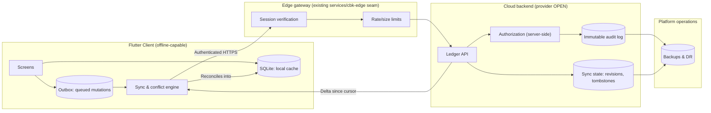

# Plan: Cloud-Authoritative, Offline-First Multi-Tenant SaaS

**Status:** Approved as the target product direction; **not implemented**. No part of
this plan is in the shipped application. Every checklist item below is unchecked, and
no vendor, provider, or backend has been selected.

**Sequencing:** Per the overall direction in
[`../play-launch-then-cloud-direction/plan.md`](../play-launch-then-cloud-direction/plan.md),
the current local-only app launches on Google Play first, and Stage 1 of this plan ships
as the first post-launch update. Gate 1 runs in parallel.

**Supersedes the target-state claims in:** `product.md` §4/§6/§9 and
`docs/05-product-architecture-and-roadmap.md` §3/§4, which described a
`Convex` + Cloudflare cloud ledger as though it existed.

---

## 1. Overview & Objective

Collection Book's target product is an **offline-capable, cloud-authoritative,
multi-tenant SaaS**.

- The **cloud ledger is the system of record**. After reconciliation, cloud state is
  canonical for an organization.
- The **Flutter SQLite database becomes a local cache plus a mutation outbox** for
  offline field work, not a second ledger of equal standing.
- **Offline operation is preserved and is a hard requirement.** A field collector on a
  2G link or with no signal must be able to record payments instantly. Writes may be
  accepted locally and queued; the cloud becomes canonical once reconciliation
  succeeds.

The objective of this document is to make the target architecture, its invariants, the
migration blockers it creates, and its launch gates explicit and reviewable **before**
any backend work starts.

### 1.1 Non-Goals

- Selecting or committing to a backend vendor, database, or hosting provider.
- Implementing any part of the cloud backend, sync engine, or identity stack in this
  plan.
- Changing shipped user-facing copy (landing page, privacy policy, Play Store
  metadata) to imply the cloud already exists. The shipped app is local-only and its
  copy must stay truthful until cloud code is merged and deployed.
- Replacing the existing local-first product. The current app remains the product until
  the staged rollout in §9 is complete.
- Remote lockout or destruction of operator data. The data-export guarantee below is scoped to **authorized members of the organization**; it is not a promise to a revoked member. A revoked device's cached-data treatment is an **open decision** (§13) and must be addressed before launch.

### 1.2 Operator Data Access Guarantee (scoped)

Operators retain full read and export access to their data, subject to role
authorization enforced server-side. Concretely, in the target state:

- An **authorized Owner or Manager** retains full read and export of their
  organization's data, including after plan downgrade or account recovery.
- A **Collector** never holds a standing export entitlement; if a collector's role is
  revoked, the server must stop authorizing their export, but the **device's local
  cache is a separate problem** — what happens to a revoked collector's already-cached
  and not-yet-synced data on that device is **not yet decided** and is recorded as an
  open decision (§13) and a launch security review item (§8.1.1).
- Nothing in this plan grants a revoked member persistent access to organization data.

---

## 2. Current-State Evidence (as shipped today)

The following is factual about the repository at the time of writing and is the
baseline the target must migrate from.

| Area | Current state | Source |
| :--- | :--- | :--- |
| Storage | Local SQLite only, `DatabaseService` singleton, `databaseVersion = 8` | `lib/services/database_service.dart` |
| Authority | Local device **is** the ledger. No cloud write path exists | no sync service in `lib/services/` |
| Identity | No accounts, no login, no session, no per-user attribution of a payment | — |
| Tenancy | Single tenant, implicit. No `org`/`tenant` column on any of the ledger tables (`areas`, `subscribers`, `payments`; this list is not an exhaustive inventory of the v8 schema, which also carries import-run and analytics tables) | `subscribers`, `areas`, `payments` DDL |
| Money | `monthly_rent`, `previous_due`, `amount_paid`, `adjustment` are SQLite `REAL`; Dart models expose money as `double` | `lib/services/database_service.dart` |
| Identifiers | `INTEGER PRIMARY KEY AUTOINCREMENT` on `areas`, `subscribers`, `payments`. Locally allocated, device-scoped, and reused after reinstall/reset | same |
| Row versioning | Creation time only: `subscribers.created_at` and `payments.recorded_at`. No `updated_at` on any table, no revision counter, no tombstones | same |
| Deletion | `deletePayment` hard-deletes a payment row; subscriber/area removal is not represented as a tombstone | `lib/services/database_service.dart` |
| Editability | `insertOrUpdatePayment` overwrites a month in place, so a corrected amount leaves no history | same |
| Backup | `BackupService` writes a timestamped `.db` dump and shares it via the OS share sheet. `restoreFromFile` copies back a picked file; it performs **no schema-version check, no integrity check, and no content validation** | `lib/services/backup_service.dart` |
| Reset | `AppResetService` drops the local database; a reset erases the only copy of the ledger | `lib/services/app_reset_service.dart` |
| Analytics | `analytics_events` local buffer flushed to the edge telemetry route; pseudonymous, no ledger data | `lib/services/analytics_service.dart` |
| Backend | Only `services/cbk-edge` (landing, privacy, referral, asset links, telemetry intake). No ledger, auth, or persistence | `services/cbk-edge/` |

### 2.1 Migration Blockers

Each of these is a hard blocker for a cloud-authoritative ledger, not a cleanup item:

1. **Money stored as `REAL` / `double`.** Binary floating point cannot be reconciled
   across devices or summed for audit without drift. Monetary values must move to
   integer minor units (paise) or a fixed-precision decimal type, on the server and
   in the local cache, with a documented rounding rule per operation.
2. **Local autoincrement IDs.** An autoincrement row id is device-allocated and can
   collide or diverge between two devices that create the same subscriber offline. The
   cloud must own globally stable identity; see §5.1.
3. **Hard deletes.** A hard-deleted payment is unrecoverable and cannot be replicated as
   a state transition. Financial records must be reversed or tombstoned, never erased.
4. **No `updated_at`, no revision, no tombstone.** Without a version, an offline device
   cannot detect that a record changed underneath it, and a last-writer-wins merge
   would silently lose a collection. See §5.3 and §5.5.
5. **Unsafe restore.** A restored local `.db` can be an arbitrary old, hand-edited, or
   corrupt file, and the current restore path performs **no schema-version check, no
   integrity check, and no content validation**. In a cloud-authoritative model, restore
   is a local-cache repopulation, not a ledger overwrite, and must be explicitly
   re-validated against the server.
6. **No authentication and no server-side authorization.** There is no identity, no
   session, no role, and no tenant boundary anywhere in the current stack. Every
   permission decision is currently implicit in whoever holds the unlocked phone.

---

## 3. Target Architecture

Vendor-neutral. The components below are *responsibilities*; no product has been chosen
for any of them, and none may be treated as selected until §11 Gate 1 closes.

### 3.1 Authority Boundary

| Concern | Local (device) | Cloud (system of record) |
| :--- | :--- | :--- |
| Payment entry while offline | **Authoring** of an intent | Not yet aware |
| Queued mutation | Holds it until acknowledged | Applies and versions it on arrival |
| Read of committed history | Cached copy for speed/availability | Authoritative |
| Balance / due figures | Derived locally, must be labeled as unsynced while mutations are pending | Authoritative once reconciled |
| Subscriber master data | Cached | Authoritative; last accepted cloud revision wins |
| Identity, roles, entitlements | Cached for offline use, refreshed on sync | Authoritative; a device cannot grant itself a role |
| Deletion | Recorded as a tombstone intent | Final state; history preserved |
| Restore from a `.db` file | Replaces the **cache**, not the ledger | Unaffected; cache is refilled from the cloud |

A device may refuse to display a value it has not reconciled, but it must never present
a locally invented value as a settled, cloud-confirmed financial fact. Unsynced state
requires a visible, persistent indicator.

---

## 4. Domain & Data Model Requirements

These are capability requirements. The storage engine, schema dialect, and provider are
open.

1. **Organization (tenant) as the root of all data.** Every record carries a tenant
   scope. Tenant scoping is enforced server-side on read and write, and is never
   derived from a client-supplied value alone.
2. **Users and memberships.** A person may belong to one or more organizations with a
   distinct role per membership. A user is not an organization.
3. **Globally stable identifiers.** Every syncable entity needs a client-generatable,
   globally unique, collision-resistant id (for example a UUIDv7 or an equivalent) plus
   the local autoincrement id retained only as a device-local convenience. See §11
   Gate 2 for the id decision.
4. **Money as minor units.** All monetary columns are integer paise or a fixed-precision
   decimal, with an explicit scale and a single documented rounding policy. No `REAL`
   and no `double` for money in the ledger path.
5. **Every row carries:** `id`, `org_id`, `created_at`, `updated_at`, a monotonically
   increasing per-entity `revision`, and a lifecycle state (`active` / `tombstoned`).
6. **Time, and billing-period attribution.** The client sends a device timestamp for
   operator context, but the server assigns and owns the authoritative ordering
   timestamp. Ordering must not depend on device clock correctness.
   - A collection entry is attributed to a **billing period** (`year` + `month` in the
     current model). The client may propose a period, but the **server validates or
     derives the authoritative period** and rejects or corrects a device-supplied one.
   - Period boundaries are resolved in the **organization's configured IANA timezone**,
     which **defaults to `Asia/Kolkata`** unless the organization configures another.
     A device's local timezone never moves a month boundary.
   - A device whose clock is wrong can therefore mis-*label* a collection in the moment,
     but it cannot mis-attribute it to the wrong billing period after reconciliation.
   - Any timezone change for an organization is itself an audited change and must state
     how it affects in-flight and already-closed periods.
7. **Append-only financial history.** A monthly collection slot is modeled as a series
   of entries rather than a single mutable row, so a correction is a new reversing or
   superseding entry. The current `UNIQUE(subscriber_id, year, month)` single-row
   constraint is a client-side convenience, not a ledger guarantee.
8. **Service-mode separation is preserved.** Cable TV (`tv`) and fiber (`fiber`)
   separation must survive in the cloud model, in price periods, in imports, filters,
   and reporting.
9. **Area/route and collector attribution.** Area is an organization-scoped entity, and
   a collection entry records which membership collected it.
10. **Import history is durable.** Import runs must be recorded server-side so a failed
    or partially-applied MSO import is auditable and resumable.

---

## 5. Sync Contract Requirements

### 5.1 Identity & Creation

- A device may create a record offline. It assigns a globally stable client id.
- The server treats a client id as an *idempotency key* for creation, so a replayed or
  retried create for the same id never produces a duplicate subscriber, area, or payment.
- The server may reject a client-assigned id collision with an explicit, retryable error
  rather than silently overwriting the incumbent record.

### 5.2 Envelope

Every queued mutation carries, at minimum:

| Field | Purpose |
| :--- | :--- |
| `mutation_id` | Globally unique, stable across retries; the idempotency key |
| `entity_type`, `entity_id` | Target record |
| `operation` | `create` / `update` / `reverse` / `tombstone` |
| `base_revision` | The revision the client believes it was editing |
| `payload` | The full field set for the operation |
| `client_timestamp` | Operator-facing device time, non-authoritative |
| `actor_device_id` | Stable per-installation device identifier |

### 5.3 Required Semantics

1. **At-least-once delivery, idempotent application.** Retries are mandatory on poor
   networks; duplicates must be impossible.
2. **Bounded, resumable push.** The client flushes the outbox in batches, persists a
   resume cursor, and survives process death mid-flush.
3. **Delta pull.** The client pulls changes since a persisted cursor, using a
   server-issued cursor or opaque version token. Pull results include tombstones so
   deletions propagate.
4. **Explicit acknowledgement.** The server returns the accepted `revision` per
   mutation; the outbox entry is only retired on that acknowledgement. No optimistic
   "assume it worked" behavior.
5. **Durable outbox.** The outbox is persisted in the same local database as the cache
   and is written in the same transaction as the user's action. A write is never
   acknowledged to the operator before the outbox row is durable.
6. **Backpressure and bound.** A device that has been offline for a long time must hit a
   bounded, resumable, chunked sync, not a single unbounded request.
7. **Permanent rejection is a first-class outcome.** Some rejections are not transient
   and will never succeed on retry. The contract must distinguish them explicitly:
   - A **transient** failure retries with backoff and keeps the outbox entry.
   - A **permanent** rejection (invalid payload, closed billing period, revoked role,
     unknown or already-tombstoned parent, a rejected mutation after a conflict, or a
     quarantine threshold breach) moves the entry to a **quarantine** state.
   - A quarantined entry is **never silently dropped** and **never retried forever**.
     Retrying an unfixable mutation without bound is its own data-integrity bug.
   - Quarantined entries are **durably retained** and surfaced through **persistent,
     actionable operator UI** (a visible sync-problem indicator plus a per-entry reason
     and a resolution action such as *fix and resend*, *reassign to another period*, or
     *record as a manual exception*). A rejection must never disappear behind a green
     "synced" state.
   - Quarantined entries are reported to the server for operator/owner visibility, and
     an export must declare them rather than omit them.
8. **Destructive local actions are blocked while the outbox is non-empty.** The following
   must be **blocked, or require an explicit, clearly-stated data-loss acknowledgement**,
   whenever unsynced outbox entries exist for the organization:
   - **Local database reset** (`AppResetService`): blocked while any outbox entry is
     pending or quarantined. This is the highest-risk action, because today a reset
     deletes the only copy of the ledger.
   - **Local export / share of the `.db`** (§8.1.1): must declare pending and quarantined
     entries, and must not present a partially-synced file as a complete backup.
   - **Restore from a `.db` file**: blocked while unsynced entries exist, because
     restoring would silently discard the outbox with the cache.
   - Uninstalling is outside app control, but the app must warn the operator about
     unsynced work before any such flow, and recovery guidance must assume it can happen.

### 5.4 Device Loss Before First Sync — Recorded Residual Risk

A device can collect payments offline and then be lost, stolen, factory-reset, or
uninstalled **before its outbox ever reaches the server**. That data exists only in the
local database, and once the device is gone it is gone.

- This is **accepted as a residual risk in the target state, not solved by it.** Sync
  reduces the window; it does not close it.
- The honest statement is that the offline window is a real data-loss window, and the
  product must not claim otherwise. Cloud backup does not help here — there is nothing
  to back up yet — which is precisely why cloud backup is not a substitute for
  synchronization.
- Required mitigations to evaluate: prominent unsynced-count indicators, a
  first-sync prompt that encourages reconnecting after a field round, and a defined
  "never-synced device" recovery story that does not promise recovery it cannot
  deliver.
- Residual-risk treatment, the operator-facing wording, and any recovery aid are
  **open decisions** (§13).
- It is also a **launch test case** (§10): record offline, lose the device before first
  sync, and confirm the product reports the loss honestly rather than implying the cash
  was saved.

### 5.5 Conflict Policy (must be decided, not defaulted silently)

| Case | Required behavior |
| :--- | :--- |
| Two devices edit the same subscriber field | Detect via `base_revision`; surface a conflict to the operator; never silently discard a financial edit |
| Two devices record a payment for the same subscriber/month | Preserve **both** as separate entries; require explicit operator reconciliation, not automatic overwrite |
| Offline device edits a field that changed on the server | Queue as conflicted; do not auto-resolve by last-writer-wins |
| A device that is far behind syncs | Server returns a bounded backlog; the client can request a full cache rehydration rather than a giant delta |
| A mutation is permanently rejected | Quarantine the entry, keep it durably, show persistent actionable operator UI, and declare it in exports; never silently drop and never retry without bound (§5.3) |
| Two devices record in different periods for the same subscriber | Server derives the authoritative billing period in the organization timezone, default `Asia/Kolkata`; the device's local month boundary does not decide it (§4.6) |

Financial conflicts must never be resolved automatically in a way that changes a
settled amount. Automatic merge is permitted only for non-financial, low-risk fields
and only when the merge rule is documented and tested.

---

## 6. Identity, RBAC, and Tenant Isolation

### 6.1 Roles

| Role | Capabilities |
| :--- | :--- |
| **Owner** | Full organization control: members, roles, billing, data export, destructive operations, recovery |
| **Manager** | Operational control: subscribers, areas, imports, collections, reports; may manage collectors; may not change ownership, billing, or delete the organization |
| **Collector** | Record and view collections for assigned areas/routes; no subscriber master-data edits, no imports, no member management, no exports of financial history |

- Role checks are **server-side on every request**. The client is a usability layer,
  never the enforcement point.
- Every authorization decision is evaluated against the authenticated membership, not
  against a client-supplied role claim.
- A device that is offline must be able to keep collecting. Offline capability therefore
  comes from **last-known, server-granted entitlements cached on the device**, with an
  explicit expiry. The client can render a capability it was granted; it cannot grant
  itself one.
- Privilege reduction (for example an owner removing a collector) must be able to
  invalidate a cached capability at the next sync, and the plan must state what a
  revoked device can still do while offline. That residual-risk question — including
  what happens to the revoked device's **local cache** and to any of its unsynced
  outbox entries — is an open decision (§13) and a launch security review item (§8.1.1).

### 6.2 Tenant Isolation

- Every query is scoped by `org_id` derived from the authenticated session.
- Cross-tenant access is a security defect, not a UX error: it must fail closed and be
  covered by negative tests.
- Authorization must be verified for reads, writes, exports, imports, and audit access
  separately; a role allowed to write is not automatically allowed to read all history.

### 6.3 Authentication

- Passwordless-first (phone OTP) is the expected shape for this market, but the
  mechanism is an open decision (§13).
- Session lifetime, refresh, device revocation, and recovery must be defined before
  implementation. A lost phone must not be a route to permanent org takeover.
- Authentication is a launch-scope requirement. There is currently no authentication of
  any kind in the app.

---

## 7. Financial Integrity & Audit Rules

1. **Append-only.** Collection entries, reversals, and adjustments are appended. Nothing
   that has ever contributed to a reported financial figure is hard-deleted.
2. **Corrections are explicit.** A correction is a reversing entry plus a new entry,
   each attributed to an actor, timestamped, and reasoned. The 12-month matrix and
   dashboards must continue to render correctly across reversals.
3. **No `REAL` money.** Integer minor units or fixed-precision decimal, with a single
   documented rounding rule applied identically on client and server.
4. **Exact, order-independent reconciliation.** After sync, the sum of a subscriber's
   entries on any device must equal the server total exactly, with no floating-point
   drift.
5. **Immutable audit log.** Every server-side mutation records actor membership, role,
   organization, entity, prior and new revision, authoritative timestamp, request
   correlation id, and result. The audit log is append-only and is not operator-editable
   in-product.
6. **Exports are consistent.** A data export is produced from a server-consistent
   snapshot, not from a partially synced local cache.
7. **Attribution.** Who collected the cash is part of the financial record, which is the
   product's core anti-theft value. `collected_by` must be server-assigned from the
   authenticated membership, not client-declared.
8. **Trial/report honesty.** While mutations are unsynced, financial reports state that
   they include unconfirmed local entries.

---

## 8. Security, Privacy, and Disaster Recovery

### 8.1 Security

- Transport: TLS everywhere, with certificate validation; no cleartext fallback.
- Secrets never ship in the client binary; no vendor API keys or admin credentials in
  `android/` assets, `assets/`, or source control.
- Secrets and signing material remain in ignored local files, per existing repository
  rules.
- Encryption in transit and at rest is a provider-selection input, not an afterthought.
- The `services/cbk-edge` security-header policy, bounded error bodies, and method
  handling continue to apply to any new edge routes.
- Rate limiting and payload size bounds on the sync API are required, because an
  offline queue is a natural amplification vector.
- Abuse and fraud review: an org cannot read another org's data by guessing ids, and
  collector accounts cannot be silently mass-created or escalated.

### 8.1.1 Local Cache Security (device-side; part of the launch security review)

The device holds a full copy of ledger data and a session credential. This is a first-order
security surface, not an implementation detail. These are **decisions to be made and
reviewed**, not library picks — no library is chosen by this plan.

| Concern | Requirement |
| :--- | :--- |
| **Session credential storage** | Tokens must be held in **platform secure storage** (Android Keystore-backed storage), not in plain `SharedPreferences` and not inside the SQLite database. If secure storage is unavailable on a device, the app must fail safe rather than downgrade silently. |
| **Cache encryption** | Decide, via an explicit **threat model**, whether the local cache is encrypted at rest and under what threat (device theft, malicious app with root/backup access, shared device). A shared/lost field phone is a realistic threat for this market. The decision and its rationale must be recorded, including the case for *not* encrypting. |
| **Sensitive recents & app lock** | Decide whether cached subscriber names, phone numbers, and amounts are masked until the app is unlocked (biometric/PIN app lock), and whether recent-subscriber shortcuts are shown on a locked screen or in the recents/overview card. |
| **Outbox contents** | The outbox carries full financial payloads and must get the same protection as the cache. |
| **Secure export policy** | Exports leave the app through the OS share sheet into other apps. Define a policy: default scope (organization-wide vs. a range), default format, whether a passphrase is offered for an export, and an explicit statement of where the file ends up. An export must declare pending and quarantined mutations (§5.3). |
| **Revoked device cache** | What a revoked collector's device retains locally, and whether the server can require a wipe, is an **open decision** (§13). It must be settled before launch, not discovered during it. |
| **Logging** | The sync engine must not log payloads, tokens, subscriber names, phone numbers, or amounts. |

All of the above are **launch security review items**, resolved together with the backend
vendor decision rather than as an afterthought bolted onto it.

### 8.2 Privacy & Compliance

- **The shipped privacy policy stays accurate for the shipped app.** Adding a cloud
  ledger changes what is stored, where, and why, and the `/privacy` page, the Play
  Store data-safety disclosure, and any in-app messaging must be updated **as part of
  the implementation**, reviewed, and only then shipped. This plan does not change that
  copy now.
- The local analytics queue's zero-PII boundary (`services/cbk-edge` telemetry) remains
  separate from ledger data. Ledger data is not analytics data and must never be emitted
  to the telemetry route.
- Consent, retention, and deletion requests must be answerable per organization.
- The immutable audit log is a legal-record retention concern and needs an explicit
  retention decision (§13).
- No IP addresses, user agents, subscriber data, or operator data may be logged by the
  backend beyond what a documented, minimized audit record requires.

### 8.3 Backups & DR

- **Cloud backup is backend disaster recovery and account recovery. It is not a
  substitute for synchronization.** A backup that is not reconciled with live state
  does not make a device's data safe, and sync is what makes a *second device* correct.
- Point-in-time recoverable backups, tested restores, and a written RPO/RTO are
  required before launch.
- Restore drills are a launch gate (§11 Gate 10), not an assumption.
- Account recovery (a lost phone plus a lost org admin) is a separate design problem
  from database restore and must be covered.

---

## 9. Migration & Staged Rollout

The existing local-only product is not thrown away. It becomes the offline client.
Stages 0–8 below are the **canonical rollout sequence** and are mirrored, with the same
numbers and the same states, in `product.md` §9 and
`docs/05-product-architecture-and-roadmap.md` §4.

| Stage | Name | State | Exit condition |
| :--- | :--- | :--- | :--- |
| 0 | **Documentation pivot** | **Complete (documentation only)** | This plan, `product.md`, and the architecture doc agree on current vs. target. Shipped copy unchanged. |
| 1 | **Local data foundations (vendor-neutral)** | Not started | Money moves to minor units with rounding tests; global ids, `updated_at`, `revision`, and tombstones exist **locally**; a durable outbox table exists and is written in the same transaction as user actions. **Backend-free and explicitly allowed to start before Gate 1.** |
| 2 | **Read-only cloud projection** | Blocked on Gate 1 (vendor) | One-way, authenticated read of cloud state into the local cache. Writes stay local-only and are clearly labeled. |
| 3 | **Identity, tenancy, and RBAC** | Blocked on Gate 1 (vendor) | Sign-in, organizations, owner/manager/collector memberships, server-side authorization, and the cross-tenant negative test suite. |
| 4 | **Authenticated sync, single device** | Blocked on Gate 1 (vendor) | Outbox push, delta pull, idempotency, cursor resume, conflict and permanent-rejection surfacing, billing-period attribution. One device per organization first, so the conflict surface area is minimal. |
| 5 | **Multi-device and multi-user** | Not started | Additional devices, collector role in daily operation, role management, revocation, and revoked-device cache treatment. |
| 6 | **Migration of existing local ledgers** | Not started | Onboarding flow that claims an existing local database into an organization without losing or double-counting money, with a verified reconciliation report. |
| 7 | **Ledger cloud authority enforced** | Not started | Local device state is unambiguously a cache: unsynced indicators, server-authoritative reports, append-only financial history, export from a server-consistent snapshot. |
| 8 | **Commercial, compliance, and launch** | Not started | Entitlements bound to server-side plan state, checkout, GST scope per the existing future-only plan, privacy and data-safety updates shipped, launch security review closed. |

Rollout rules:

- **Stage 1 is vendor-neutral and may begin before the vendor decision closes.** It
  changes no cloud dependency and no user-visible behavior, and getting the data model
  right before committing ledger semantics to a provider is the point. Gates 3, 4, and 5
  in §11 are the local counterparts of Stage 1.
- No stage may ship while a later stage's correctness depends on an unbuilt guarantee.
- Each stage needs its own plan under `docs/plans/<name>/plan.md`. This document
  authorizes direction, not the stage implementations.
- Existing users on a local-only ledger keep a working local-only path until Stage 6
  exists; no forced migration without an explicit, tested import path.
- **Stage 1 is pinned as the first update after the Google Play launch**
  ([`../play-launch-then-cloud-direction/plan.md`](../play-launch-then-cloud-direction/plan.md)).
  The Play installs created before it are the legacy ledgers Stage 1 must migrate
  locally and Stage 6 must later claim, so Stage 6 must handle ledgers from both the
  launched schema and the post-Stage-1 schema.
- Rollback: every stage must have a documented way to return a device to a working
  local-only state without data loss.

---

## 10. Test Strategy

| Layer | Requirement |
| :--- | :--- |
| Unit | Rounding and minor-unit arithmetic; revision/conflict state machine; outbox ordering and retry; id generation and idempotency-key parsing; serialization round-trips |
| Deterministic sync | A local test double implementing the sync contract: duplicate delivery, out-of-order delivery, mid-flush process death, partial batch failure, cursor resume, full rehydration after long offline |
| Permanent rejection | A permanently rejected mutation is quarantined, never dropped, never retried forever, and is visible with a reason and a resolution action; a green "synced" state is impossible while a quarantine exists |
| Destructive-action blocking | Local reset, export/share, and restore are blocked (or require an explicit data-loss acknowledgement) while unsynced or quarantined outbox entries exist |
| Device loss before first sync | Record offline, then lose the device before any successful sync; confirm the app reports the loss honestly and never implies the unsynced cash was saved (§5.4) |
| Billing period | Same instant attributed correctly from a device in a non-IST timezone; a device with a wrong clock still lands in the server-derived period; a `Asia/Kolkata` default and a configured-timezone organization both verified |
| Conflict | Concurrent edits of the same subscriber; two collectors on the same month; both preserved and surfaced, never silently merged |
| Multi-tenancy | Negative tests: every read/write/export/import path rejects a cross-tenant id, including guessed and replayed ids |
| RBAC | Per-role per-endpoint matrix, asserted on the server, including revoked roles |
| Audit | Append-only guarantee; reversals attributed; no actor can edit or delete an audit record |
| Financial | Exact sum equality between server and device after sync; no drift over long histories; export equals reported totals |
| Offline UX | Field journey: record with the radio off, close the app, reopen, sync later, verify totals |
| Local cache security | Secure token storage is used and not bypassable via `SharedPreferences`; the app-lock/recents decision is implemented as specified; an export declares pending and quarantined entries and applies the secure export policy |
| Flutter | `dart format`, `flutter analyze`, `flutter test`, and the Patrol compile gate; new user-visible behavior gets Patrol journey coverage in `patrol_test/` |
| TypeScript | `bun run format:check`, `bun run typecheck`, `bun test`, `bun run build:worker` for anything added under `packages/` or `services/` |
| DR | Backup restore drill and a documented RPO/RTO result |

Native file pickers, installed-WhatsApp handling, and real-device App Link behavior stay
explicit opt-in/manual scenarios unless a deterministic fixture and device contract
exist, per existing repository testing guidance.

---

## 11. Phased Checklist (all unchecked)

- [ ] **Gate 1 — Backend vendor decision.** Evaluate candidates against hard
      requirements: integer money, per-entity revision/tombstone support, transaction
      isolation, row-level or equivalent tenant scoping, point-in-time restore,
      India-region data residency, sub-₹15,000/month projected cost at 5,000 operators,
      Bun/TypeScript SDK viability, and a reversible exit. Record the decision and its
      rationale.
      **Scope of the block:** Gate 1 blocks **provider-dependent work only** — Stages
      2, 3, and 4, the server-side ledger schema, the sync transport, and the audit-log
      storage. It **does not block** the vendor-neutral local work in Gates 2, 3, 4, and
      5 (rollout **Stage 1**), the conflict/sync state machines behind a test double, the
      cross-tenant test suites written against a contract, or any decision work. Do not
      wait on the vendor to start work that is provider-independent.
- [ ] **Gate 2 — Global id strategy.** Choose the client-generatable id format and
      document collision and clock-skew behavior. *(Vendor-neutral; may start now.)*
- [ ] **Gate 3 — Money representation.** Land minor-unit money locally with rounding
      tests and a migration of existing `REAL` values, including how already-collected
      cash is preserved exactly. *(Vendor-neutral; may start now.)*
- [ ] **Gate 4 — Local sync foundations.** Durable outbox, revisions, tombstones, and
      `updated_at` in the local schema, written in the same transaction as user actions.
      *(Vendor-neutral; may start now.)*
- [ ] **Gate 5 — Append-only financial history.** Replace in-place payment overwrite
      with reversing/superseding entries; verify dashboards and the 12-month matrix.
      *(Vendor-neutral; may start now.)*
- [ ] **Gate 6 — Identity.** Authentication mechanism, session model, device
      revocation, and recovery.
- [ ] **Gate 7 — Organizations, roles, tenant isolation.** Server-enforced RBAC plus
      the cross-tenant negative test suite.
- [ ] **Gate 8 — Sync service.** Push/pull contract, idempotency, cursor resume,
      bounded backpressure, conflict surfacing.
- [ ] **Gate 9 — Audit log.** Append-only audit records, retention decision, and
      operator-visible audit views where justified.
- [ ] **Gate 10 — Backups and DR.** PITR configured, restore drill executed, RPO/RTO
      written down.
- [ ] **Gate 11 — Privacy, compliance, and local-cache security review.** Updated
      `/privacy`, Play data-safety disclosure, consent/retention/deletion handling, the
      §8.1.1 local-cache security decisions (secure token storage, cache-encryption
      threat model, app lock and recents, secure export policy, revoked-device cache
      treatment), and Indian legal review.
- [ ] **Gate 12 — Migration and rollout.** Claim-an-existing-ledger flow with a verified
      reconciliation report, staged rollout, and per-stage rollback.
- [ ] **Gate 13 — Commercial binding.** Entitlements bound to server-side plan state;
      reconcile with `docs/plans/gtm-freemium-paywall-licensing/` and
      `docs/plans/gtm-upi-checkout-edge-pipeline/`.
- [ ] **Gate 14 — Launch gate.** Every gate above closed with evidence; sync proven
      offline-first under a real network outage; DR drill green; legal sign-off.

### Explicit Launch Gates

The product must not be marketed, listed, or described as a cloud/sync/multi-user
product until **all** of the following hold:

1. Gate 1 through Gate 13 are closed with recorded evidence. (Gates 2–5 are vendor-neutral
   and are not waiting on Gate 1.)
2. Sync is proven under a real offline/online cycle on a real device, including
   process death mid-flush and a long-offline backlog.
3. Financial totals reconcile exactly between server and device, and billing-period
   attribution is proven correct across a device with a wrong clock and a non-IST device
   timezone.
4. Cross-tenant negative tests pass.
5. Backup restore drill succeeds within the written RPO/RTO.
6. Privacy, data-safety, local-cache security, and legal review are complete and shipped.
7. Permanent rejection, quarantine, and blocked reset/export/restore while unsynced are
   proven on a real device, including the device-loss-before-first-sync case (§5.4).
8. Customer-facing copy is updated **in the same release** that makes the capability
   true. Copy must never lead the implementation.

---

## 12. Dependencies

Existing plans that this plan interacts with, and what they now depend on **from** it:

| Plan | Relationship |
| :--- | :--- |
| `docs/plans/play-launch-then-cloud-direction/` | Overall direction. Sets the Play launch of the local-only app ahead of this plan and pins Stage 1 as the first post-launch update. |
| `docs/plans/gtm-freemium-paywall-licensing/` | Its offline Ed25519 license token and local 100-subscriber cap assume device-local authority. Entitlement enforcement must move to server-side plan state once Gate 13 closes. |
| `docs/plans/gtm-upi-checkout-edge-pipeline/` | Its Convex plan mutation depends on Gate 1. The edge webhook seam is reusable; the ledger backend is not yet decided. |
| `docs/plans/india-gst-billing-and-invoicing/` | Already records that money is `REAL`/`double` and that payment rows are editable. Both become launch-relevant under Gate 3 and Gate 5. |
| `docs/plans/gtm-acquisition-telemetry-funnel/` | Stays a pseudonymous, no-ledger-data channel. Must keep that boundary when the ledger backend lands. |
| `docs/plans/monorepo-cbk-edge/` and `docs/plans/cbk-vps-landing-launch/` | Provide the existing edge and landing surface. They are not the ledger backend, and their shipped copy must stay truthful to a local-only app. |
| `docs/04-pricing-and-5k-customer-economics.md` | Its cost model and margin are expressed against a **provisional Convex + Cloudflare assumption**. It shares the working total and margin used in `product.md` §7.2 and must be re-derived once Gate 1 closes. |
| `AGENTS.md` | Repository rules are unchanged. This plan does not authorize implicit architecture expansion; Gate 1 is the explicit decision point for provider-dependent work. |

---

## 13. Open Decisions

| # | Decision | Why it is open |
| :--- | :--- | :--- |
| 1 | **Backend vendor** | Explicitly undecided. No provider may be assumed. See Gate 1. Stage 1 local work may proceed regardless. |
| 2 | Id format and clock-skew tolerance | Affects id generation, ordering, and tests |
| 3 | Exact conflict-resolution policy per field class | Needs product input on how much operator mediation is acceptable |
| 4 | Authentication mechanism (phone OTP vs. alternatives) and abuse controls | Cost, deliverability, SIM-swap risk |
| 5 | Offline capability expiry for revoked roles, and what a revoked device's local cache and unsynced outbox may still reach | A security/usability trade-off that must be decided explicitly, alongside whether the server can require a wipe (§8.1.1) |
| 6 | Audit-log retention and operator access to audit records | Legal and privacy scope |
| 7 | Whether the local `.db` export stays a supported, promised artifact in the target | Currently promised in the privacy policy and non-functional requirements; interacts with the secure export policy (§8.1.1) |
| 8 | Data residency and India-region requirements | Constrains vendor shortlist |
| 9 | Plan/entitlement behavior while a device is offline past expiry | Commercial policy |
| 10 | Whether GST scope becomes launch-critical or stays a later plan | Interacts with `india-gst-billing-and-invoicing` |
| 11 | Rollout population and per-stage feature flags | Depends on operational capacity, not architecture |
| 12 | **Device loss before first sync**: how the product communicates the loss window, whether any recovery aid is offered, and what wording avoids over-promising | Accepted residual risk, not solvable by sync (§5.4) |
| 13 | **Billing-period timezone**: confirm the `Asia/Kolkata` default, whether organizations may configure another, and how a timezone change affects open and closed periods | Affects financial correctness for multi-timezone organizations (§4.6) |
| 14 | **Local cache encryption**: encrypt at rest or not, under which threat model, with the rationale recorded either way | Security/usability trade-off, plus key-management cost on low-end devices (§8.1.1) |
| 15 | **App lock and sensitive recents**: whether cached names, numbers, and amounts are masked until unlock, and what the recents/overview card may show | Usability for a fast field tool vs. exposure on a shared or stolen phone (§8.1.1) |
| 16 | **Secure export policy**: default scope, default format, and whether a passphrase is offered for an export | Data leaves the app through the OS share sheet into other apps (§8.1.1) |

---

## 14. What This Plan Does Not Claim

- It does not claim any part of the cloud ledger, sync, identity, tenancy, RBAC, audit,
  local-cache security, or DR is implemented. None of it is.
- It does not select a backend vendor.
- It does not claim the offline window is risk-free. Device loss before first sync is an
  accepted residual risk (§5.4).
- It does not change shipped landing, privacy, or Play Store copy.
- It does not mark any checkbox in any other plan complete.
