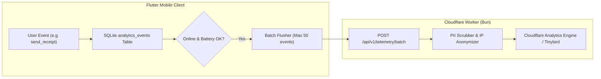

# Plan: Acquisition & Product Funnel Telemetry

## 1. Overview & Objective
Optimizing customer acquisition cost (CAC) and conversion rates requires precise visibility into the operator journey:
$$\text{Ad / Referral Click} \longrightarrow \text{Install} \longrightarrow \text{Add / Import 1st Subscriber} \longrightarrow \text{Send 1st WhatsApp Receipt} \longrightarrow \text{Reach 100 Cap} \longrightarrow \text{Upgrade to Starter}$$

However, traditional web analytics SDKs (Mixpanel, Segment, Google Analytics) fail in offline environments, slow down app startup, and risk leaking customer PII.

This plan details the technical architecture for:
1. **Offline SQLite Event Queue**: Buffering telemetry logs locally with zero impact on UI render performance.
2. **Cloudflare Edge Beacon (Bun Runtime)**: Low-overhead batch ingest endpoint that receives event payloads when the phone regains internet connectivity.
3. **Strict Data Minimization & Privacy**: Enforcing zero customer PII transmission (only anonymous hashed operator IDs, device model, and event names).

---

## 2. Requirements & Scope

### In Scope
- **Local Event Buffer Table**: SQLite table `analytics_events` inside `rent_ledger.db`.
- **Event Taxonomy**: 8 key funnel milestone events (see `event-taxonomy.md`).
- **Cloudflare Edge Ingestion Worker**: `POST /api/v1/telemetry/batch` accepting gzip-compressed JSON event batches.
- **Battery & Bandwidth Throttling**: Sync flushes occur only when connected to unmetered network or after a significant user milestone (e.g. paywall view).

### Out of Scope
- Session screen recording or heatmaps (unnecessary overhead on entry-level Android devices).

---

## 3. Architecture & Technical Design



### 3.1 SQLite Schema for Local Event Queue
```sql
CREATE TABLE analytics_events (
  id INTEGER PRIMARY KEY AUTOINCREMENT,
  event_name TEXT NOT NULL,
  properties_json TEXT NOT NULL,
  timestamp INTEGER NOT NULL,
  synced INTEGER NOT NULL DEFAULT 0
);
CREATE INDEX idx_events_synced ON analytics_events(synced);
```

---

## 4. Implementation Checklist

- [ ] **Phase 1: Local Event Queue**
  - [ ] Add `analytics_events` table in SQLite schema migration.
  - [ ] Create `lib/services/analytics_service.dart`.
  - [ ] Implement non-blocking fire-and-forget event logger.

- [ ] **Phase 2: Event Instrumentation Across Screens**
  - [ ] Instrument `first_app_open` in `lib/main.dart`.
  - [ ] Instrument `mso_import_success` in `lib/services/import_service.dart`.
  - [ ] Instrument `whatsapp_receipt_dispatched` in `lib/services/whatsapp_receipt_service.dart`.
  - [ ] Instrument `paywall_impression` and `upi_checkout_initiated` in paywall modal.

- [ ] **Phase 3: Background Flush Engine**
  - [ ] Implement periodic batch flusher checking network state via `connectivity_plus`.
  - [ ] Implement Cloudflare edge ingest route `/api/v1/telemetry/batch`.

---

## 5. Verification Plan

### Automated Tests
- Unit test: SQLite event insertion does not block the database or UI thread.
- Unit test: Event batch flusher marks synced rows and removes events older than 30 days.

### Manual Verification
- Perform actions in airplane mode; verify events accumulate in `analytics_events`.
- Reconnect WiFi; verify batch flushes and HTTP 200 returned from edge endpoint.
