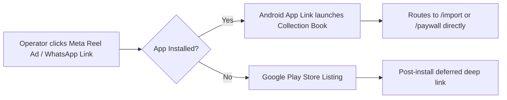

# Plan: Android Release Packaging, App Links & ASO Pipeline

## 1. Overview & Objective
In Tier 2/3/4 India, mobile data bandwidth is precious and phone storage is constrained (predominantly 32GB–64GB budget Android devices). High APK download sizes (> 30MB) result in up to $40\%$ drop-off before app installation completes.

This plan details the technical engineering for:
1. **Download Weight Optimization**: R8 code shrinking, resource stripping, and ABI splitting keeping the Google Play download size **$< 15\text{MB}$**.
2. **Android App Links & Deep Linking**: Direct routing from ad clicks and YouTube descriptions into specific onboarding flows (e.g. MSO file picker or add subscriber).
3. **Automated Multi-Language ASO Pipeline**: Generating localized Play Store listings and screenshots across English, Hindi, Marathi, Bengali, and Tamil.

---

## 2. Requirements & Scope

### In Scope
- **Android Gradle Tuning**:
  - `minifyEnabled true`, `shrinkResources true`.
  - ProGuard rules tailored for Flutter, SQLite (`sqflite`), and URL launcher.
  - Target SDK 35, Min SDK 21 (covering 99.4% of active Android devices in India).
- **Deep Linking Engine**:
  - Local Flutter routing is implemented. `lib/services/app_link_router.dart` accepts only the exact canonical HTTPS origin and exact `/import` or `/r/{code}` paths, and `lib/main.dart` resolves both the cold full-URI launch and the warm path route through `onGenerateRoute` without migrating to `Router` or adding a dependency.
  - Route intents:
    - `https://cbk.sarbaa.com/import`: Opens the MSO import wizard on Android. On any other client, or while Android domain verification is still incomplete, the Worker's `GET /import` serves the same cacheable, header-protected landing page as `GET /`, so the public link is never a JSON 404. The Worker is implemented locally but not deployed, so `https://cbk.sarbaa.com/import` does not resolve in production yet.
    - `https://cbk.sarbaa.com/r/{code}`: Opens Home for a code matching `[A-Z0-9]{6}`. The code is not stored, logged, or attributed.
  - Digital Asset Links at `https://cbk.sarbaa.com/.well-known/assetlinks.json` and referral capture/attribution remain pending: the Worker is not deployed, the production signing fingerprint is unknown, and no verified domain association exists yet.
- **ASO Automation (Bun CLI)**:
  - The `packages/play-store-metadata` package compiles the multi-language titles, short descriptions, and full descriptions into Play-ready text files. Copy requires native-language editorial review before upload.

### Out of Scope
- iOS App Store packaging (deliberately deferred; $< 1\%$ of Indian cable technicians use iOS).

---

## 3. Architecture & Technical Design

### 3.1 Gradle Build Configuration (`android/app/build.gradle.kts`)

The checked-in Kotlin DSL keeps Flutter's configured SDK/version defaults,
enables release optimization explicitly, and assigns the release signing
configuration only when the ignored production properties are available. The
separate `verifyReleaseSigning` task still fails every release build when those
real properties or the keystore are missing; it never falls back to the debug
key.

```kotlin
android {
    defaultConfig {
        applicationId = "com.sarbaa.cbk"
        minSdk = flutter.minSdkVersion
        targetSdk = flutter.targetSdkVersion
        versionCode = flutter.versionCode
        versionName = flutter.versionName
    }

    buildTypes {
        release {
            isMinifyEnabled = true
            isShrinkResources = true
            proguardFiles(
                getDefaultProguardFile("proguard-android-optimize.txt"),
                project.file("proguard-rules.pro"),
            )

            if (keystorePropertiesFile.exists()) {
                signingConfig = signingConfigs.getByName("release")
            }
        }
    }
}
```

### 3.2 Deep Linking Flow (`assetlinks.json`)



---

## 4. Implementation Checklist

- [ ] **Phase 1: Gradle & ProGuard Optimization**
  - [x] Add and document `android/app/proguard-rules.pro`. It intentionally has no broad Flutter, `sqflite_android`, or `url_launcher_android` keep rules; add only a narrow rule if an actual signed release failure proves one is required.
  - [x] Enable R8 minification and resource shrinking and attach the optimized default rules plus the project rules in `android/app/build.gradle.kts`.
  - [x] Add and pass the deterministic `:app:verifyReleaseOptimization` Gradle verification.
  - [ ] Build a production-signed release AAB and verify its size is $< 15\text{MB}$. This remains pending because `android/key.properties` and the real signing key are unavailable; no release artifact or size claim has been produced.

- [ ] **Phase 2: Android App Links Configuration**
  - [x] Keep the `https://cbk.sarbaa.com/r/` `intent-filter` with `android:autoVerify="true"` and add a separate exact `android:path="/import"` filter, plus explicit `flutter_deeplinking_enabled` activity metadata, in `android/app/src/main/AndroidManifest.xml`.
  - [ ] Generate the real SHA-256 fingerprint from the production release keystore.
  - [x] Implement the `cbk.sarbaa.com` asset-links response for package `com.sarbaa.cbk` in the Worker.
  - [ ] Deploy the Worker, configure the matching real fingerprint, and verify both `/.well-known/assetlinks.json` and `GET /import` on the production domain. No deployment or DNS change has been made, so `https://cbk.sarbaa.com/import` does not resolve yet.
  - [x] Implement strict Flutter navigation for `com.sarbaa.cbk` in `lib/main.dart`: `/import` opens `ImportWizardScreen`, a valid `/r/{code}` route opens `HomeScreen` under a sanitized `RouteSettings(name: '/')`, and a rejected link that still looks like an App Link (`AppLinkRouter.isPotentialAppLink`) falls back to the same sanitized Home. Every other unknown route name returns `null` from `onGenerateRoute`, so a mistyped internal `pushNamed` keeps Flutter's normal "Could not find a generator for route" failure instead of being masked. Existing internal routes and argument validation are unchanged.
  - [x] Keep referral capture and attribution out of scope. The parser returns only a destination kind and never retains, logs, or emits the code, and the fallback routes are built with a sanitized route name so the code is not retained in `RouteSettings` either.
  - [x] Serve a bounded, cache-aware `GET /import` fallback in the Worker that returns the same security-header-protected landing page as `GET /`, with non-GET methods still returning 405 and no referral cookie or log. Implemented and covered by `services/cbk-edge/test/handler.test.ts`; production deployment is still pending.
  - [ ] Capture external referral codes and attribute installs later once that product decision, privacy review, and a deployed asset-links association exist.

### Known residual navigation behavior

Repeated warm App Link intents are not de-duplicated. A route factory can only
push, so a second warm `/import` stacks a second `ImportWizardScreen`, and a
warm referral or malformed App Link pushes Home **above** the current route, so
Android Back pops that duplicate Home and re-reveals the previously visible
screen. Collapsing these duplicates would require a `NavigatorObserver` or
Router-level redesign, which is deliberately deferred until an actual operator
complaint justifies the navigation risk.

- [ ] **Phase 3: Automated ASO Pipeline**
  - [x] Write metadata definitions across 5 languages (see `play-store-metadata.md`). The canonical copy lives in `packages/play-store-metadata/src/metadata.ts` and covers `en-IN`, `hi-IN`, `mr-IN`, `bn-IN`, and `ta-IN` with a title (max 30 code points), short description (max 80), and truthful full description (max 4000). Claims were re-derived from the app source: no nonexistent package field, Cable TV described by VC/STB number and Internet by account or card number, the .xlsx/.xls/.csv picker with the .xls caveat for HTML-table exports, and a pre-filled WhatsApp receipt that falls back to wa.me rather than an in-app editor or share-to-any-app. Unsupported promises are blocked by `packages/play-store-metadata/src/claims.ts`, including a numeric subscriber/customer/connection cap guard covering Latin, Devanagari, Bengali, and Tamil digits.
  - [x] Add the Bun CLI and tests that validate the metadata and emit Play-ready `title.txt`, `short-description.txt`, and `full-description.txt` under a requested output directory (default `packages/play-store-metadata/dist`, which is git-ignored). `bun run aso:generate` writes the files and `bun run aso:check` validates into a temporary directory; `aso:check` is part of `bun run verify:bun`, which CI now runs as the independent Bun gate. Claim scanning runs inside the shared `assertValidMetadata`, so planning, generation, and `--check` all reject a bad claim before writing. Output is path-guarded (no symlinked locale directory or target file, `O_NOFOLLOW` where supported) and inventoried fail-closed, so stale or unknown output is reported rather than kept or deleted.
  - [ ] Native-language editorial review of the four vernacular listings. Automated policy and terminology checks pass, including regression assertions for known malformed tokens and for the required `assets/i18n` vocabulary per locale, but no native speaker or professional translator has approved the copy. This must be done before any Play upload.
  - [ ] Package high-converting vernacular screenshots (1080x1920). Not started; this is manual design work.
  - [ ] Paste the generated files into Google Play Console and submit each listing for review. No listing has been uploaded or published.

---

## 5. Verification Plan

### Automated Tests
- [x] On 2026-09-25, `(cd android && JAVA_HOME=/opt/homebrew/Cellar/openjdk@17/17.0.20.1/libexec/openjdk.jdk/Contents/Home ./gradlew :app:verifyReleaseOptimization)` passed, confirming release minification, resource shrinking, and attachment of the existing project rules.
- [x] On 2026-09-25, `flutter build apk --debug` and `patrol build android --debug` passed; the Patrol build produced both the debug app and AndroidTest APKs.
- [x] On 2026-09-25, `flutter analyze` and `flutter test` passed (70 tests), including the new pure `AppLinkRouter` accept/reject suite and the cold/warm import, referral, and malformed-route navigation tests.
- [x] On 2026-09-25, `bun install` with the pinned Bun 1.3.4 registered the new workspace in `bun.lock`, and `bun install --frozen-lockfile` passes against it.
- [x] On 2026-09-25, `bun run format`, `bun run typecheck`, and `bun test` (78 tests across 4 files, 36 of them in `packages/play-store-metadata/test/metadata.test.ts`) passed. `bun run aso:generate` wrote 15 files to the git-ignored `packages/play-store-metadata/dist`, and regenerating produced byte-identical output.
- [x] On 2026-09-25, `bun run verify:bun` passed, including the new `aso:check` step, which regenerates into a temporary directory and leaves no tracked change. CI's Bun job now runs `bun run verify:bun` so the ASO metadata check is covered.
- [x] On 2026-09-25, `dart format --output=none --set-exit-if-changed lib test patrol_test`, `flutter analyze`, `flutter test` (74 tests), `patrol build android --debug`, and `flutter build apk --debug` passed after the App Link review corrections (`isPotentialAppLink` policy, sanitized `RouteSettings`, and the Worker's `GET /import` landing fallback). `bun run verify:bun` passed with 80 tests across 4 files, including the new `/import` status, content, security-header, cache, method, and no-referral-side-effect assertions.
- [x] On 2026-09-25, the debug APK was reinstalled non-destructively on device `45fa99100e02` with `adb install -r` and re-exercised with explicit-package cold and warm `am start -W -a android.intent.action.VIEW -p com.sarbaa.cbk` intents. `uiautomator` evidence showed: cold `https://cbk.sarbaa.com/import` → `Import Cable TV Subscribers`; warm `https://cbk.sarbaa.com/r/AB12CD` from that wizard → `Collection Book` / `All Subscribers` / `Record Payment`; warm `https://cbk.sarbaa.com/import` from Home → `Import Cable TV Subscribers` again; cold `https://cbk.sarbaa.com/r/AB12CD` after `am force-stop` → Home. The warm cases also reproduced the documented duplicate-stack residual. This is debug intent-routing evidence only; it is not Digital Asset Links or domain verification, and `-p com.sarbaa.cbk` bypasses the chooser entirely.
- [x] On 2026-09-25, `tool/run_patrol_android.sh --device 45fa99100e02` completed 10/10 journeys on the current source (5m16; 5m39.29 wall time) and restored `screen_off_timeout` from 2147483647 to 30000. An immediately preceding run of the same source completed 9/10 with one `A SemanticsHandle was active at the end of the test` leak in the first journey; it did not reproduce and is recorded in `docs/plans/patrol-e2e/plan.md`.
- [ ] With the real production signing configuration available, run `flutter build appbundle --release` and verify the output is under 15MB. This is pending and was not replaced by a debug-signed build.
- [ ] On a device with the signed `com.sarbaa.cbk` release installed and a verified `assetlinks.json`, run `adb shell am start -W -a android.intent.action.VIEW -d "https://cbk.sarbaa.com/r/AB12CD" -p com.sarbaa.cbk` to test the verified referral App Link. This cannot pass before the production keystore fingerprint exists and the Worker is deployed.

### Manual Verification
- Test installation on a budget Android device (e.g. 2GB RAM / Android Go) under throttled 3G network simulation.
- Verify instant startup time interactive within $< 800\text{ms}$.
