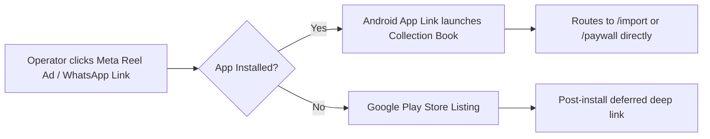

# Plan: Android Release Packaging, App Links & ASO Pipeline

## 1. Overview & Objective
In Tier 2/3/4 India, mobile data bandwidth is precious and phone storage is constrained (predominantly 32GB–64GB budget Android devices). High APK download sizes (> 30MB) result in up to $40\%$ drop-off before app installation completes.

This plan details the technical engineering for:
1. **Download Weight Optimization**: R8 code shrinking, resource stripping, and ABI splitting keeping the Google Play download size **$< 15\text{MB}$**.
2. **Android App Links & Deep Linking**: Direct routing from ad clicks and YouTube descriptions into specific onboarding flows (e.g. MSO file picker or add subscriber).
3. **Automated Multi-Language ASO Pipeline**: Generating localized Play Store listings and screenshots across English, Hindi, Marathi, Bengali, and Tamil.

---

## 2. Requirements & Scope

### In Scope
- **Android Gradle Tuning**:
  - `minifyEnabled true`, `shrinkResources true`.
  - ProGuard rules tailored for Flutter, SQLite (`sqflite`), and URL launcher.
  - Target SDK 35, Min SDK 21 (covering 99.4% of active Android devices in India).
- **Deep Linking Engine**:
  - Digital Asset Links served at `https://cbk.sarbaa.com/.well-known/assetlinks.json` once the Worker is deployed and the real signing fingerprint is configured.
  - Route intents:
    - `https://cbk.sarbaa.com/import`: Opens MSO import wizard directly when deep-link navigation is implemented.
    - `https://cbk.sarbaa.com/r/{ref}`: Opens the verified App Link; referral capture remains pending.
- **ASO Automation (Bun CLI)**:
  - CLI script compiling multi-language titles, short descriptions, and promotional text.

### Out of Scope
- iOS App Store packaging (deliberately deferred; $< 1\%$ of Indian cable technicians use iOS).

---

## 3. Architecture & Technical Design

### 3.1 Gradle Build Configuration (`android/app/build.gradle`)

```groovy
android {
    defaultConfig {
        applicationId "com.sarbaa.cbk"
        minSdkVersion 21
        targetSdkVersion 35
        versionCode 100
        versionName "1.0.0"
        
        ndk {
            abiFilters "armeabi-v7a", "arm64-v8a", "x86_64"
        }
    }

    buildTypes {
        release {
            signingConfig signingConfigs.release
            minifyEnabled true
            shrinkResources true
            proguardFiles getDefaultProguardFile('proguard-android-optimize.txt'), 'proguard-rules.pro'
        }
    }
}
```

### 3.2 Deep Linking Flow (`assetlinks.json`)



---

## 4. Implementation Checklist

- [ ] **Phase 1: Gradle & ProGuard Optimization**
  - [ ] Configure `android/app/proguard-rules.pro` with keep rules for `sqflite` and Flutter engine.
  - [ ] Enable R8 shrinking and resource optimization in `android/app/build.gradle`.
  - [ ] Verify release AAB bundle size is $< 15\text{MB}$ via `flutter build appbundle --release`.

- [ ] **Phase 2: Android App Links Configuration**
  - [x] Add the `https://cbk.sarbaa.com/r/` `intent-filter` with `android:autoVerify="true"` in `android/app/src/main/AndroidManifest.xml`.
  - [ ] Generate the real SHA-256 fingerprint from the production release keystore.
  - [x] Implement the `cbk.sarbaa.com` asset-links response for package `com.sarbaa.cbk` in the Worker.
  - [ ] Deploy the Worker, configure the matching real fingerprint, and verify `/.well-known/assetlinks.json` on the production domain.
  - [ ] Implement Flutter deep-link navigation/attribution for `com.sarbaa.cbk` in `lib/main.dart`.

- [ ] **Phase 3: Automated ASO Pipeline**
  - [ ] Write metadata definitions across 5 languages (see `play-store-metadata.md`).
  - [ ] Package high-converting vernacular screenshots (1080x1920).

---

## 5. Verification Plan

### Automated Tests
- Run `flutter build appbundle --release` and verify output size is under 15MB.
- On a device with the signed `com.sarbaa.cbk` release installed, run `adb shell am start -W -a android.intent.action.VIEW -d "https://cbk.sarbaa.com/r/AB12CD" com.sarbaa.cbk` to test the verified referral App Link.

### Manual Verification
- Test installation on a budget Android device (e.g. 2GB RAM / Android Go) under throttled 3G network simulation.
- Verify instant startup time interactive within $< 800\text{ms}$.
