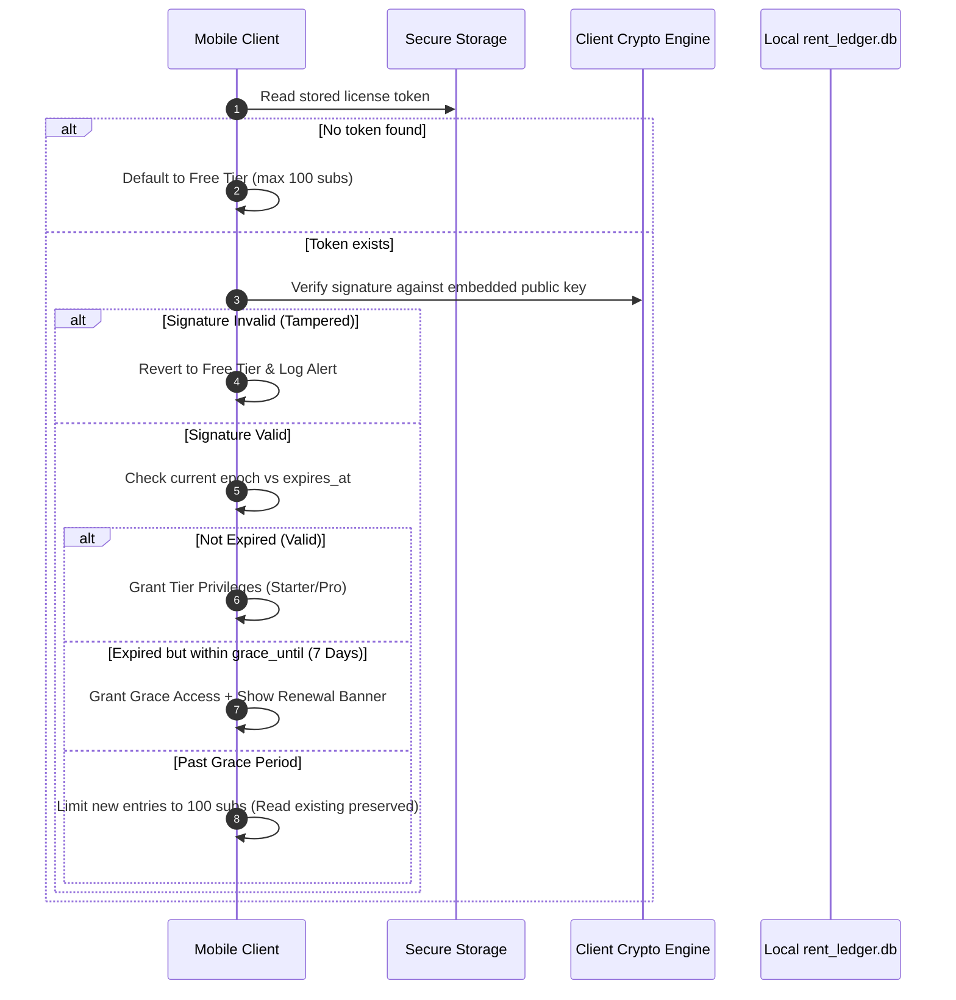

# Offline-Durable Cryptographic Licensing Architecture

Because local cable operators frequently work in basements, rural pockets, or zero-connectivity lanes, the licensing system **must never require a network ping to verify active subscription status**.

This specification outlines the asymmetric cryptography (Ed25519) and token persistence architecture used to secure paid tiers offline.

---

## 1. Cryptographic Token Payload

When a payment completes through the Cloudflare Edge Gateway, the server issues a signed compact JWT or binary license token containing:

```json
{
  "sub": "org_9823412093",
  "phone": "+919876543210",
  "tier": "starter",
  "max_subscribers": 500,
  "max_devices": 2,
  "issued_at": 1790150400,
  "expires_at": 1821686400,
  "grace_until": 1822291200,
  "features": [
    "whatsapp_receipts",
    "cloud_backup",
    "upi_links",
    "mso_import"
  ]
}
```

### Digital Signature Scheme
* **Algorithm**: Ed25519 (Edwards-curve Digital Signature Algorithm).
* **Private Key**: Securely stored in Cloudflare Worker secrets (`CBK_LICENSE_ED25519_PRIVATE_KEY`). Never shipped to client.
* **Public Key**: Hardcoded as an embedded constant string inside the Flutter binary (`lib/constants/crypto_keys.dart`).

---

## 2. Client-Side Verification Sequence



---

## 3. Anti-Tamper & Clock Manipulation Safeguards

To prevent operators from turning back their Android system clock to exploit expired licenses:
1. **Monotonic High-Water Mark in SQLite**: Every time a payment or transaction is recorded, the app checks if `recorded_at < last_known_timestamp`. If a backward clock jump > 24 hours is detected, the app locks new additions until clock resynchronizes.
2. **Device Hardware Fingerprint**: Token includes SHA-256 of `ANDROID_ID` or installation hash to prevent copying `.db` and secure storage tokens to non-paying peer devices.
