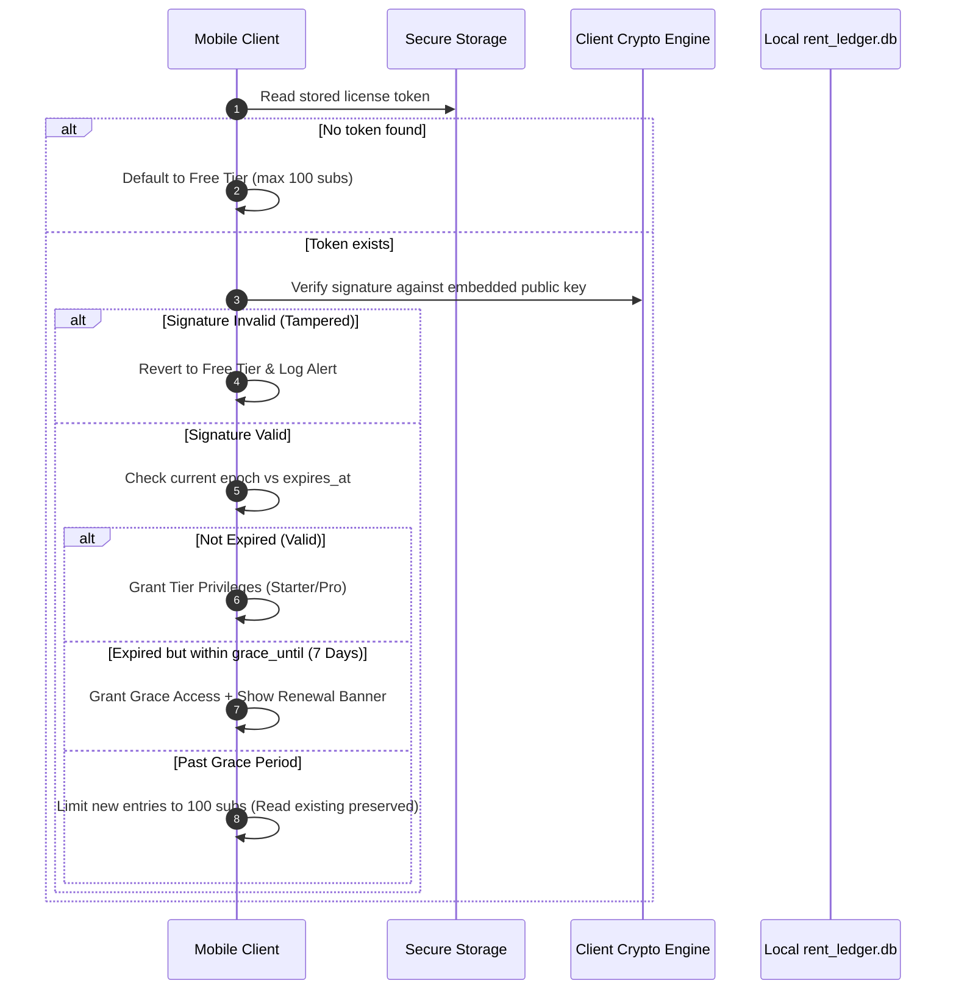

# Offline-Durable Cryptographic Licensing Architecture

> ## SUPERSEDED AS AN AUTHORITY MODEL — NONOPERATIVE FOR THE SaaS TARGET
>
> This document specifies a **device-authoritative** licensing system in which a
> locally-verified Ed25519 token *is* the grant, and a local count of 100 subscribers
> *is* the cap. In the approved target the cloud ledger is the system of record and
> **entitlements bind to server-side plan state**. Therefore:
>
> - **The token is no longer the authority.** It becomes a **cached, expiring grant**
>   that keeps an offline device usable until it can revalidate with the server. The
>   offline-durability *problem* this document solves is real and must keep working; the
>   device-local *authority* is what is replaced.
> - **The 100-subscriber default in the verification flow is nonoperative**, as is the
>   device-local cap enforcement described in
>   [`plan.md`](plan.md). A device with no grant must not silently present itself as a
>   decided free tier with a decided limit.
> - **The payload fields below are placeholders.** `tier`, `max_subscribers`,
>   `max_devices`, `grace_until`, and the `features` list encode an offer that the
>   commercial gate (Gate 13, in
>   [`../cloud-authoritative-offline-first-saas/plan.md`](../cloud-authoritative-offline-first-saas/plan.md)
>   §11) has not decided, and the `cloud_backup` feature names a capability the shipped
>   app does not have.
> - **Do not implement this as the enforcement path.** The offline-expiry behavior, the
>   cache-encryption threat model, and the secure-token-storage decision are handled by
>   the canonical plan (§8.1.1, §9.1) and are not re-decided here. Nothing below is
>   implemented, and no checklist item in this plan is complete.

Because local cable operators frequently work in basements, rural pockets, or zero-connectivity lanes, the licensing system **must never require a network ping to verify active subscription status**.

> **This opening requirement survives the pivot**: offline continuity is a hard
> requirement. What changes is *what* is being verified — a server-authoritative grant
> cached for offline use, not a device-local license.

This specification outlines the asymmetric cryptography (Ed25519) and token persistence architecture used to secure paid tiers offline.

---

## 1. Cryptographic Token Payload

> **Provisional payload, superseded semantics.** The claims below are placeholders from
> the pre-Gate-13 device-authoritative model, not an agreed grant. Do not implement this
> claim set; it is re-derived from the server-side plan state decided at Gate 13.

When a payment completes through the Cloudflare Edge Gateway, the server issues a signed compact JWT or binary license token containing:

```json
{
  "sub": "org_9823412093",
  "phone": "+919876543210",
  "tier": "starter",
  "max_subscribers": 500,
  "max_devices": 2,
  "issued_at": 1790150400,
  "expires_at": 1821686400,
  "grace_until": 1822291200,
  "features": [
    "whatsapp_receipts",
    "cloud_backup",
    "upi_links",
    "mso_import"
  ]
}
```

### Digital Signature Scheme
* **Algorithm**: Ed25519 (Edwards-curve Digital Signature Algorithm).
* **Private Key**: Securely stored in Cloudflare Worker secrets (`CBK_LICENSE_ED25519_PRIVATE_KEY`). Never shipped to client.
* **Public Key**: Hardcoded as an embedded constant string inside the Flutter binary (`lib/constants/crypto_keys.dart`).

---

## 2. Client-Side Verification Sequence

> **Superseded flow.** The `Default to Free Tier (max 100 subs)` fallback and the
> `Limit new entries to 100 subs` outcome are **nonoperative**: the cap is not a
> device-authoritative fact in the target model, and it must not be enforced or
> advertised as a decided limit. What survives is the **signature verification and
> offline-cache** discipline, applied to a cached grant that the server remains the
> authority for.


```mermaid
sequenceDiagram
    autonumber
    participant App as Mobile Client
    participant SecStore as Secure Storage
    participant Ed25519 as Client Crypto Engine
    participant SQLite as Local rent_ledger.db

    App->>SecStore: Read stored license token
    alt No token found
        App->>App: Default to Free Tier (max 100 subs)
    else Token exists
        App->>Ed25519: Verify signature against embedded public key
        alt Signature Invalid (Tampered)
            App->>App: Revert to Free Tier & Log Alert
        else Signature Valid
            App->>App: Check current epoch vs expires_at
            alt Not Expired (Valid)
                App->>App: Grant Tier Privileges (Starter/Pro)
            else Expired but within grace_until (7 Days)
                App->>App: Grant Grace Access + Show Renewal Banner
            else Past Grace Period
                App->>App: Limit new entries to 100 subs (Read existing preserved)
            end
        end
    end
```

---

## 3. Anti-Tamper & Clock Manipulation Safeguards

> **Clock integrity is a canonical-plan requirement, not a licensing one.** Billing
> periods are **server-derived** (canonical §4.6), and a device with a wrong clock still
> lands in the server-derived period. The high-water-mark idea below should therefore be
> re-derived from the sync/revision work in Gates 4 and 8 rather than implemented here.
> The `ANDROID_ID` fingerprint idea below is **superseded** by the device
> identification and revocation decisions in the canonical plan (§8.1.1, Gate 6); do not
> implement it from this document.

To prevent operators from turning back their Android system clock to exploit expired licenses:
1. **Monotonic High-Water Mark in SQLite**: Every time a payment or transaction is recorded, the app checks if `recorded_at < last_known_timestamp`. If a backward clock jump > 24 hours is detected, the app locks new additions until clock resynchronizes.
2. **Device Hardware Fingerprint**: Token includes SHA-256 of `ANDROID_ID` or installation hash to prevent copying `.db` and secure storage tokens to non-paying peer devices.
