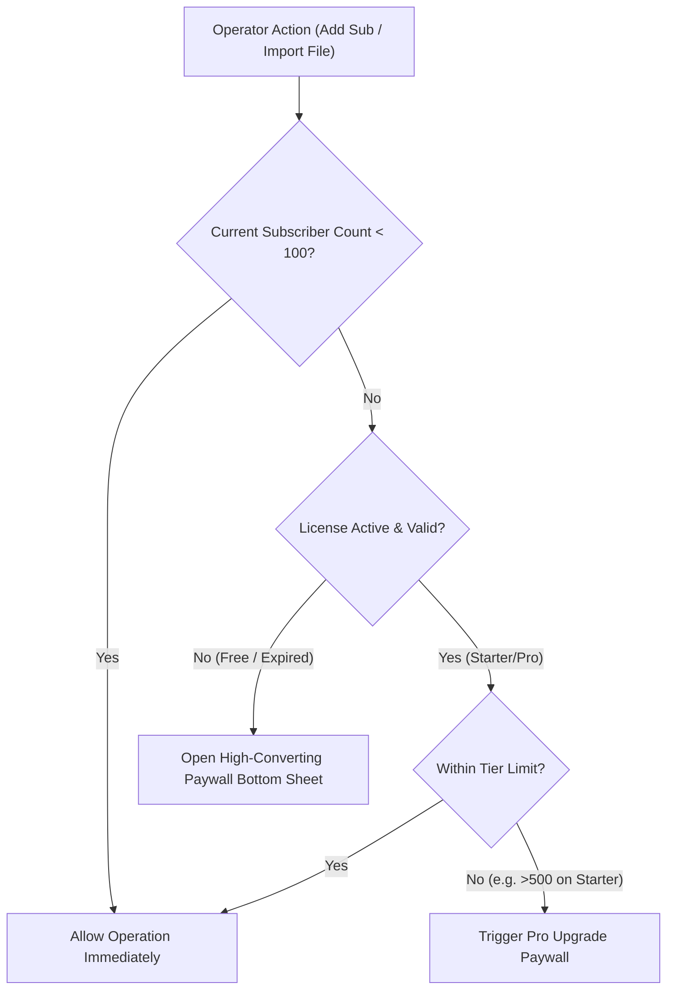

# Plan: Freemium Paywall, Licensing & Tier Enforcement

## 1. Overview & Objective
Collection Book's core business model is a high-velocity freemium hook:
- **Free Tier**: ₹0 forever, up to 100 subscribers. Full offline SQLite functionality.
- **Starter Tier**: ₹199/month or ₹1,499/year. Up to 500 subscribers, 1 line boy login, cloud backup.
- **Pro Tier**: ₹349/month or ₹2,499/year. Up to 2,000 subscribers, unlimited line boys, MSO bulk import, role-based auditing.

This plan details the technical enforcement of the 100-subscriber freemium limit, the in-app paywall UI triggers, and offline-durable cryptographic license verification.

---

## 2. Requirements & Scope

### In Scope
- **Subscriber Cap Interceptor**: Hard guard preventing creation or import of the 101st subscriber unless the operator is on Starter or Pro.
- **MSO Bulk Import Grace Gate**: If an operator imports an Excel sheet with 350 subscribers on the Free tier, import the first 100 records and present an immediate upgrade summary sheet (*"100 imported for free. Upgrade to Starter to unlock the remaining 250 in 1 tap"*).
- **Contextual Paywall Sheet**: Vernacular bottom sheet displaying the "Cost of 3 lost bills" psychological anchor with direct 1-tap UPI payment trigger.
- **Offline Cryptographic License Token**: Storing an Ed25519-signed JWT token locally so the app remains unlocked when operating without network connectivity.
- **7-Day Grace Period Engine**: If an annual plan expires, grant a 7-day read/write grace period with subtle warning banners before reverting to 100-sub enforcement.

### Out of Scope
- Remote wiping or locking the user out of previously entered data (operators always retain 100% read/export access to their SQLite database).

---

## 3. Architecture & Technical Design

### 3.1 Entitlement Service Layer (`LicenseService`)

### 3.2 Paywall Trigger Points
1. **Manual Add**: In [`lib/screens/add_subscriber_screen.dart`](file:///c:/projects/cross/collection_book/lib/screens/add_subscriber_screen.dart), tapping "Save Subscriber" checks active count.
2. **MSO Excel Import**: In [`lib/services/import_service.dart`](file:///c:/projects/cross/collection_book/lib/services/import_service.dart), parse the entire file, import first 100, pause import and show upgrade modal.
3. **Multi-User Staff Addition**: Settings $\rightarrow$ "Add Line Boy" gates non-owners to paid tiers.
4. **Cloud Backup**: Daily automated cloud snapshot gates to paid tiers.

### 3.3 High-Converting Paywall UI Layout
The Paywall Bottom Sheet features:
- **Badge**: ⭐️ *Apna Operator Plan* (Most Popular)
- **Anchor Headline**: *"Sirf 3 bills ka hisab bachane par poore saal ka kharcha nikal jata hai!"*
- **Pricing Cards**:
  - Annual: **₹1,499 / year** (Save 37% — ₹125/mo) [Pre-selected]
  - Monthly: **₹199 / month**
- **1-Tap Action**: [ ⚡️ UPI se Turant Pay Karein (₹1,499) ]
- **Security Assurances**: 100% Safe | Razorpay Verified | Instant Activation

---

## 4. Implementation Checklist

- [ ] **Phase 1: License State Management**
  - [ ] Create `lib/models/license_state.dart` (Tier enum: `free`, `starter`, `pro`, expiry date, max subscribers, signature).
  - [ ] Implement `lib/services/license_service.dart` with secure storage (`flutter_secure_storage`).
  - [ ] Add offline cryptographic token verification (Ed25519 public key embedded in client).

- [ ] **Phase 2: Entitlement Guards**
  - [ ] Intercept `DatabaseService.insertSubscriber()` to throw `SubscriberLimitExceededException` if cap reached.
  - [ ] Update [`lib/screens/add_subscriber_screen.dart`](file:///c:/projects/cross/collection_book/lib/screens/add_subscriber_screen.dart) to catch limit and display bottom sheet.
  - [ ] Update [`lib/services/import_service.dart`](file:///c:/projects/cross/collection_book/lib/services/import_service.dart) to batch up to remaining limit and return partial import metadata.

- [ ] **Phase 3: Vernacular Paywall UI Component**
  - [ ] Create `lib/widgets/paywall_bottom_sheet.dart`.
  - [ ] Add tier comparison cards (Free vs Starter vs Pro).
  - [ ] Support vernacular strings for headings, value propositions, and guarantees.
  - [ ] Wire direct UPI launch handler.

- [ ] **Phase 4: Expiry & Grace Period Engine**
  - [ ] Implement 7-day grace period logic when `expiryDate < now`.
  - [ ] Add warning banner on [`lib/screens/home_screen.dart`](file:///c:/projects/cross/collection_book/lib/screens/home_screen.dart) during grace window.

---

## 5. Verification Plan

### Automated Tests
- Unit test: `LicenseService.canAddSubscriber()` returns `true` for 99 subs on Free, `false` for 100 subs.
- Unit test: Partial MSO import stops at 100 records and produces upgrade prompt.
- Unit test: Ed25519 token parsing and tamper detection (modified expiry fails validation).

### Manual Verification
- Seed local SQLite DB with 100 subscribers; verify clicking "Add Subscriber" immediately presents the upgrade sheet.
- Disconnect device WiFi/cellular; verify paid plan remains recognized via local signed token.
