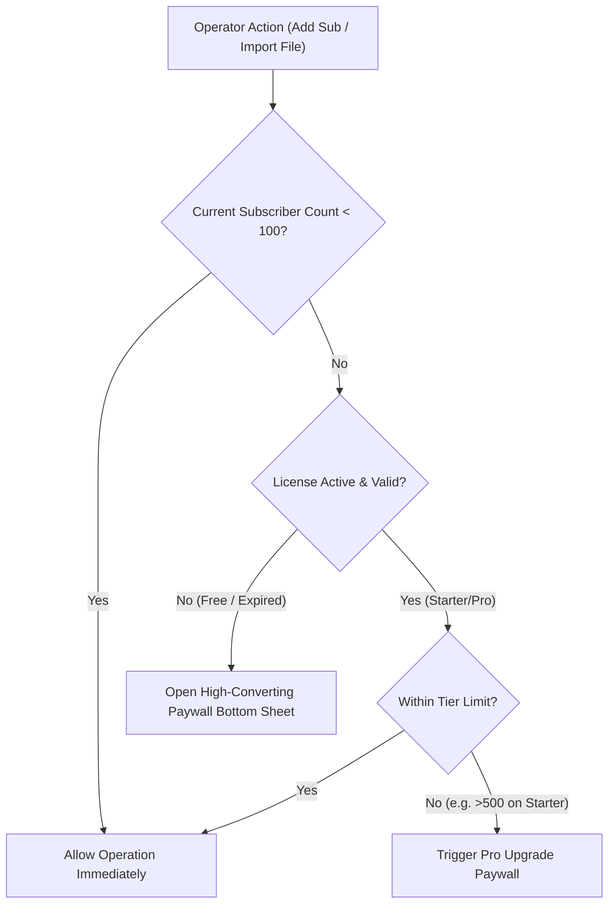

# Plan: Freemium Paywall, Licensing & Tier Enforcement

> ## OBSOLETE AS A SHIPPED MODEL — DEPENDS ON GATE 13
>
> **This plan describes device-authoritative enforcement, which is obsolete for the SaaS
> target. Do not build it as written.** Two things in it are **nonoperative**:
>
> 1. **The device-local 100-subscriber cap** and the MSO import grace gate. In the
>    approved target the cloud ledger is the system of record and **entitlements bind to
>    server-side plan state**; a cap counted on one phone is a transitional placeholder,
>    never the public model.
> 2. **The Ed25519 license token as the authority.** It becomes a **cached, expiring
>    grant** for offline continuity, not the thing that grants the plan. Offline
>    behavior still must keep working, so the offline-durability *problem* is real; the
>    device-local *authority* is what is replaced.
>
> **§4 is a dependent checklist: every item in it must be re-derived at the commercial
> gate (Gate 13) before it is treated as work.** Nothing in this plan is implemented, no
> checkbox below is complete, and this reconciliation changes no checkbox.
>
> **Also provisional:** the free entry path is **retained** as an affordable entry, but
> its boundary, any cap, and the prices around it are undecided. No copy may promise
> "free forever", state a price, or name a specific subscriber cap. A downgrade must
> still leave authorized members able to read and export the records they already have,
> and a paywall must never remove access to data the operator already recorded.
> Building any of this needs an explicit, separately approved decision.
>
> **Commercial gate reference:** Gate 13 in
> [`../cloud-authoritative-offline-first-saas/plan.md`](../cloud-authoritative-offline-first-saas/plan.md)
> §11, with the entitlement model in that plan's §9.1 and the dependency relationships in
> its §12.

## 1. Overview & Objective
Collection Book's core business model is a high-velocity freemium hook (**illustrative, pre-Gate-13, and not the target enforcement model**; the free entry path is retained as an affordable entry, and every limit and price below is **provisional and undecided**):
- **Free Tier**: ₹0 forever, up to 100 subscribers. Full offline SQLite functionality. *(Legacy assumption: do not ship "free forever" or a named cap.)*
- **Starter Tier**: ₹199/month or ₹1,499/year. Up to 500 subscribers, 1 line boy login, cloud backup. *(Placeholder names, prices, and limits. "Cloud backup" is a future capability — the shipped app has no cloud account, no sync, and no cloud backup.)*
- **Pro Tier**: ₹349/month or ₹2,499/year. Up to 2,000 subscribers, unlimited line boys, MSO bulk import, role-based auditing. *(Placeholder; an offline single-user app cannot enforce roles or multi-device staff access today.)*

This plan details the technical enforcement of the 100-subscriber freemium limit, the in-app paywall UI triggers, and offline-durable cryptographic license verification.

> **Read §2, §3, and §4 below as a historical design sketch of the device-local model.**
> They are kept to show the intended shape for the Gate 13 decision; they are not an
> implementation contract.

---

## 2. Requirements & Scope

### In Scope

> **Device-local, pre-Gate-13 sketch.** Every bullet below describes the superseded
> device-authoritative model. They are re-derived at Gate 13 against server-side
> entitlements; the copy inside them is blocked until then.

- **Subscriber Cap Interceptor**: Hard guard preventing creation or import of the 101st subscriber unless the operator is on Starter or Pro. *(Device-local count; nonoperative for the SaaS target.)*
- **MSO Bulk Import Grace Gate**: If an operator imports an Excel sheet with 350 subscribers on the Free tier, import the first 100 records and present an immediate upgrade summary sheet (*"100 imported for free. Upgrade to Starter to unlock the remaining 250 in 1 tap"*).
- **Contextual Paywall Sheet**: Vernacular bottom sheet displaying the "Cost of 3 lost bills" psychological anchor with direct 1-tap UPI payment trigger.
- **Offline Cryptographic License Token**: Storing an Ed25519-signed JWT token locally so the app remains unlocked when operating without network connectivity. *(The offline-continuity problem is real and must keep working; the token is a cached, expiring grant, not the entitlement authority.)*
- **7-Day Grace Period Engine**: If an annual plan expires, grant a 7-day read/write grace period with subtle warning banners before reverting to 100-sub enforcement. *(Policy placeholder; the grace behavior itself is an open commercial decision.)*
- **Partial MSO import**: the "import the first 100, prompt to upgrade" behavior must never make the remaining imported records inaccessible to the operator.

### Out of Scope
- Remote wiping or locking the user out of previously entered data (operators always retain 100% read/export access to their SQLite database).

---

## 3. Architecture & Technical Design

### 3.1 Entitlement Service Layer (`LicenseService`)

> **Superseded flowchart.** The device-local branch `Current Subscriber Count < 100?` is
> **nonoperative for the SaaS target**: entitlement comes from server-side plan state.
> Keep the diagram for the shape of an offline-continuity cache, not as the enforcement
> model.

```mermaid
flowchart TD
    A["Operator Action (Add Sub / Import File)"] --> B{"Current Subscriber Count < 100?"}
    B -- Yes --> C["Allow Operation Immediately"]
    B -- No --> D{"License Active & Valid?"}
    D -- Yes (Starter/Pro) --> E{"Within Tier Limit?"}
    E -- Yes --> C
    E -- No (e.g. >500 on Starter) --> F["Trigger Pro Upgrade Paywall"]
    D -- No (Free / Expired) --> G["Open High-Converting Paywall Bottom Sheet"]
```

### 3.2 Paywall Trigger Points
1. **Manual Add**: In [`lib/screens/add_subscriber_screen.dart`](file:///c:/projects/cross/collection_book/lib/screens/add_subscriber_screen.dart), tapping "Save Subscriber" checks active count.
2. **MSO Excel Import**: In [`lib/services/import_service.dart`](file:///c:/projects/cross/collection_book/lib/services/import_service.dart), parse the entire file, import first 100, pause import and show upgrade modal.
3. **Multi-User Staff Addition**: Settings $\rightarrow$ "Add Line Boy" gates non-owners to paid tiers.
4. **Cloud Backup**: Daily automated cloud snapshot gates to paid tiers.

### 3.3 High-Converting Paywall UI Layout

> **Blocked copy sketch — not approved, not built.** The badge, headline, prices, "Save
> 37%", the 1-tap UPI action, and the security assurances below all name an undecided
> tier, price, and discount, and the `findUnsupportedClaims` scanner in
> `packages/contracts/` would reject them today. Do not add this surface, or any localized
> variant of it, before Gate 13 decides the offer.

The Paywall Bottom Sheet features:
- **Badge**: ⭐️ *Apna Operator Plan* (Most Popular)
- **Anchor Headline**: *"Sirf 3 bills ka hisab bachane par poore saal ka kharcha nikal jata hai!"*
- **Pricing Cards**:
  - Annual: **₹1,499 / year** (Save 37% — ₹125/mo) [Pre-selected]
  - Monthly: **₹199 / month**
- **1-Tap Action**: [ ⚡️ UPI se Turant Pay Karein (₹1,499) ]
- **Security Assurances**: 100% Safe | Razorpay Verified | Instant Activation

---

## 4. Implementation Checklist

> **DEPENDENT CHECKLIST — rewrite at Gate 13 before treating any item as work.** Every
> item below is written against the obsolete device-authoritative model. At the
> commercial gate the whole list is re-derived against server-side entitlements,
> server-derived plan state, and the decided offer; the offline-continuity requirement
> survives that rewrite, the device-local cap and token-as-authority do not. Building
> from this list without that rewrite would ship a device-authoritative paywall.
>
> **No item below is complete, and none is started by this reconciliation.**

- [ ] **Phase 1: License State Management**
  - [ ] Create `lib/models/license_state.dart` (Tier enum: `free`, `starter`, `pro`, expiry date, max subscribers, signature).
  - [ ] Implement `lib/services/license_service.dart` with secure storage (`flutter_secure_storage`).
  - [ ] Add offline cryptographic token verification (Ed25519 public key embedded in client).

- [ ] **Phase 2: Entitlement Guards**
  - [ ] Intercept `DatabaseService.insertSubscriber()` to throw `SubscriberLimitExceededException` if cap reached.
  - [ ] Update [`lib/screens/add_subscriber_screen.dart`](file:///c:/projects/cross/collection_book/lib/screens/add_subscriber_screen.dart) to catch limit and display bottom sheet.
  - [ ] Update [`lib/services/import_service.dart`](file:///c:/projects/cross/collection_book/lib/services/import_service.dart) to batch up to remaining limit and return partial import metadata.

- [ ] **Phase 3: Vernacular Paywall UI Component**
  - [ ] Create `lib/widgets/paywall_bottom_sheet.dart`.
  - [ ] Add tier comparison cards (Free vs Starter vs Pro).
  - [ ] Support vernacular strings for headings, value propositions, and guarantees.
  - [ ] Wire direct UPI launch handler.

- [ ] **Phase 4: Expiry & Grace Period Engine**
  - [ ] Implement 7-day grace period logic when `expiryDate < now`.
  - [ ] Add warning banner on [`lib/screens/home_screen.dart`](file:///c:/projects/cross/collection_book/lib/screens/home_screen.dart) during grace window.

---

## 5. Verification Plan

> **These assertions describe the superseded model.** They are re-derived at Gate 13; do
> not write them against the current app as a gate for shipping.

### Automated Tests
- ~~Unit test: `LicenseService.canAddSubscriber()` returns `true` for 99 subs on Free, `false` for 100 subs.~~ *(device-local cap; superseded by server-side entitlement checks)*
- ~~Unit test: Partial MSO import stops at 100 records and produces upgrade prompt.~~ *(depends on an undecided cap; superseded)*
- Unit test: Ed25519 token parsing and tamper detection (modified expiry fails validation) — still required for the **cached grant**, with the authority moved server-side.

### Manual Verification
- ~~Seed local SQLite DB with 100 subscribers; verify clicking "Add Subscriber" immediately presents the upgrade sheet.~~ *(obsolete device-local trigger)*
- Disconnect device WiFi/cellular; verify paid plan remains recognized via local signed token. *(Requirement survives as offline continuity, subject to Gate 13's offline-expiry policy.)*
