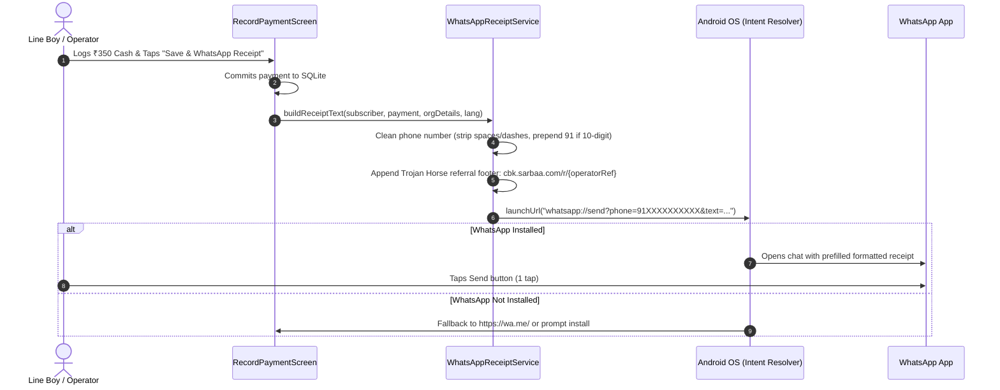

# Plan: In-Product Viral Loop & WhatsApp Receipts Engine

**Status:** Implemented locally; physical-device WhatsApp, fallback, and deployed referral-link checks remain pending.

**Backend dependency:** The public referral landing/redirect service is tracked separately in [`../monorepo-cbk-edge/plan.md`](../monorepo-cbk-edge/plan.md).

## 1. Overview & Objective
Local Cable Operators (LCOs) and FTTH technicians interact with 100 to 2,000+ customers monthly. Every collection is an opportunity for customer trust and organic viral acquisition. This plan specifies the engineering architecture for:
1. **Zero-Cost WhatsApp Receipts**: Generating and dispatching instant payment receipts via native Android platform intents (`whatsapp://send`), eliminating recurring Meta Cloud API / BSP fees.
2. **The "Trojan Horse" Referral Loop**: Embedding a discrete, non-intrusive footer in every receipt linking to a tracked download link, turning every receipt sent to a customer into a potential acquisition touchpoint for neighboring operators and collection boys.
3. **Database index migration (SQLite schema v7)**: `subscribers.phone` and its column were already present from schema v5/v6; v7 adds the missing `idx_subscribers_phone` index without adding the column again.

> **Correction from the original plan:** the earlier v4 → v5 instruction to add `phone` is stale. The implementation preserves the cumulative v1 → v6 migration chain, keeps the existing `phone` column, and uses a v7 index-only migration. Receipts use the canonical base URL `https://cbk.sarbaa.com/` and referral links of the form `https://cbk.sarbaa.com/r/{referralCode}`.

---

## 2. Requirements & Scope

### In Scope
- **Schema migration (v7 index-only)**: Backwards-compatible `CREATE INDEX IF NOT EXISTS` for the existing `phone` column.
- **Intent Service**: `WhatsAppReceiptService` supporting Android `whatsapp://send` URI intent with fallback to web browser (`https://wa.me/`).
- **Dynamic Vernacular Templates**: Formatting receipts dynamically in 5 languages (English, Hindi, Marathi, Bengali, Tamil) with dynamic balance status (*Fully Paid*, *Advance*, *Arrears/Baqaya*).
- **Trojan Horse Attribution**: Unique operator referral code injected into the download link footer.
- **UI Integration**: 1-Tap "Share on WhatsApp" action button on both [`RecordPaymentScreen`](file:///c:/projects/cross/collection_book/lib/screens/record_payment_screen.dart) and [`SubscriberDetailScreen`](file:///c:/projects/cross/collection_book/lib/screens/subscriber_detail_screen.dart).

### Out of Scope
- Paid Meta WhatsApp Cloud API / Twilio BSP integration (deliberately rejected due to ₹0.80–₹1.20/msg overhead).
- Automated SMS fallback gateways (can be added in Phase 3 if operator requests).

---

## 3. Architecture & Technical Design

### 3.1 SQLite Schema Upgrade (`v6 -> v7`, index only)

In [`lib/services/database_service.dart`](file:///c:/projects/cross/collection_book/lib/services/database_service.dart):
```dart
// Database version increment: 6 -> 7
// In _onUpgrade:
if (oldVersion < 7) {
  await db.execute(
    'CREATE INDEX IF NOT EXISTS idx_subscribers_phone ON subscribers(phone)',
  );
}
```

### 3.2 Receipt Delivery Engine (`WhatsAppReceiptService`)



### 3.3 Receipt Format & Trojan Horse Footer Structure

The receipt message follows a structured layout:
1. **Header**: Brand title & date stamp.
2. **Subscriber Details**: Name, Service Type (Cable TV / Fiber Internet), VC # or Box ID, Area.
3. **Billing Breakdown**: Billed Month, Amount Collected, Previous Dues, Remaining Arrears.
4. **Collector Signature**: Operator business name & contact.
5. **The Trojan Horse Footer**:
   ```text
   ━━━━━━━━━━━━━━━━━━━━━
   📱 Managed via Collection Book App
   👉 Cable/WiFi Operator? Try Free (up to 100 subs): cbk.sarbaa.com/r/OP9821
   ```

---

## 4. Implementation Checklist

- [x] **Phase 1: Database Migration**
  - [x] Bump database version to `7` in [`lib/services/database_service.dart`](file:///c:/projects/cross/collection_book/lib/services/database_service.dart).
  - [x] Preserve the existing cumulative migration chain; do not add `phone` again.
  - [x] Add `CREATE INDEX IF NOT EXISTS idx_subscribers_phone ON subscribers(phone)` for fresh installs and v7 upgrades.
  - [x] Confirm `Subscriber` already deserializes/serializes `phone`.

- [x] **Phase 2: Intent Service Implementation**
  - [x] Create `lib/services/whatsapp_receipt_service.dart`.
  - [x] Implement phone number sanitizer (E.164 normalization for India `+91`).
  - [x] Implement `whatsapp://send` intent launcher with URI encoding.
  - [x] Add fallback mechanism to `https://wa.me/` via `url_launcher`, surfacing both-path failures.

- [x] **Phase 3: Vernacular Template Engine**
  - [x] Build multi-language string formatters (see `receipt-templates.md`).
  - [x] Incorporate arithmetic status labels (*Pura Chukta*, *Baqaya*, *Advance*).
  - [x] Add Trojan Horse viral link formatter with a privacy-safe persisted six-character referral code.

- [x] **Phase 4: UI Screens & Workflows**
  - [x] Add `phone` input field to [`lib/screens/add_subscriber_screen.dart`](file:///c:/projects/cross/collection_book/lib/screens/add_subscriber_screen.dart).
  - [x] Update [`lib/screens/record_payment_screen.dart`](file:///c:/projects/cross/collection_book/lib/screens/record_payment_screen.dart) with "Save & Send Receipt" split action.
  - [x] Add WhatsApp icon button on [`lib/screens/subscriber_detail_screen.dart`](file:///c:/projects/cross/collection_book/lib/screens/subscriber_detail_screen.dart) ledger entries.
- [x] Persist receipt language, business name, and anonymous referral code with existing SharedPreferences.
- [x] Update Android application ID/namespace to `com.sarbaa.cbk`, move `MainActivity`, and add URL intent visibility.

---

## 5. Verification Plan

### Automated Tests
- [x] Unit test: v6 → v7 index-only migration preserves subscriber phone data and is idempotent.
- [x] Unit test: Phone number normalization edge cases (`9876543210`, `+91 98765 43210`, `09876543210`).
- [x] Unit test: URI encoding, canonical referral construction, balance states, and vernacular receipt templates across all 5 languages.
- [x] Unit test: app-intent and `wa.me` fallback behavior, including surfaced delivery failures.
- [x] Unit test: no receipt locale advertises a subscriber cap or a free tier, enforced by the shared `findUnsupportedClaims` scanner over the Dart source and by per-locale assertions.

### Manual Verification (Pending)
- [ ] Test payment creation and receipt dispatch on an Android physical device with WhatsApp installed.
- [ ] Test a device without WhatsApp installed and confirm the `https://wa.me` fallback.
- [ ] Verify that clicking the Trojan Horse link routes to the app installation landing page with referral query parameters preserved.
