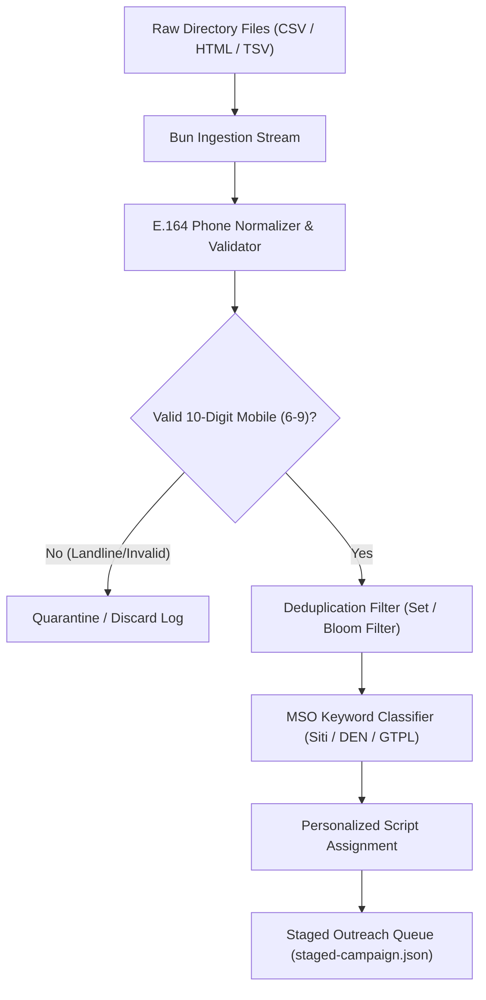

# Plan: Outbound Scraping & WhatsApp Campaign Pipeline (Bun CLI)

## 1. Overview & Objective
While paid Meta Ads create an inbound install engine, the fastest route to acquiring the first 500 paying operators is **direct outbound video demonstrations sent to verified LCO phone numbers**.

Public registries of cable operators and ISP license holders are maintained by:
- TRAI (Telecom Regulatory Authority of India) public postal registration records.
- State Cable TV Operator Associations (e.g. Maharashtra Cable Sena, Karnataka Cable Operators Association).
- MSO franchisee / LCO dealer directories.

This plan details the technical architecture of a standalone **Bun CLI data pipeline** (`scripts/gtm/outbound-processor.ts`) that cleans, normalizes, deduplicates, and stages outbound WhatsApp campaigns with anti-spam rate limiting.

---

## 2. Requirements & Scope

### In Scope
- **Bun CLI Utility**: High-performance TypeScript batch processor running directly on Bun (`bun run scripts/gtm/outbound-processor.ts`).
- **Data Ingestion**: Parses raw CSV, TSV, or HTML directory exports containing operator names, business names, city, state, and contact numbers.
- **Normalization & Cleansing**:
  - Validates against Indian E.164 phone standards (`+91` prefix, 10 valid digits starting with 6, 7, 8, or 9).
  - Rejects landlines, toll-free numbers, and invalid sequences.
  - Deduplicates on normalized mobile number.
- **MSO Brand Tagging**: Detects mentions of MSO brands (DEN, Siti, GTPL, Hathway, Fastway, Railwire) to attach relevant customized video pitch scripts.
- **Outbound Batch Staging**: Generates formatted CSV / JSON queues with randomized delay brackets (120–300 seconds) to comply with WhatsApp safety guidelines.

### Out of Scope
- Direct headless browser automation to bypass WhatsApp terms of service. The CLI outputs clean staging datasets for managed broadcast dispatchers or official business numbers.

---

## 3. Architecture & Technical Design

---

## 4. Implementation Checklist

- [ ] **Phase 1: CLI Scaffolding (Bun Runtime)**
  - [ ] Initialize `scripts/gtm/outbound-processor.ts`.
  - [ ] Create directory `data/raw/` and `data/staged/`.
  - [ ] Implement CLI argument parser using Bun's native `Bun.argv`.

- [ ] **Phase 2: Cleaning & Normalization Engine**
  - [ ] Implement regex phone normalizer: strip punctuation, whitespace, prepend `91`.
  - [ ] Filter out non-mobile numbers (ensure prefix is `6`, `7`, `8`, or `9`).
  - [ ] Implement in-memory deduplication set.

- [ ] **Phase 3: Tagging & Message Formatting**
  - [ ] Map operators to regional language based on state column (e.g. Maharashtra $\rightarrow$ Marathi script, UP $\rightarrow$ Hindi script).
  - [ ] Format personalized WhatsApp messages with embedded 30-second YouTube demo links.

---

## 5. Verification Plan

### Automated Tests
- Run `bun test scripts/gtm/outbound-processor.test.ts` on dummy dataset containing valid/invalid numbers, landlines, and duplicates.
- Verify 100% deduplication and valid E.164 outputs.

### Manual Verification
- Process a test sample of 100 rows; verify output JSON file opens cleanly and phone links resolve to valid WhatsApp chat URLs (`https://wa.me/91XXXXXXXXXX`).
