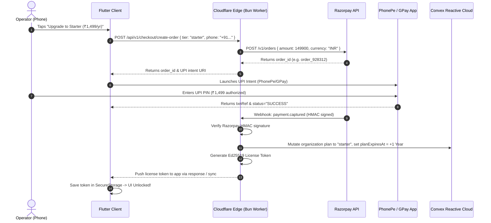

# Plan: 1-Tap UPI Checkout & Cloudflare Edge Webhook Pipeline

## 1. Overview & Objective
In the Indian mass market, credit cards and net banking account for $< 5\%$ of micro-business SaaS transactions. Local operators expect a **1-tap payment experience directly launching their installed UPI app (PhonePe, Google Pay, Paytm, BHIM)**.

This plan details the technical architecture for:
1. **Direct Android UPI Intent**: Triggering native payment apps without sluggish webview redirects.
2. **Cloudflare Edge Gateway (Bun Runtime)**: Serverless edge functions mediating Razorpay order creation and HMAC webhook validation.
3. **Automated Provisioning & WhatsApp Invoicing**: Upgrading Convex account state and delivering an instant digital tax invoice / license token back to the operator's phone.

---

## 2. Requirements & Scope

### In Scope
- **Edge API (Bun + Cloudflare Workers)**:
  - `POST /api/v1/checkout/create-order`: Generates Razorpay order ID and signed payload.
  - `POST /api/v1/checkout/webhook`: Receives Razorpay `payment.captured` event, validates HMAC SHA-256 signature, updates Convex organization status, and creates an Ed25519 license token.
- **Mobile Client Integration**:
  - Razorpay Flutter SDK / Android Native UPI Intent launcher.
  - Polling & instant reactive listener for payment confirmation.
- **Self-Healing Fallback**: If webhook delivery experiences delay, client polls edge worker `GET /api/v1/checkout/status?order_id=...` with exponential backoff.

### Out of Scope
- Recurring UPI AutoPay / e-Mandates in Phase 1 (focus on friction-free single annual UPI checkout first; AutoPay can be introduced in Phase 3).

---

## 3. Architecture & Technical Design

---

## 4. Implementation Checklist

- [ ] **Phase 1: Cloudflare Edge Worker (Bun Runtime)**
  - [ ] Implement `services/edge/src/index.ts` using Bun runtime standards.
  - [ ] Implement Razorpay order creation endpoint (`/api/v1/checkout/create-order`).
  - [ ] Implement HMAC-SHA256 signature verification for Razorpay webhooks (`/api/v1/checkout/webhook`).
  - [ ] Implement Ed25519 token generation using Web Crypto API.

- [ ] **Phase 2: Convex Backend Integration**
  - [ ] Implement mutation `convex/organizations.ts:upgradePlan`.
  - [ ] Store payment transaction logs in Convex `transactions` table.
  - [ ] Add audit trail of activated tiers and expiry dates.

- [ ] **Phase 3: Flutter Client Payment Handler**
  - [ ] Integrate Razorpay Flutter package or native UPI URI intent builder.
  - [ ] Add loading state, retry handler, and success confetti dialog.
  - [ ] Store received Ed25519 license token in `flutter_secure_storage`.
  - [ ] Update `AppModeService` and `LicenseService` reactive streams.

---

## 5. Verification Plan

### Automated Tests
- Bun test suite for edge worker: HMAC signature verification pass/fail unit tests.
- Convex mutation integration tests: verifying `plan` upgrade and `planExpiresAt` timestamp calculation.
- Client unit tests: payment result handler parsing success/failure UPI callbacks.

### Manual Verification
- Test end-to-end UPI flow in Razorpay Sandbox mode using test UPI apps on Android emulator / physical phone.
- Verify instant tier transition in Flutter UI without manual app restart.
