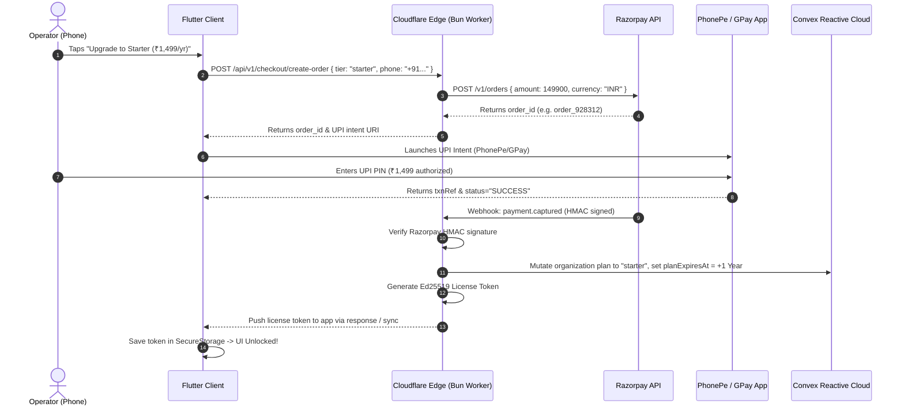

# Plan: 1-Tap UPI Checkout & Cloudflare Edge Webhook Pipeline

> ## NON-NORMATIVE — BLOCKED BY GATE 1
>
> **Status: this plan is a historical draft. No provider is selected, and the plan is
> blocked.** The backend vendor decision is **Gate 1** of
> [`../cloud-authoritative-offline-first-saas/plan.md`](../cloud-authoritative-offline-first-saas/plan.md)
> §11 and it is **still open**. Every **Convex**-specific name, mutation, table, and
> binding below — `CONVEX_URL`, `CONVEX_ADMIN_KEY`, `organizations:upgradePlan`,
> `organizations:upgradePlanFromPayment`, the Convex `transactions` table, the
> "Reactive Cloud" participant — is a **NON-NORMATIVE placeholder**. It is **not a
> selection, not a commitment, and not an API contract.** Do not implement it, and do not
> copy it into `services/cbk-edge` or any other active source.
>
> **Do not paper over the gap with an invented endpoint.** Until Gate 1 closes, the
> webhook's downstream step is simply **undefined**. It must not be replaced with a
> generic or guessed "mutate the plan" endpoint, a vendor-neutral HTTP shape, or a
> speculative schema invented here. Vendor selection is the decision Gate 1 exists to
> record; whatever shape the plan-state write takes must be re-derived from that
> recorded decision.
>
> **What remains valid and reusable:** the Cloudflare edge gateway, the Razorpay
> HMAC-SHA256 webhook verification seam, the native UPI intent launch, and the polling
> fallback. Those seams are provider-neutral and can be designed now against a contract
> and a test double.
>
> **Ordering:** checkout and commercial binding run at cloud Stage 8 and the commercial
> gate (**Gate 13**, §11), not before. Nothing in this plan is implemented, and nothing
> below is marked complete.

## 1. Overview & Objective
In the Indian mass market, credit cards and net banking account for $< 5\%$ of micro-business SaaS transactions. Local operators expect a **1-tap payment experience directly launching their installed UPI app (PhonePe, Google Pay, Paytm, BHIM)**.

This plan details the technical architecture for:
1. **Direct Android UPI Intent**: Triggering native payment apps without sluggish webview redirects.
2. **Cloudflare Edge Gateway (Bun Runtime)**: Serverless edge functions mediating Razorpay order creation and HMAC webhook validation.
3. **Automated Provisioning & WhatsApp Invoicing**: *(blocked — see below)* Upgrading **server-side organization plan state** and delivering an instant digital tax invoice / license token back to the operator's phone.

> **Blocked sub-goal 3.** The plan-state write is the vendor-dependent step this plan
> cannot specify. "Upgrading Convex account state" is replaced at Gate 1; until then the
> shape is undecided, and the "license token" half of it is separately superseded by
> server-side entitlements (see
> [`../gtm-freemium-paywall-licensing/licensing-architecture.md`](../gtm-freemium-paywall-licensing/licensing-architecture.md)
> and the canonical plan's §9.1).

---

## 2. Requirements & Scope

### In Scope
- **Edge API (Bun + Cloudflare Workers)**:
  - `POST /api/v1/checkout/create-order`: Generates Razorpay order ID and signed payload. *(Provider-neutral seam; valid.)*
  - `POST /api/v1/checkout/webhook`: Receives Razorpay `payment.captured` event and validates HMAC SHA-256 signature. *(Provider-neutral seam; valid.)*
  - **BLOCKED (Gate 1):** the downstream "updates organization plan status and issues a license token" step. The vendor, the mutation name, and the plan-state shape are undecided, and are deliberately left **undefined** here rather than guessed.
- **Mobile Client Integration**:
  - Razorpay Flutter SDK / Android Native UPI Intent launcher.
  - Polling & instant reactive listener for payment confirmation.
- **Self-Healing Fallback**: If webhook delivery experiences delay, client polls edge worker `GET /api/v1/checkout/status?order_id=...` with exponential backoff.

> **Pricing note.** The amounts and tier names inside the order-creation and status
> payloads are **illustrative placeholders**, not decided prices. The commercial gate
> (Gate 13, §11) decides them.

### Out of Scope
- Recurring UPI AutoPay / e-Mandates in Phase 1 (focus on friction-free single annual UPI checkout first; AutoPay can be introduced in Phase 3).

---

## 3. Architecture & Technical Design

> **The diagram below is a historical sketch.** Its `Convex Reactive Cloud` participant
> and its `Mutate organization plan` step are **NON-NORMATIVE and blocked by Gate 1**, and
> the amount `₹1,499/yr` with `tier: "starter"` is an undecided placeholder. Read the
> diagram for the **edge/UPI sequencing** only; treat the ledger write as unresolved.

```mermaid
sequenceDiagram
    autonumber
    actor Op as Operator (Phone)
    participant App as Flutter Client
    participant Edge as Cloudflare Edge (Bun Worker)
    participant RZP as Razorpay API
    participant UPI as PhonePe / GPay App
    participant Convex as Convex Reactive Cloud

    Op->>App: Taps "Upgrade to Starter (₹1,499/yr)"
    App->>Edge: POST /api/v1/checkout/create-order { tier: "starter", phone: "+91..." }
    Edge->>RZP: POST /v1/orders { amount: 149900, currency: "INR" }
    RZP-->>Edge: Returns order_id (e.g. order_928312)
    Edge-->>App: Returns order_id & UPI intent URI
    App->>UPI: Launches UPI Intent (PhonePe/GPay)
    Op->>UPI: Enters UPI PIN (₹1,499 authorized)
    UPI-->>App: Returns txnRef & status="SUCCESS"
    RZP->>Edge: Webhook: payment.captured (HMAC signed)
    Edge->>Edge: Verify Razorpay HMAC signature
    Edge->>Convex: Mutate organization plan to "starter", set planExpiresAt = +1 Year
    Edge->>Edge: Generate Ed25519 License Token
    Edge-->>App: Push license token to app via response / sync
    App->>App: Save token in SecureStorage -> UI Unlocked!
```

---

## 4. Implementation Checklist

> **Gate discipline.** Phases 1 and 3 are provider-neutral and unblocked. **Phase 2 is
> blocked by Gate 1 and must be rewritten after the vendor decision is recorded, not
> implemented as written.** No checkbox below changes state with this reconciliation.

- [ ] **Phase 1: Cloudflare Edge Worker (Bun Runtime)** *(provider-neutral; unblocked)*
  - [ ] Implement `services/edge/src/index.ts` using Bun runtime standards.
  - [ ] Implement Razorpay order creation endpoint (`/api/v1/checkout/create-order`).
  - [ ] Implement HMAC-SHA256 signature verification for Razorpay webhooks (`/api/v1/checkout/webhook`).
  - [ ] Implement Ed25519 token generation using Web Crypto API. **Revisit before starting:** the signed client token is superseded by server-side entitlements and becomes a cached, expiring grant — see [`../gtm-freemium-paywall-licensing/licensing-architecture.md`](../gtm-freemium-paywall-licensing/licensing-architecture.md) and the canonical plan's §9.1.

- [ ] **Phase 2: Backend plan-state integration — BLOCKED BY GATE 1, DO NOT IMPLEMENT AS WRITTEN**
  - [ ] **BLOCKED.** Implement mutation `convex/organizations.ts:upgradePlan`. The vendor is unselected; this name and path are non-normative placeholders.
  - [ ] **BLOCKED.** Store payment transaction logs in Convex `transactions` table.
  - [ ] **BLOCKED.** Add audit trail of activated tiers and expiry dates.
  - [ ] **Required in place of the three items above:** once Gate 1 records the backend decision, rewrite this phase against the selected provider and re-decide where plan state, payment records, and the entitlement audit trail live. Do not substitute an invented generic mutation endpoint.

- [ ] **Phase 3: Flutter Client Payment Handler** *(provider-neutral; unblocked, copy-blocked)*
  - [ ] Integrate Razorpay Flutter package or native UPI URI intent builder.
  - [ ] Add loading state, retry handler, and success confetti dialog.
  - [ ] Store received Ed25519 license token in `flutter_secure_storage`. **Revisit before starting:** the token is not the authority; entitlements are server-side (canonical §9.1).
  - [ ] Update `AppModeService` and `LicenseService` reactive streams.
  - [ ] **Copy gate:** no checkout, upgrade, or price surface may be added to the app before Gate 13 decides the offer, and no price, tier, or "free" wording may ship before then.

---

## 5. Verification Plan

### Automated Tests
- Bun test suite for edge worker: HMAC signature verification pass/fail unit tests.
- Convex mutation integration tests — **BLOCKED together with Phase 2.** There is no
  selected backend to integration-test; do not write these against a placeholder
  provider. The equivalent assertions are re-derived at Gate 1.
- Client unit tests: payment result handler parsing success/failure UPI callbacks.

### Manual Verification
- Test end-to-end UPI flow in Razorpay Sandbox mode using test UPI apps on Android emulator / physical phone.
- Verify instant tier transition in Flutter UI without manual app restart.
