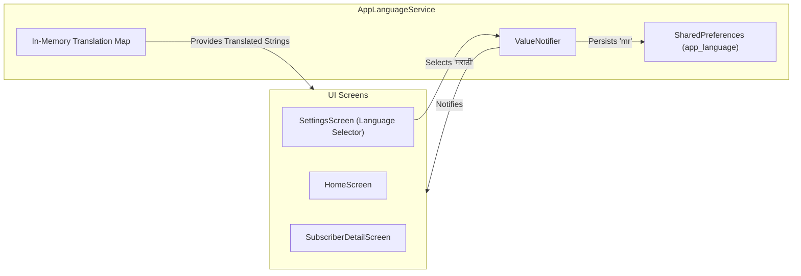

# Plan: Vernacular Localization Engine (i18n)

## 1. Overview & Objective
English-only B2B software fails catastrophically in India's Tier 2, Tier 3, and rural cable belts. More than $70\%$ of local cable operators in Maharashtra, UP, Bihar, Bengal, and Tamil Nadu maintain their paper registers (*bahi-khata*) in regional vernacular scripts.

This plan details the technical architecture for:
1. **5 Regional Language Support**: English (`en`), Hindi (`hi`), Marathi (`mr`), Bengali (`bn`), and Tamil (`ta`).
2. **Dynamic In-App Language Switching**: Reactive `AppLanguageService` enabling instant UI translation without restarting the app.
3. **Vernacular Jargon Standardization**: Accurate mapping of grassroots operational vocabulary (*line boy, pichla baqaya, parchi, chukta, box number*).
4. **Font & Layout Safeguards**: Preserving layout integrity, avoiding text clipping on entry-level Android devices with custom OEM system fonts.

---

## 2. Requirements & Scope

### In Scope
- **Languages**:
  - `en`: English (Default international terminology)
  - `hi`: हिन्दी (Northern belt - UP, Bihar, MP, Rajasthan, Haryana, Delhi)
  - `mr`: मराठी (Western cable hub - Maharashtra, Goa)
  - `bn`: বাংলা (Eastern belt - West Bengal, Tripura)
  - `ta`: தமிழ் (Southern cable belt - Tamil Nadu)
- **State Management**: `AppLanguageService` extending `ChangeNotifier` backed by `SharedPreferences`.
- **Localization System**: Lightweight JSON string loader or ARB translation catalog with parameter interpolation (`{name}`, `{amount}`, `{month}`).
- **Receipt Sync**: Automatic receipt language alignment with selected app language or per-subscriber language override.

### Out of Scope
- Dynamic speech-to-text voice entry (deferred to future roadmap).

---

## 3. Architecture & Technical Design

### 3.1 Localization Service Layer (`AppLanguageService`)



### 3.2 Dynamic String Interpolation Helper

```dart
// Usage in Flutter Widgets
Text(context.tr('balance_due', {'amount': '₹350'}))
```

---

## 4. Implementation Checklist

- [x] **Phase 1: Translation Assets & Catalog**
  - [x] Create `assets/i18n/` directory.
  - [x] Add JSON translation catalogs: `en.json`, `hi.json`, `mr.json`, `bn.json`, `ta.json`.
  - [x] Populate translations according to `vocabulary-matrix.md`.
  - [x] Register asset paths in `pubspec.yaml`.

- [x] **Phase 2: AppLanguageService & Extension**
  - [x] Implement `lib/services/app_language_service.dart`.
  - [x] Create BuildContext extension `context.tr(key, [args])`.
  - [x] Store chosen language code in `SharedPreferences`.

- [x] **Phase 3: UI Integration**
  - [x] Add language selector dialog / tile in [`lib/screens/settings_screen.dart`](lib/screens/settings_screen.dart).
  - [x] Localize home, subscriber list/detail, add/edit, payment recording, settings/import, and shared action/dialog surfaces.
  - [x] Keep the current route mounted during live language changes and use flexible detail labels for longer translations.
  - [x] Align generated WhatsApp receipt templates, service labels, and billing months with the selected app language.

### Automated Verification Status

- [x] Five catalogs load as Flutter assets and expose identical key sets.
- [x] All catalogs preserve English interpolation-token parity.
- [x] Missing regional keys fall back to English deterministically.
- [x] Selected language persists and updates the running widget tree without an app restart.
- [x] Cold-start tests cover supported/invalid app-language restoration, valid legacy migration, and explicit-value precedence.
- [x] Service-level composition tests prove every app-language selection reaches the matching receipt template without native launchers.
- [x] Unit/widget tests, Flutter analysis, and the Patrol Android compile gate pass.
- [x] Current-source Patrol completed 11/11 on the Mi A3 (`45fa99100e02`, Android 13 / API 33), including the Hindi import-history journey and a new five-language journey that switches between all five languages through the production Settings selector and renders Settings, the TV Import Wizard, Home, and Subscribers in each without an app restart. The passing run took 6m14 (6m42.24 wall time) and restored `screen_off_timeout` to 30000.
- [x] The five-language journey runs on the Mi A3's 720x1560 physical display and asserts `takeException() == null` after each localized Settings lower surface, Import Wizard, Home, and Subscriber List render, so a `RenderFlex`/layout exception in vernacular copy fails the journey deterministically. It also asserts, per locale, that four representative translated values resolve to that locale's own copy and not the captured English value, so a silent per-key English fallback cannot pass. The journey found one real defect before those guards existed: the Home dues hero-card header overflowed by 44px on the right with long vernacular labels. The header is now two expandable columns, and the journey asserts the localized label and count in all five languages.
- [x] Run history, kept distinct: the 10-journey source (before journey 11 existed) ran 9/10 when a Patrol semantics-handle leak failed the first journey at end of test, and an identical-source rerun of that 10-journey tree completed 10/10; while journey 11 was being built, interim runs sat at 10/11 with the new journey itself failing and one of them surfacing the 44px hero-card overflow; the current source passes 11/11 after the responsive fix. No 10/10 run of the 11-journey source is claimed.

---

## 5. Verification Plan

### Automated Tests
- Unit test: verify all 5 language JSON files share identical key sets (zero missing keys).
- Unit test: string interpolation replacing tokens properly across all languages.

### Manual Verification
- [ ] Toggle through all five languages in Settings on a named Android device and verify representative app screens in each language. The automated journey does this on the Mi A3; a native-speaker/editorial review of the copy is still outstanding.
- [ ] On a low-resolution Android screen, verify wrapping and layout in all five languages with no `RenderFlex overflowed` errors. The automated journey already proves no overflow on the Mi A3's 720x1560 display for Settings, the TV Import Wizard, Home, and Subscribers; this manual pass covers visual quality, truncation, and any surface the journey does not render.
- [ ] Record the device/API and exact manual result when these all-language visual checks are performed. No all-five-language manual visual pass is currently claimed; the automated five-language journey passed on the Mi A3 as recorded above.
