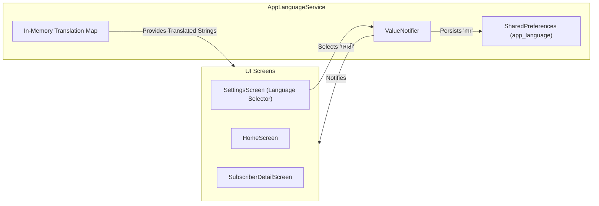

# Plan: Vernacular Localization Engine (i18n)

## 1. Overview & Objective
English-only B2B software fails catastrophically in India's Tier 2, Tier 3, and rural cable belts. More than $70\%$ of local cable operators in Maharashtra, UP, Bihar, Bengal, and Tamil Nadu maintain their paper registers (*bahi-khata*) in regional vernacular scripts.

This plan details the technical architecture for:
1. **5 Regional Language Support**: English (`en`), Hindi (`hi`), Marathi (`mr`), Bengali (`bn`), and Tamil (`ta`).
2. **Dynamic In-App Language Switching**: Reactive `AppLanguageService` enabling instant UI translation without restarting the app.
3. **Vernacular Jargon Standardization**: Accurate mapping of grassroots operational vocabulary (*line boy, pichla baqaya, parchi, chukta, box number*).
4. **Font & Layout Safeguards**: Preserving layout integrity, avoiding text clipping on entry-level Android devices with custom OEM system fonts.

---

## 2. Requirements & Scope

### In Scope
- **Languages**:
  - `en`: English (Default international terminology)
  - `hi`: हिन्दी (Northern belt - UP, Bihar, MP, Rajasthan, Haryana, Delhi)
  - `mr`: मराठी (Western cable hub - Maharashtra, Goa)
  - `bn`: বাংলা (Eastern belt - West Bengal, Tripura)
  - `ta`: தமிழ் (Southern cable belt - Tamil Nadu)
- **State Management**: `AppLanguageService` extending `ChangeNotifier` backed by `SharedPreferences`.
- **Localization System**: Lightweight JSON string loader or ARB translation catalog with parameter interpolation (`{name}`, `{amount}`, `{month}`).
- **Receipt Sync**: Automatic receipt language alignment with selected app language or per-subscriber language override.

### Out of Scope
- Dynamic speech-to-text voice entry (deferred to future roadmap).

---

## 3. Architecture & Technical Design

### 3.1 Localization Service Layer (`AppLanguageService`)



### 3.2 Dynamic String Interpolation Helper

```dart
// Usage in Flutter Widgets
Text(context.tr('balance_due', {'amount': '₹350'}))
```

---

## 4. Implementation Checklist

- [ ] **Phase 1: Translation Assets & Catalog**
  - [ ] Create `assets/i18n/` directory.
  - [ ] Add JSON translation catalogs: `en.json`, `hi.json`, `mr.json`, `bn.json`, `ta.json`.
  - [ ] Populate translations according to `vocabulary-matrix.md`.
  - [ ] Register asset paths in `pubspec.yaml`.

- [ ] **Phase 2: AppLanguageService & Extension**
  - [ ] Implement `lib/services/app_language_service.dart`.
  - [ ] Create BuildContext extension `context.tr(key, [args])`.
  - [ ] Store chosen language code in `SharedPreferences`.

- [ ] **Phase 3: UI Integration**
  - [ ] Add language selector bottom sheet / tile in [`lib/screens/settings_screen.dart`](file:///c:/projects/cross/collection_book/lib/screens/settings_screen.dart).
  - [ ] Replace hardcoded strings in [`lib/screens/home_screen.dart`](file:///c:/projects/cross/collection_book/lib/screens/home_screen.dart), [`lib/screens/subscriber_list_screen.dart`](file:///c:/projects/cross/collection_book/lib/screens/subscriber_list_screen.dart), and [`lib/screens/record_payment_screen.dart`](file:///c:/projects/cross/collection_book/lib/screens/record_payment_screen.dart).
  - [ ] Validate button paddings and chip widths for longer vernacular strings.

---

## 5. Verification Plan

### Automated Tests
- Unit test: verify all 5 language JSON files share identical key sets (zero missing keys).
- Unit test: string interpolation replacing tokens properly across all languages.

### Manual Verification
- Toggle through all 5 languages in Settings on an Android test device.
- Verify text wrapping on low-resolution screens (e.g. 720x1600 DPI) to ensure no overflow errors (`RenderFlex overflowed`).
