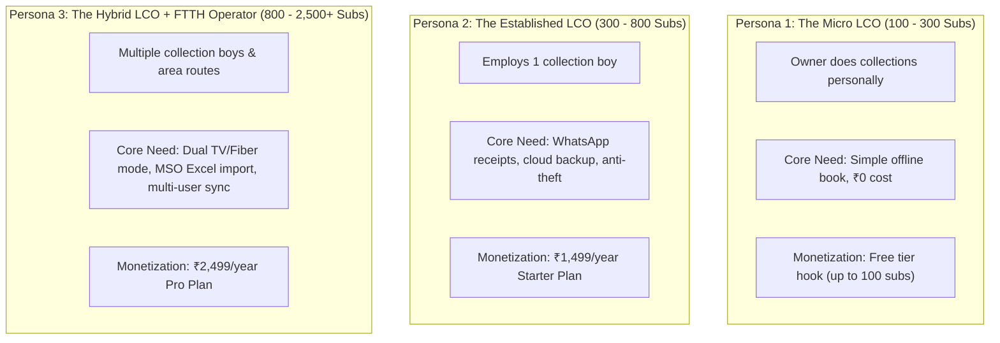
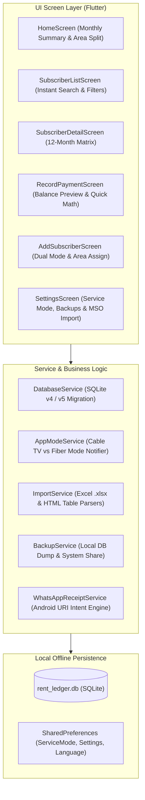
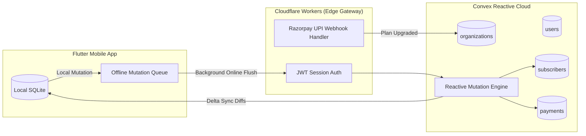

# Collection Book: Product Requirements Document (PRD) & Product Specification

**Version:** 1.0.0  
**Status:** Approved for Implementation  
**Target Market:** India (Local Cable Operators - LCOs & FTTH Internet Service Providers - ISPs)  
**Primary Platforms:** Android (Flutter Client), Convex Reactive Cloud (Cloudflare Edge Gateway)  
**Runtime & Tooling Standard:** Bun runtime for backend scripts; Flutter 3.29+ / Dart 3.9+ for mobile client.

---

## 1. Executive Summary & Vision

### 1.1 Product Statement
**Collection Book** (formerly *Rent Ledger*) is an offline-first, door-to-door billing, ledger, and cash-reconciliation mobile application engineered specifically for India’s **85,000+ Local Cable Operators (LCOs)** and **15,000+ local FTTH broadband ISPs**.

### 1.2 The Core Problem
For three decades, local cable operators and small neighborhood internet providers in India have managed multi-lakh monthly cash collections using handwritten paper diaries (*bahi-khata* or *collection registers*). 
* **Cash Leakage (*Hisab Gol Karna*)**: Field collection agents (*line boys*) collect cash at customer doorsteps, manipulate carbon receipts, or fail to reconcile partial dues.
* **Dispute Friction**: Customers frequently claim past payments (*"Maine toh pichle mahine de diya tha!"*), forcing operators to either forfeit revenue or lose customers to DTH/Jio/Airtel.
* **Field Disconnection**: In high-density chawls, basement flats, and rural fringes, mobile internet drops to 2G or zero signal, causing existing web-based SaaS apps (BixApp, Mobiezy) to hang or crash.
* **Incumbent Price Gouging**: Legacy software vendors lock operators into upfront annual contracts of ₹3,000 to ₹6,000+ per year with complex desktop-first software requiring manual training.

### 1.3 The Solution
Collection Book provides:
1. **100% Offline-First Speed**: Powered by local embedded SQLite. Instant search across 2,000+ subscribers with zero network latency.
2. **Field-Optimized UX**: One-tap payment logging, automated arrears/advance calculation (*Clear Due Helper*), and dual-service switching (Cable TV Blue vs Fiber Green).
3. **Zero-Cost WhatsApp Receipts**: Uses native Android platform intents (`whatsapp://send`) to deliver branded digital receipts in regional languages without Meta Cloud API fees.
4. **MSO Parser**: Instant onboarding by parsing existing MSO billing files (Siti, DEN, GTPL, Hathway) from Excel (`.xlsx`) or HTML tables in seconds.
5. **Freemium Self-Serve Pricing**: A permanent **Free Tier (up to 100 subscribers)** that transitions into a disruptive **₹1,499/year Starter Plan** with instant UPI checkout.

---

## 2. Market Context & Competitive Landscape

### 2.1 Market Sizing (India)
* **Total Local Cable Operators (LCOs)**: ~85,000 active operators (AIDCF & EY Industry Reports).
* **Wired Broadband Subscribers**: 48+ Million connections (TRAI Performance Indicators).
* **Total Addressable Market (TAM)**: ~1,00,000 independent cable & ISP entities.
* **Serviceable Addressable Market (SAM)**: ~65,000 operators with 100 to 2,500 active subscribers.
* **Serviceable Obtainable Market (SOM - 3-Year Target)**: 5,000 paying operators (~5% market penetration), generating **~₹90 Lakhs ($108k USD) ARR** at **>96% net software margins**.

### 2.2 Competitive Matrix

| Feature / Dimension | Traditional Paper Register | Generic Khata Apps *(Khatabook, OkCredit)* | Legacy Cable SaaS *(BixApp, Mobiezy)* | **Collection Book** |
| :--- | :--- | :--- | :--- | :--- |
| **Pricing** | ₹150 notebook cost | Free (ad/loan monetization) | ₹2,500 – ₹6,000 / year (mandatory upfront) | **Free (100 subs) / ₹1,499/yr Starter** |
| **Offline Reliability** | 100% offline (paper) | Requires internet for sync/reload | Degraded / hangs on poor 2G/4G | **100% Offline-First SQLite Engine** |
| **Subscription Cycles** | Manual cross-checking | Single-entry debtor credit only | Supported | **Native 12-Month Matrix & Billing Cycles** |
| **VC / STB Card Search** | Impossible (leaf through pages) | Not supported | Supported | **Instant Search by Name, Alias, or VC #** |
| **Dual Service Mode** | Difficult (multiple diaries) | Not supported | Fragmented modules | **Instant Toggle: Cable TV vs Fiber Internet** |
| **Receipt Delivery** | Handwritten carbon slip | SMS link (charges apply) | WhatsApp API (expensive) | **Zero-Cost Device WhatsApp Intent** |
| **Onboarding Speed** | Manual re-writing every year | Manual customer typing | Manual onboarding call | **Instant MSO Excel/HTML Import** |
| **Language Support** | Handwritten local dialect | Multilingual | Primarily English/Hindi | **English, Hindi, Marathi, Bengali, Tamil** |

---

## 3. Target User Personas & Jobs to Be Done (JTBD)

### 3.1 Field Terminology & Vocabulary

| Vernacular Term | English Definition | Operational Reality |
| :--- | :--- | :--- |
| **Collection Book / Register** | The collection diary | The dog-eared physical notebook carried on motorbikes to mark collections with pencil ticks. |
| **Line Boy / Collection Boy** | Field collection technician | The frontline worker who splices fiber, fixes signal drops, and collects cash door-to-door from the 1st to 15th. |
| **VC Number / STB Number** | Viewing Card Number | Unique 10–12 digit hardware ID on the subscriber Set-Top Box or fiber ONT MAC address. |
| **Pichla Baqaya (पिछला बकाया)**| Previous Dues / Arrears | Unpaid balances carried forward when a subscriber makes a partial payment or travels. |
| **Parchi / Rasid (पर्ची / रसीद)** | Paper receipt slip | Carbon-copy paper slip torn from a book upon receiving cash. |
| **Hisab Gol Karna (हिसाब गोल करना)**| Cash skimming | When a line boy collects ₹300, records ₹200, and pockets the difference. |
| **Recharge / MSO Portal** | Portal Wallet Top-up | Monthly payment the LCO makes to Siti, DEN, GTPL, or Hathway to keep channels authorized. |

### 3.2 ICP Personas



#### Persona 1: "Ramesh Bhai" – The Micro LCO
* **Profile**: Operates 150 to 250 cable TV connections in a semi-urban colony or large village. Works with Siti or GTPL.
* **Current State**: Uses a ₹150 paper notebook. Collects money door-to-door himself on a motorcycle.
* **Key Pain**: Loses the diary or gets it soaked in monsoon rain; forgets who paid partial dues.
* **Adoption Trigger**: Downloads free app from Google Play Store; replaces paper register immediately without spending money.

#### Persona 2: "Suresh Patel" – The Established LCO
* **Profile**: 400 to 700 connections across 4 neighborhoods. Employs 1 line boy for field collection.
* **Current State**: Line boy brings back cash every evening; Suresh spends 1.5 hours cross-checking tick marks.
* **Key Pain**: Suspects line boy pockets partial cash; customers dispute arrears.
* **Adoption Trigger**: Line boy uses app; 1-tap WhatsApp receipt sent to customer immediately upon collection. Upgrades to **₹1,499/year Starter Plan**.

#### Persona 3: "Vikram Reddy" – The Hybrid Cable & Fiber ISP
* **Profile**: 1,200 cable TV subscribers and 400 fiber broadband subscribers. Employs 3 collection boys.
* **Current State**: Uses desktop Excel in the office and paper books in the field.
* **Key Pain**: Cable TV is billed per calendar month (₹250–₹350), but Fiber internet has varied plans (₹499/mo, ₹799/mo) and renewal dates.
* **Adoption Trigger**: Bulk imports MSO subscriber list via Excel in 30 seconds; switches between Cable TV and Fiber modes with one tap; manages team permissions. Upgrades to **₹2,499/year Pro Plan**.

### 3.3 Jobs to Be Done (JTBD) Framework
* **Functional Job**: Reconcile monthly door-to-door subscriptions street-by-street without losing cash, forgetting dues, or spending 4 hours every weekend auditing paper notes.
* **Emotional Job**: Relief from constant suspicion that field boys are pocketing collections or that customers are bluffing about past payments.
* **Social Job**: Look modern, tech-savvy, and transparent in front of younger fiber customers who demand instant digital WhatsApp payment confirmations.

---

## 4. Product Architecture & Technical Design

### 4.1 Client-Side System Architecture (Flutter + SQLite)
The mobile application operates as an autonomous, single-tenant, local SQLite database client. Zero network connectivity is required for core ledger operations.



### 4.2 Database Schema Specification (`rent_ledger.db`)

#### Table: `areas`
Stores physical neighborhoods, wards, colonies, or collection routes.
```sql
CREATE TABLE areas (
  id INTEGER PRIMARY KEY AUTOINCREMENT,
  name TEXT NOT NULL UNIQUE
);
```

#### Table: `subscribers`
Core customer registry with dual service categorization, billing metadata, and hardware IDs.
```sql
CREATE TABLE subscribers (
  id INTEGER PRIMARY KEY AUTOINCREMENT,
  area_id INTEGER,
  name TEXT NOT NULL,
  alias_name TEXT,
  phone TEXT,                                -- Upgraded in Schema v5 for WhatsApp receipts
  vc_number TEXT,                            -- Viewing Card or STB Number / ONT MAC
  monthly_rent REAL NOT NULL DEFAULT 0,
  previous_due REAL NOT NULL DEFAULT 0,      -- Initial legacy carryover balance
  is_active INTEGER NOT NULL DEFAULT 1,
  service_type TEXT NOT NULL DEFAULT 'tv',   -- 'tv' | 'fiber' | 'both'
  start_year INTEGER,                        -- Start tracking year
  start_month INTEGER,                       -- Start tracking month (1-12)
  created_at TEXT NOT NULL DEFAULT (datetime('now')),
  FOREIGN KEY (area_id) REFERENCES areas(id)
);

CREATE INDEX idx_subscribers_area ON subscribers(area_id);
CREATE INDEX idx_subscribers_phone ON subscribers(phone);
```

#### Table: `payments`
Immutable ledger entries for each monthly billing reconciliation.
```sql
CREATE TABLE payments (
  id INTEGER PRIMARY KEY AUTOINCREMENT,
  subscriber_id INTEGER NOT NULL,
  year INTEGER NOT NULL,
  month INTEGER NOT NULL,                     -- Billing month (1-12)
  amount_paid REAL NOT NULL DEFAULT 0,        -- Actual cash/UPI collected
  adjustment REAL NOT NULL DEFAULT 0,         -- Positive = surcharge/charge, Negative = discount/waiver
  adjustment_note TEXT,                       -- Reason for adjustment (e.g. "Wire damage discount")
  recorded_at TEXT NOT NULL DEFAULT (datetime('now')),
  FOREIGN KEY (subscriber_id) REFERENCES subscribers(id),
  UNIQUE(subscriber_id, year, month)
);

CREATE INDEX idx_payments_subscriber ON payments(subscriber_id, year, month);
```

### 4.3 Balance & Due Calculation Engine
The system calculates a subscriber's outstanding balance dynamically using a cumulative carry-forward formula:

$$\text{Balance}_{\text{Initial}} = \text{previous\_due}$$

For each active billing month $m$ from start date up to current date:

$$\text{Charge}_m = \text{monthly\_rent} + \text{adjustment}_m$$
$$\text{Due}_m = \text{Balance}_{m-1} + \text{Charge}_m - \text{amount\_paid}_m$$

* **If $\text{Due} > 0$**: Subscriber owes arrears (highlighted in Red).
* **If $\text{Due} = 0$**: Fully cleared (highlighted in Green).
* **If $\text{Due} < 0$**: Subscriber has paid in advance (highlighted in Blue).

---

## 5. Feature & Screen Specifications

### 5.1 Service Mode Dynamic Theming (Cable TV vs Fiber Internet)
Operators frequently offer both Cable TV and Fiber Internet, but maintain distinct pricing and collection cycles.
* **Cable TV Mode**:
  * **Brand Color**: Deep Royal Blue (`#1565C0`)
  * **Icon**: Phosphor `television`
  * **Filter**: Shows subscribers with `service_type IN ('tv', 'both')`
* **Fiber Internet Mode**:
  * **Brand Color**: Forest Emerald Green (`#2E7D32`)
  * **Icon**: Phosphor `globe` / `wifiHigh`
  * **Filter**: Shows subscribers with `service_type IN ('fiber', 'both')`
* **Global Reactivity**: Managed via `AppModeService` with a `ValueNotifier<ServiceMode>`. Toggling the mode in Settings instantly updates the theme color and filters all dashboard figures, subscriber lists, and payment records without app reload.

### 5.2 Dashboard (Home Screen)
* **Month Selector**: Header with previous/next month navigation arrows and year display.
* **KPI Metrics Cards**:
  1. **Total Expected Rent**: Sum of all active monthly rents + opening arrears.
  2. **Total Collected**: Total cash collected in the selected month.
  3. **Total Outstanding Dues**: Remaining unpaid balance for the month.
  4. **Active Subscribers**: Total active subscriber count for the active mode.
* **Area-Wise Collection Breakdown**:
  * Visual cards for each neighborhood showing: `Area Name`, `Collected / Total Expected`, and `Remaining Dues`.
  * Enables the operator to immediately see which neighborhood/lane has lag in collection.

### 5.3 Subscriber Directory & Instant Search
* **Search Field**: Real-time filtering with debounce across Name, Alias (e.g., *"Chintu Grocery"*), and VC/STB Card Number.
* **Filter Pills**:
  * **All**: Entire directory.
  * **Unpaid**: Outstanding balance $> 0$.
  * **Paid**: Outstanding balance $\le 0$.
  * **Partial**: Amount paid $> 0$ but balance remaining.
  * **Inactive**: Suspended / disconnected connections.
* **Area Dropdown Filter**: Restricts view to a specific lane or colony for door-to-door rounds.
* **Subscriber List Card**: Displays Name, VC Number, Area Tag, Monthly Rent, and Due Balance Pill (Red for due, Green for paid, Blue for advance).

### 5.4 12-Month Matrix (Subscriber Detail Screen)
* **Header Profile**: Subscriber name, alias, VC number, phone number, area tag, monthly rate, and active switch.
* **Financial Summary Cards**: Year Start Balance, Total Billed, Total Paid, and Current Balance.
* **The 12-Month Grid**:
  * Displays 12 month chips (`Jan` to `Dec`) for the selected year.
  * Color-coded status:
    * **Solid Green**: Paid in full ($\text{paid} \ge \text{rent}$).
    * **Solid Orange**: Partial payment ($\text{paid} > 0$ but $<$ rent).
    * **Solid Red**: Zero payment recorded.
    * **Muted Grey**: Month prior to subscriber activation.
  * Tapping any month card opens the payment recorder pre-filled for that month.
* **Payment Ledger History**: Reverse-chronological list of all transactions with date stamps, adjustments, notes, and deletion option.

### 5.5 Record Payment & "Clear Due Helper"
* **Input Form**:
  * Subscriber selector (with auto-focus and search).
  * Billing Month and Year picker.
  * Amount Paid (numeric keypad, instant formatting).
  * Adjustments & Adjustment Note (e.g. discount or installation charge).
* **"Clear Due Helper" (Magic Wand)**:
  * One-tap button that calculates the exact sum required to zero out all historical arrears plus current month rent.
  * Eliminates mental math errors for line boys at the doorstep.
* **Real-Time Projection Pill**:
  * Dynamically updates as the operator types numbers:
    * *"After save: due becomes 0 (fully clear)."*
    * *"After save: remaining due will be ₹150."*
    * *"After save: advance will be ₹200."*
* **1-Tap WhatsApp Receipt Generator**:
  * Directly launches WhatsApp with pre-filled message text in the chosen regional language.

```
*Collection Book Receipt*
Date: 23-Sep-2026
Customer: Rajesh Sharma (VC: 0214889210)
Paid Amount: ₹350
Month: September 2026
Remaining Due: ₹0 (Fully Paid)
Collected By: Ramesh Cable Network
Thank you for your timely payment!
```

### 5.6 MSO Bulk Import Engine (`ImportService`)
Operators migrating from Siti, DEN, GTPL, or Hathway receive raw files from their MSO portal. The app includes an embedded parser:
1. **Format 1 - Book1 XLSX Ledger**: Parses Excel worksheets containing customer names, VC numbers, monthly rent, and past monthly payment records.
2. **Format 2 - Active Packages HTML Report**: Parses HTML tables containing `STB_NUMBER`, `CUSTOMER_NAME`, `START_DATE`, and package pricing.
3. **Format 3 - Total List HTML Report**: Parses HTML tables with `STB_ISSUE_DATE`, address/area, and connection statuses.
* **Auto Area Creation**: Discovers unknown areas in the file and inserts them into the `areas` table automatically.
* **Deduplication Engine**: Matches on `vc_number` first, then falls back to normalized customer name to prevent duplicate customer records.

### 5.7 Backup, Sharing & Data Protection
* **Local SQLite Dump**: Generates a timestamped `.db` backup in application document storage.
* **Native System Share**: Directly shares the database file to WhatsApp, Google Drive, Gmail, or SD card via `share_plus`.
* **Restore from File**: File picker to restore database state with automatic validation.

---

## 6. Cloud Backend & Synchronization Architecture (Convex + Cloudflare)

For multi-device synchronization (Owner in office + 3 Line Boys on field), Collection Book pairs the Flutter SQLite engine with a **Convex TypeScript reactive backend** mediated by a Cloudflare Edge Gateway.



### 6.1 Convex Schema Blueprint (`convex/schema.ts`)
```typescript
import { defineSchema, defineTable } from "convex/server";
import { v } from "convex/values";

export default defineSchema({
  // Organization / Operator Business Account
  organizations: defineTable({
    name: v.string(),
    ownerPhone: v.string(),
    state: v.string(),
    plan: v.union(v.literal("free"), v.literal("starter"), v.literal("pro")),
    planExpiresAt: v.optional(v.number()),
    maxSubscribers: v.number(),
    upiVpa: v.optional(v.string()),
    createdAt: v.number(),
  }).index("by_phone", ["ownerPhone"]),

  // Staff Accounts (Owner Admin vs Line Boy Collector)
  users: defineTable({
    orgId: v.id("organizations"),
    name: v.string(),
    phone: v.string(),
    role: v.union(v.literal("admin"), v.literal("collector")),
    isActive: v.boolean(),
  }).index("by_org", ["orgId"]),

  // Areas / Wards / Routes
  areas: defineTable({
    orgId: v.id("organizations"),
    name: v.string(),
    serverCreatedAt: v.number(),
  }).index("by_org", ["orgId"]),

  // Subscribers
  subscribers: defineTable({
    orgId: v.id("organizations"),
    areaId: v.optional(v.id("areas")),
    localId: v.number(), // maps to local SQLite id
    name: v.string(),
    phone: v.optional(v.string()),
    aliasName: v.optional(v.string()),
    vcNumber: v.optional(v.string()),
    monthlyRent: v.number(),
    previousDue: v.number(),
    serviceType: v.union(v.literal("tv"), v.literal("fiber"), v.literal("both")),
    startYear: v.number(),
    startMonth: v.number(),
    isActive: v.boolean(),
    updatedAt: v.number(),
  })
    .index("by_org", ["orgId"])
    .index("by_org_and_area", ["orgId", "areaId"]),

  // Payments
  payments: defineTable({
    orgId: v.id("organizations"),
    subscriberId: v.id("subscribers"),
    collectedByUserId: v.id("users"),
    year: v.number(),
    month: v.number(),
    amountPaid: v.number(),
    adjustment: v.number(),
    recordedAt: v.number(),
  })
    .index("by_sub", ["subscriberId"])
    .index("by_org_month", ["orgId", "year", "month"]),
});
```

---

## 7. Pricing, Packaging & Unit Economics

### 7.1 Tier Packaging Matrix

| Tier Name | Target Operator | Price Point | Subscriber Limit | Devices & Logins | Key Capabilities |
| :--- | :--- | :--- | :--- | :--- | :--- |
| **Free Tier** *(Micro LCO)* | Village / Small Colony | **₹0 Forever** | Up to 100 Connections | 1 Device | 100% Offline SQLite, Search, Manual Payment Log |
| **Starter Tier** *(Apna Operator)* | Established Cable LCO | **₹199 / month** or **₹1,499 / year** | Up to 500 Connections | 1 Owner + 1 Line Boy | 1-Tap WhatsApp Receipts, Automated Cloud Backup, UPI Links |
| **Pro Tier** *(Super Operator)* | Hybrid Cable + FTTH ISP | **₹349 / month** or **₹2,499 / year** | Up to 2,000 Connections | Unlimited Line Boys | MSO Bulk Excel Import, Multi-User Roles, P&L & Aging Reports |

### 7.2 Economics at 5,000 Paying Customers

$$\begin{aligned}
\text{Starter Plan (70%):} \quad & 3,500\ \text{operators} \times ₹1,499/\text{yr} = \mathbf{₹52,46,500} \\
\text{Pro Plan (30%):} \quad & 1,500\ \text{operators} \times ₹2,499/\text{yr} = \mathbf{₹37,48,500} \\
\hline
\mathbf{\text{Total Annual Recurring Revenue (ARR):}} \quad & \mathbf{₹89,95,000\ (\approx ₹90\ \text{Lakhs\ INR}\ /\ \approx \$108,000\ \text{USD})}
\end{aligned}$$

#### Annual Infrastructure Cost at 5,000 Customers:
* Convex Cloud Database: ~$70/mo ($\approx ₹70,000/\text{year}$)
* Cloudflare Workers & KV: ~$5/mo ($\approx ₹5,000/\text{year}$)
* Razorpay UPI Fees: ~2% deducted at transaction ($\approx ₹1,80,000/\text{year}$)
* Total Infrastructure Cost: **$\approx ₹2,55,000/\text{year}$**
* **Net Software Gross Margin: $> 97.1\%$**

---

## 8. Go-To-Market & Growth Strategy

### 8.1 Why Google Ads Fails vs Meta Advantage+ & Reels
* **Google Search Trap**: Search keywords like *"cable billing software"* have high CPC (₹65–₹200) with low volume. Most operators search in regional queries or don't know software exists.
* **Meta Advantage+ Advantage**: Indian operators spend 2+ hours daily on Facebook and Instagram Reels. 
  * Target profile: Men, 28–52, self-employed, interested in *DTH television, Siti Networks, DEN Networks, GTPL, BharatNet, optical fiber*.
  * Budget: ₹500/day generating ₹12–₹25 CPI (Cost Per Install).

### 8.2 Regional Language Playbook
Tier 2, 3, and 4 cable operators operate almost exclusively in vernacular languages.
* **Initial 5 Supported Languages**:
  1. **English (`en`)**: Default UI
  2. **Hindi (`hi`)**: Northern belt (UP, MP, Bihar, Rajasthan, Delhi-NCR)
  3. **Marathi (`mr`)**: Western cable belt (Maharashtra, Goa)
  4. **Bengali (`bn`)**: Eastern belt (West Bengal, Tripura)
  5. **Tamil (`ta`)**: Southern cable stronghold (Tamil Nadu)
* **Play Store ASO**: Vernacular metadata, titles, and localized screenshots (*"केबल और इंटरनेट कलेक्शन बुक"*).

---

## 9. Phased Implementation Roadmap

```
┌─────────────────────────────────┬─────────────────────────────────┬─────────────────────────────────┐
│ PHASE 1: CLIENT ENHANCEMENT     │ PHASE 2: CLOUD SYNC & BACKEND   │ PHASE 3: MONETIZATION & GTM     │
│ (Milestone 1)                   │ (Milestone 2)                   │ (Milestone 3)                   │
├─────────────────────────────────┼─────────────────────────────────┼─────────────────────────────────┤
│ • SQLite v5 migration (`phone`) │ • Initialize Convex backend     │ • Enforce 100-subscriber cap    │
│ • WhatsApp device intent engine │ • Cloudflare Worker edge auth   │ • Razorpay UPI in-app paywall   │
│ • 5-language regional i18n kit  │ • Offline mutation sync queue   │ • Google Play Store release     │
│ • MSO parser mobile file-picker │ • Role-based permissions        │ • Meta Advantage+ ad campaign   │
│ • Clear Due Helper refinement   │ • Automated daily cloud backups │ • Direct WhatsApp outbound loop │
└─────────────────────────────────┴─────────────────────────────────┴─────────────────────────────────┘
```

---

## 10. Non-Functional Requirements & Guardrails

1. **Performance**:
   * App launch time to interactive $< 800\text{ms}$ on an entry-level Android device (4GB RAM, MediaTek G35).
   * Search queries across 2,500 subscribers must return within $< 16\text{ms}$ (maintaining 60 FPS).
2. **Offline Durability**:
   * Zero data loss if app is closed or phone battery dies during a transaction.
   * Full offline capability: app never blocks user actions with a loading spinner due to lack of network.
3. **Data Sovereignty**:
   * Operators retain 100% ownership of their data. They can export an unencrypted SQLite `.db` file at any time without paying a fee.
4. **Tooling Rule**:
   * Strictly adhere to `bun` as the JavaScript runtime for all backend scripts and Convex functions (no `npm` or `npx`).
