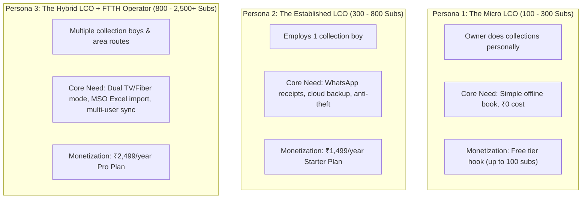
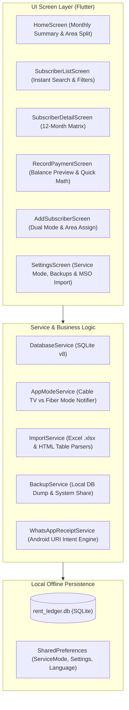

# Collection Book: Product Requirements Document (PRD) & Product Specification

**Version:** 1.1.0 (records the cloud-authoritative SaaS pivot; superseded target-state claims in §6 and §9)

**Status:** Product intent and target direction approved. **Implementation status: Stage 0 only** (this document and the plan set). No cloud, sync, identity, tenancy, RBAC, audit, or DR capability is implemented; the shipped app is local-only.

**Target Market:** India (Local Cable Operators - LCOs & FTTH Internet Service Providers - ISPs)

**Primary Platforms:** Android (Flutter Client). The **current** backend is local-only SQLite plus an additive Cloudflare edge slice (`services/cbk-edge`) for landing, privacy, referral, and telemetry intake. The cloud ledger is the approved *target* and is **not built**.

**Runtime & Tooling Standard:** Bun runtime for backend scripts; Flutter 3.29+ / Dart 3.9+ for mobile client.

### Status and Current-vs-Target Note

> **Read this before the rest of the document.**
>
> - **CURRENT (shipped):** the product is a **local-authoritative, single-tenant, offline-first
>   Android app**. The SQLite database on the device is the ledger. There is **no account,
>   no cloud ledger, no synchronization, no multi-user roles, and no server-side
>   authorization**. Customer-facing copy (landing page, privacy policy, Play Store
>   listing) is deliberately written to that reality.
> - **TARGET (approved direction, not implemented):** the product becomes an
>   **offline-capable, cloud-authoritative, multi-tenant SaaS**. The cloud ledger is the
>   system of record; SQLite becomes a **local cache plus a mutation outbox**. Offline
>   operation is preserved as a hard requirement: writes may be accepted locally and
>   queued, and the cloud becomes canonical after reconciliation.
> - This document is the **product** statement. The **implementation** statement is
>   [`docs/plans/cloud-authoritative-offline-first-saas/plan.md`](docs/plans/cloud-authoritative-offline-first-saas/plan.md),
>   which holds the full phased checklist. **No checkbox in it is complete**, and the
>   only rollout stage recorded as complete is **Stage 0, this documentation pivot**
>   (documentation only). Everything from Stage 1 onward is unstarted.
> - Earlier revisions of this document named **Convex** as the cloud ledger. That was a
>   provisional assumption, it was never built, and **it is not a selection**. The backend
>   vendor is an open decision gate that blocks provider-dependent work only. Do not read
>   any Convex reference below as a commitment; **§6.3** records it as superseded history.
> - Customer-facing copy must never lead the implementation. Nothing in this document
>   authorizes changing shipped landing, privacy, or Play Store metadata to imply a cloud
>   product that does not exist.

---

## 1. Executive Summary & Vision

### 1.1 Product Statement
**Collection Book** (formerly *Rent Ledger*) is an offline-first, door-to-door billing, ledger, and cash-reconciliation mobile application engineered specifically for India’s **85,000+ Local Cable Operators (LCOs)** and **15,000+ local FTTH broadband ISPs**.

### 1.2 The Core Problem
For three decades, local cable operators and small neighborhood internet providers in India have managed multi-lakh monthly cash collections using handwritten paper diaries (*bahi-khata* or *collection registers*). 
* **Cash Leakage (*Hisab Gol Karna*)**: Field collection agents (*line boys*) collect cash at customer doorsteps, manipulate carbon receipts, or fail to reconcile partial dues.
* **Dispute Friction**: Customers frequently claim past payments (*"Maine toh pichle mahine de diya tha!"*), forcing operators to either forfeit revenue or lose customers to DTH/Jio/Airtel.
* **Field Disconnection**: In high-density chawls, basement flats, and rural fringes, mobile internet drops to 2G or zero signal, causing existing web-based SaaS apps (BixApp, Mobiezy) to hang or crash.
* **Incumbent Price Gouging**: Legacy software vendors lock operators into upfront annual contracts of ₹3,000 to ₹6,000+ per year with complex desktop-first software requiring manual training.

### 1.3 The Solution
Collection Book provides:
1. **100% Offline-First Speed**: Powered by local embedded SQLite. Instant search across 2,000+ subscribers with zero network latency. *(Current and preserved in the target: the client stays offline-capable, but in the target state SQLite is a cache with a durable mutation outbox rather than a competing source of truth.)*
2. **Field-Optimized UX**: One-tap payment logging, automated arrears/advance calculation (*Clear Due Helper*), and dual-service switching (Cable TV Blue vs Fiber Green).
3. **Zero-Cost WhatsApp Receipts**: Uses native Android platform intents (`whatsapp://send`) to deliver branded digital receipts in regional languages without Meta Cloud API fees.
4. **MSO Parser**: Instant onboarding by parsing existing MSO billing files (Siti, DEN, GTPL, Hathway) from Excel (`.xlsx`) or HTML tables in seconds.
5. **Freemium Self-Serve Pricing**: A permanent **Free Tier (up to 100 subscribers)** that transitions into a disruptive **₹1,499/year Starter Plan** with instant UPI checkout.

---

## 2. Market Context & Competitive Landscape

### 2.1 Market Sizing (India)
* **Total Local Cable Operators (LCOs)**: ~85,000 active operators (AIDCF & EY Industry Reports).
* **Wired Broadband Subscribers**: 48+ Million connections (TRAI Performance Indicators).
* **Total Addressable Market (TAM)**: ~1,00,000 independent cable & ISP entities.
* **Serviceable Addressable Market (SAM)**: ~65,000 operators with 100 to 2,500 active subscribers.
* **Serviceable Obtainable Market (SOM - 3-Year Target)**: 5,000 paying operators (~5% market penetration), generating **~₹90 Lakhs ($108k USD) ARR** at **>96% net software margins**.

### 2.2 Competitive Matrix

| Feature / Dimension | Traditional Paper Register | Generic Khata Apps *(Khatabook, OkCredit)* | Legacy Cable SaaS *(BixApp, Mobiezy)* | **Collection Book** |
| :--- | :--- | :--- | :--- | :--- |
| **Pricing** | ₹150 notebook cost | Free (ad/loan monetization) | ₹2,500 – ₹6,000 / year (mandatory upfront) | **Free (100 subs) / ₹1,499/yr Starter** |
| **Offline Reliability** | 100% offline (paper) | Requires internet for sync/reload | Degraded / hangs on poor 2G/4G | **100% Offline-First SQLite Engine** |
| **Subscription Cycles** | Manual cross-checking | Single-entry debtor credit only | Supported | **Native 12-Month Matrix & Billing Cycles** |
| **VC / STB Card Search** | Impossible (leaf through pages) | Not supported | Supported | **Instant Search by Name, Alias, or VC #** |
| **Dual Service Mode** | Difficult (multiple diaries) | Not supported | Fragmented modules | **Instant Toggle: Cable TV vs Fiber Internet** |
| **Receipt Delivery** | Handwritten carbon slip | SMS link (charges apply) | WhatsApp API (expensive) | **Zero-Cost Device WhatsApp Intent** |
| **Onboarding Speed** | Manual re-writing every year | Manual customer typing | Manual onboarding call | **Instant MSO Excel/HTML Import** |
| **Language Support** | Handwritten local dialect | Multilingual | Primarily English/Hindi | **English, Hindi, Marathi, Bengali, Tamil** |

---

## 3. Target User Personas & Jobs to Be Done (JTBD)

### 3.1 Field Terminology & Vocabulary

| Vernacular Term | English Definition | Operational Reality |
| :--- | :--- | :--- |
| **Collection Book / Register** | The collection diary | The dog-eared physical notebook carried on motorbikes to mark collections with pencil ticks. |
| **Line Boy / Collection Boy** | Field collection technician | The frontline worker who splices fiber, fixes signal drops, and collects cash door-to-door from the 1st to 15th. |
| **VC Number / STB Number** | Viewing Card Number | Unique 10–12 digit hardware ID on the subscriber Set-Top Box or fiber ONT MAC address. |
| **Pichla Baqaya (पिछला बकाया)**| Previous Dues / Arrears | Unpaid balances carried forward when a subscriber makes a partial payment or travels. |
| **Parchi / Rasid (पर्ची / रसीद)** | Paper receipt slip | Carbon-copy paper slip torn from a book upon receiving cash. |
| **Hisab Gol Karna (हिसाब गोल करना)**| Cash skimming | When a line boy collects ₹300, records ₹200, and pockets the difference. |
| **Recharge / MSO Portal** | Portal Wallet Top-up | Monthly payment the LCO makes to Siti, DEN, GTPL, or Hathway to keep channels authorized. |

### 3.2 ICP Personas


```mermaid
flowchart TD
    subgraph P1["Persona 1: The Micro LCO (100 - 300 Subs)"]
        A1["Owner does collections personally"]
        A2["Core Need: Simple offline book, ₹0 cost"]
        A3["Monetization: Free tier hook (up to 100 subs)"]
    end

    subgraph P2["Persona 2: The Established LCO (300 - 800 Subs)"]
        B1["Employs 1 collection boy"]
        B2["Core Need: WhatsApp receipts, cloud backup, anti-theft"]
        B3["Monetization: ₹1,499/year Starter Plan"]
    end

    subgraph P3["Persona 3: The Hybrid LCO + FTTH Operator (800 - 2,500+ Subs)"]
        C1["Multiple collection boys & area routes"]
        C2["Core Need: Dual TV/Fiber mode, MSO Excel import, multi-user sync"]
        C3["Monetization: ₹2,499/year Pro Plan"]
    end
```

#### Persona 1: "Ramesh Bhai" – The Micro LCO
* **Profile**: Operates 150 to 250 cable TV connections in a semi-urban colony or large village. Works with Siti or GTPL.
* **Current State**: Uses a ₹150 paper notebook. Collects money door-to-door himself on a motorcycle.
* **Key Pain**: Loses the diary or gets it soaked in monsoon rain; forgets who paid partial dues.
* **Adoption Trigger**: Downloads free app from Google Play Store; replaces paper register immediately without spending money.

#### Persona 2: "Suresh Patel" – The Established LCO
* **Profile**: 400 to 700 connections across 4 neighborhoods. Employs 1 line boy for field collection.
* **Current State**: Line boy brings back cash every evening; Suresh spends 1.5 hours cross-checking tick marks.
* **Key Pain**: Suspects line boy pockets partial cash; customers dispute arrears.
* **Adoption Trigger**: Line boy uses app; 1-tap WhatsApp receipt sent to customer immediately upon collection. Upgrades to **₹1,499/year Starter Plan**.

#### Persona 3: "Vikram Reddy" – The Hybrid Cable & Fiber ISP
* **Profile**: 1,200 cable TV subscribers and 400 fiber broadband subscribers. Employs 3 collection boys.
* **Current State**: Uses desktop Excel in the office and paper books in the field.
* **Key Pain**: Cable TV is billed per calendar month (₹250–₹350), but Fiber internet has varied plans (₹499/mo, ₹799/mo) and renewal dates.
* **Adoption Trigger**: Bulk imports MSO subscriber list via Excel in 30 seconds; switches between Cable TV and Fiber modes with one tap; manages team permissions. Upgrades to **₹2,499/year Pro Plan**.

### 3.3 Jobs to Be Done (JTBD) Framework
* **Functional Job**: Reconcile monthly door-to-door subscriptions street-by-street without losing cash, forgetting dues, or spending 4 hours every weekend auditing paper notes.
* **Emotional Job**: Relief from constant suspicion that field boys are pocketing collections or that customers are bluffing about past payments.
* **Social Job**: Look modern, tech-savvy, and transparent in front of younger fiber customers who demand instant digital WhatsApp payment confirmations.

---

## 4. Product Architecture & Technical Design

### 4.1 Client-Side System Architecture (Flutter + SQLite) — CURRENT SHIPPED STATE
The mobile application **today** operates as an autonomous, single-tenant, local SQLite database client. Zero network connectivity is required for core ledger operations, and the device is the system of record. In the **target** state this same layer gains a durable mutation outbox and a sync engine, and stops being the system of record; see §6 and the SaaS plan.


```mermaid
flowchart TD
    subgraph UI_Layer["UI Screen Layer (Flutter)"]
        A["HomeScreen (Monthly Summary & Area Split)"]
        B["SubscriberListScreen (Instant Search & Filters)"]
        C["SubscriberDetailScreen (12-Month Matrix)"]
        D["RecordPaymentScreen (Balance Preview & Quick Math)"]
        E["AddSubscriberScreen (Dual Mode & Area Assign)"]
        F["SettingsScreen (Service Mode, Backups & MSO Import)"]
    end

    subgraph Service_Layer["Service & Business Logic"]
        G["DatabaseService (SQLite v8)"]
        H["AppModeService (Cable TV vs Fiber Mode Notifier)"]
        I["ImportService (Excel .xlsx & HTML Table Parsers)"]
        J["BackupService (Local DB Dump & System Share)"]
        K["WhatsAppReceiptService (Android URI Intent Engine)"]
    end

    subgraph Storage_Layer["Local Offline Persistence"]
        L[("rent_ledger.db (SQLite)")]
        M["SharedPreferences (ServiceMode, Settings, Language)"]
    end

    UI_Layer --> Service_Layer
    Service_Layer --> Storage_Layer
```

### 4.2 Database Schema Specification (`rent_ledger.db`) — CURRENT SHIPPED STATE

> **Migration blockers, deliberately left visible.** This is the schema that ships. In
> the cloud-authoritative target it becomes a local cache schema, and four of its
> properties block that transition: **monetary columns are SQLite `REAL`** (binary
> floating point cannot be reconciled across devices or audited without drift),
> **`INTEGER PRIMARY KEY AUTOINCREMENT` identifiers are device-local and can collide
> between two offline devices**, **payments are hard-deleted rather than tombstoned**,
> and **rows carry creation time only** (`subscribers.created_at`,
> `payments.recorded_at`) — **no `updated_at`, no revision, no tombstone**.
> The target schema, and the plan for changing these, are specified in
> [`docs/plans/cloud-authoritative-offline-first-saas/plan.md`](docs/plans/cloud-authoritative-offline-first-saas/plan.md) §4.

#### Table: `areas`
Stores physical neighborhoods, wards, colonies, or collection routes.
```sql
CREATE TABLE areas (
  id INTEGER PRIMARY KEY AUTOINCREMENT,
  name TEXT NOT NULL UNIQUE
);
```

#### Table: `subscribers`
Core customer registry with dual service categorization, billing metadata, and hardware IDs.
```sql
CREATE TABLE subscribers (
  id INTEGER PRIMARY KEY AUTOINCREMENT,
  area_id INTEGER,
  name TEXT NOT NULL,
  alias_name TEXT,
  phone TEXT,                                -- Upgraded in Schema v5 for WhatsApp receipts
  vc_number TEXT,                            -- Viewing Card or STB Number / ONT MAC
  monthly_rent REAL NOT NULL DEFAULT 0,
  previous_due REAL NOT NULL DEFAULT 0,      -- Initial legacy carryover balance
  is_active INTEGER NOT NULL DEFAULT 1,
  service_type TEXT NOT NULL DEFAULT 'tv',   -- 'tv' | 'fiber' | 'both'
  start_year INTEGER,                        -- Start tracking year
  start_month INTEGER,                       -- Start tracking month (1-12)
  created_at TEXT NOT NULL DEFAULT (datetime('now')),
  FOREIGN KEY (area_id) REFERENCES areas(id)
);

CREATE INDEX idx_subscribers_area ON subscribers(area_id);
CREATE INDEX idx_subscribers_phone ON subscribers(phone);
```

#### Table: `payments`
Immutable ledger entries for each monthly billing reconciliation.
```sql
CREATE TABLE payments (
  id INTEGER PRIMARY KEY AUTOINCREMENT,
  subscriber_id INTEGER NOT NULL,
  year INTEGER NOT NULL,
  month INTEGER NOT NULL,                     -- Billing month (1-12)
  amount_paid REAL NOT NULL DEFAULT 0,        -- Actual cash/UPI collected
  adjustment REAL NOT NULL DEFAULT 0,         -- Positive = surcharge/charge, Negative = discount/waiver
  adjustment_note TEXT,                       -- Reason for adjustment (e.g. "Wire damage discount")
  recorded_at TEXT NOT NULL DEFAULT (datetime('now')),
  FOREIGN KEY (subscriber_id) REFERENCES subscribers(id),
  UNIQUE(subscriber_id, year, month)
);

CREATE INDEX idx_payments_subscriber ON payments(subscriber_id, year, month);
```

### 4.3 Balance & Due Calculation Engine
The system calculates a subscriber's outstanding balance dynamically using a cumulative carry-forward formula:

$$\text{Balance}_{\text{Initial}} = \text{previous\_due}$$

For each active billing month $m$ from start date up to current date:

$$\text{Charge}_m = \text{monthly\_rent} + \text{adjustment}_m$$
$$\text{Due}_m = \text{Balance}_{m-1} + \text{Charge}_m - \text{amount\_paid}_m$$

* **If $\text{Due} > 0$**: Subscriber owes arrears (highlighted in Red).
* **If $\text{Due} = 0$**: Fully cleared (highlighted in Green).
* **If $\text{Due} < 0$**: Subscriber has paid in advance (highlighted in Blue).

---

## 5. Feature & Screen Specifications

### 5.1 Service Mode Dynamic Theming (Cable TV vs Fiber Internet)
Operators frequently offer both Cable TV and Fiber Internet, but maintain distinct pricing and collection cycles.
* **Cable TV Mode**:
  * **Brand Color**: Deep Royal Blue (`#1565C0`)
  * **Icon**: Phosphor `television`
  * **Filter**: Shows subscribers with `service_type IN ('tv', 'both')`
* **Fiber Internet Mode**:
  * **Brand Color**: Forest Emerald Green (`#2E7D32`)
  * **Icon**: Phosphor `globe` / `wifiHigh`
  * **Filter**: Shows subscribers with `service_type IN ('fiber', 'both')`
* **Global Reactivity**: Managed via `AppModeService` with a `ValueNotifier<ServiceMode>`. Toggling the mode in Settings instantly updates the theme color and filters all dashboard figures, subscriber lists, and payment records without app reload.

### 5.2 Dashboard (Home Screen)
* **Month Selector**: Header with previous/next month navigation arrows and year display.
* **KPI Metrics Cards**:
  1. **Total Expected Rent**: Sum of all active monthly rents + opening arrears.
  2. **Total Collected**: Total cash collected in the selected month.
  3. **Total Outstanding Dues**: Remaining unpaid balance for the month.
  4. **Active Subscribers**: Total active subscriber count for the active mode.
* **Area-Wise Collection Breakdown**:
  * Visual cards for each neighborhood showing: `Area Name`, `Collected / Total Expected`, and `Remaining Dues`.
  * Enables the operator to immediately see which neighborhood/lane has lag in collection.

### 5.3 Subscriber Directory & Instant Search
* **Search Field**: Real-time filtering with debounce across Name, Alias (e.g., *"Chintu Grocery"*), and VC/STB Card Number.
* **Filter Pills**:
  * **All**: Entire directory.
  * **Unpaid**: Outstanding balance $> 0$.
  * **Paid**: Outstanding balance $\le 0$.
  * **Partial**: Amount paid $> 0$ but balance remaining.
  * **Inactive**: Suspended / disconnected connections.
* **Area Dropdown Filter**: Restricts view to a specific lane or colony for door-to-door rounds.
* **Subscriber List Card**: Displays Name, VC Number, Area Tag, Monthly Rent, and Due Balance Pill (Red for due, Green for paid, Blue for advance).

### 5.4 12-Month Matrix (Subscriber Detail Screen)
* **Header Profile**: Subscriber name, alias, VC number, phone number, area tag, monthly rate, and active switch.
* **Financial Summary Cards**: Year Start Balance, Total Billed, Total Paid, and Current Balance.
* **The 12-Month Grid**:
  * Displays 12 month chips (`Jan` to `Dec`) for the selected year.
  * Color-coded status:
    * **Solid Green**: Paid in full ($\text{paid} \ge \text{rent}$).
    * **Solid Orange**: Partial payment ($\text{paid} > 0$ but $<$ rent).
    * **Solid Red**: Zero payment recorded.
    * **Muted Grey**: Month prior to subscriber activation.
  * Tapping any month card opens the payment recorder pre-filled for that month.
* **Payment Ledger History**: Reverse-chronological list of all transactions with date stamps, adjustments, notes, and deletion option.

### 5.5 Record Payment & "Clear Due Helper"
* **Input Form**:
  * Subscriber selector (with auto-focus and search).
  * Billing Month and Year picker.
  * Amount Paid (numeric keypad, instant formatting).
  * Adjustments & Adjustment Note (e.g. discount or installation charge).
* **"Clear Due Helper" (Magic Wand)**:
  * One-tap button that calculates the exact sum required to zero out all historical arrears plus current month rent.
  * Eliminates mental math errors for line boys at the doorstep.
* **Real-Time Projection Pill**:
  * Dynamically updates as the operator types numbers:
    * *"After save: due becomes 0 (fully clear)."*
    * *"After save: remaining due will be ₹150."*
    * *"After save: advance will be ₹200."*
* **1-Tap WhatsApp Receipt Generator**:
  * Directly launches WhatsApp with pre-filled message text in the chosen regional language.

```
*Collection Book Receipt*
Date: 23-Sep-2026
Customer: Rajesh Sharma (VC: 0214889210)
Paid Amount: ₹350
Month: September 2026
Remaining Due: ₹0 (Fully Paid)
Collected By: Ramesh Cable Network
Thank you for your timely payment!
```

### 5.6 MSO Bulk Import Engine (`ImportService`)
Operators migrating from Siti, DEN, GTPL, or Hathway receive raw files from their MSO portal. The app includes an embedded parser:
1. **Format 1 - Book1 XLSX Ledger**: Parses Excel worksheets containing customer names, VC numbers, monthly rent, and past monthly payment records.
2. **Format 2 - Active Packages HTML Report**: Parses HTML tables containing `STB_NUMBER`, `CUSTOMER_NAME`, `START_DATE`, and package pricing.
3. **Format 3 - Total List HTML Report**: Parses HTML tables with `STB_ISSUE_DATE`, address/area, and connection statuses.
* **Auto Area Creation**: Discovers unknown areas in the file and inserts them into the `areas` table automatically.
* **Deduplication Engine**: Matches on `vc_number` first, then falls back to normalized customer name to prevent duplicate customer records.

### 5.7 Backup, Sharing & Data Protection
* **Local SQLite Dump**: Generates a timestamped `.db` backup in application document storage.
* **Native System Share**: Directly shares the database file to WhatsApp, Google Drive, Gmail, or SD card via `share_plus`.
* **Restore from File**: File picker replaces the local database file. The current path performs no schema-version, integrity, or content validation; this is a migration blocker tracked in `docs/plans/cloud-authoritative-offline-first-saas/plan.md` §2.1.

---

## 6. Cloud Backend & Synchronization Architecture — TARGET (not implemented)

**None of this section exists in the shipped product.** It records the approved target
shape so that the PRD, the architecture document, and the implementation plan agree. It
is deliberately **vendor-neutral**.

For multi-device operation (Owner in the office + line boys in the field), Collection
Book pairs the Flutter client with an **authenticated cloud ledger**. The **cloud is the
system of record**; the device keeps a **local cache plus a durable mutation outbox**.

```mermaid
flowchart LR
    subgraph Mobile["Flutter Client (offline-capable)"]
        Cache[("SQLite: local cache")]
        Outbox[("Durable mutation outbox")]
        Engine["Sync & conflict engine"]
        Cache --> Engine
        Outbox --> Engine
    end

    subgraph Edge["Edge Gateway (existing services/cbk-edge seam)"]
        Auth["Session verification"]
        Webhook["Payment webhook handler"]
    end

    subgraph Cloud["Cloud Ledger (provider OPEN)"]
        Org[("organizations & memberships")]
        Data[("subscribers, areas, collections")]
        Ledger[("Revisions, tombstones, audit log)"]
    end

    Engine -->|Authenticated HTTPS push| Auth
    Engine -->|Delta pull since cursor| Auth
    Auth --> Data
    Webhook -->|Plan state| Org
    Data --> Ledger
    Ledger -->|Acknowledged revision| Engine
    Engine -->|Reconcile into| Cache
```

### 6.1 Target Domain Requirements (vendor-neutral)

- **Organizations** are the tenant root. Every record is organization-scoped, and
  scoping is enforced **server-side** on every read, write, export, and import.
- **Memberships** carry a role: **Owner**, **Manager**, **Collector**. Authorization is a
  server decision; the client is a usability layer only.
- **Globally stable ids.** Every syncable entity has a client-generatable unique id. The
  local `INTEGER PRIMARY KEY AUTOINCREMENT` row id is a device-local convenience only
  and is **never** used as a cloud key.
- **Money is integer minor units** (or a fixed-precision decimal), never `REAL`/`double`.
- **Every row carries** `org_id`, `created_at`, `updated_at`, a per-entity `revision`,
  and a lifecycle state so deletions propagate as **tombstones** rather than vanishing.
- **Collections are append-only.** A corrected amount is a reversing entry plus a new
  entry, not an in-place overwrite, and every entry is attributed to the collector
  membership that took the cash.
- **Billing period is server-derived.** A collection is attributed to a billing period
  that the **server validates or derives** in the **organization's configured IANA
  timezone, defaulting to `Asia/Kolkata`**. A device's clock and local timezone are
  operator-facing context and never move a month boundary.

### 6.2 Target Sync Contract Requirements

- Mutations are queued durably in the **same transaction** as the operator's action, and
  are only retired on an explicit **server acknowledgement** carrying the accepted
  revision. No optimistic "assume it worked".
- Delivery is **at-least-once with idempotent application**; each mutation carries a
  stable `mutation_id` used as the idempotency key, so retries can never duplicate a
  payment.
- Pull is a **bounded delta since a persisted cursor**, including tombstones, with a
  full rehydration path for a long-offline device.
- **Conflicts are surfaced, never silently merged**, when they touch money. Two devices
  recording the same subscriber-month keep **both** entries and require operator
  reconciliation.
- **Permanent rejection is a first-class outcome.** An unfixable mutation moves to a
  **quarantine** state: retained durably, surfaced through persistent actionable
  operator UI with a reason and a resolution action, and declared in exports. It is
  **never silently dropped and never retried without bound**.
- **Destructive local actions are blocked while the outbox is non-empty.** Local reset,
  export/share of the `.db`, and restore are blocked or require an explicit data-loss
  acknowledgement whenever unsynced or quarantined entries exist.
- **Device loss before first sync is an accepted residual risk**, not something sync
  solves. The offline window is a real data-loss window and the product must not claim
  otherwise. Cloud backup does not help, because there is nothing to back up yet — which
  is exactly why backup is not a substitute for synchronization.
- The cloud assigns authoritative ordering; device clocks are operator-facing context
  only.

### 6.3 Superseded Historical Draft (Convex) — NOT A COMMITMENT

An earlier revision of this PRD specified a **Convex TypeScript reactive backend** with
tables `organizations`, `users`, `areas`, `subscribers`, and `payments`, where
`subscribers.localId` mapped to the local SQLite row id. That draft is **superseded and
was never built**, for three recorded reasons:

1. **The vendor is not selected.** Backend choice is an explicit open decision gate
   (see §9 and the plan's Gate 1). No provider, including Convex, may be assumed.
2. **`localId` as a cloud key is unsound.** A device-local autoincrement id can collide
   and diverge between two devices creating the same record offline. The cloud must own
   globally stable identity.
3. **Its money and versioning model were incomplete.** It kept numeric money without a
   fixed scale, had no per-entity revision, no tombstone, and no append-only financial
   history, all of which are required for an auditable ledger.

The historical `convex/schema.ts` text is therefore not reproduced here. It is retained
only in git history and in the superseded sections of earlier revisions.

---

## 7. Pricing, Packaging & Unit Economics

### 7.1 Tier Packaging Matrix

| Tier Name | Target Operator | Price Point | Subscriber Limit | Devices & Logins | Key Capabilities |
| :--- | :--- | :--- | :--- | :--- | :--- |
| **Free Tier** *(Micro LCO)* | Village / Small Colony | **₹0 Forever** | Up to 100 Connections | 1 Device | 100% Offline SQLite, Search, Manual Payment Log |
| **Starter Tier** *(Apna Operator)* | Established Cable LCO | **₹199 / month** or **₹1,499 / year** | Up to 500 Connections | 1 Owner + 1 Line Boy | 1-Tap WhatsApp Receipts, Automated Cloud Backup, UPI Links |
| **Pro Tier** *(Super Operator)* | Hybrid Cable + FTTH ISP | **₹349 / month** or **₹2,499 / year** | Up to 2,000 Connections | Unlimited Line Boys | MSO Bulk Excel Import, Multi-User Roles, P&L & Aging Reports |

### 7.2 Economics at 5,000 Paying Customers

$$\begin{aligned}
\text{Starter Plan (70%):} \quad & 3,500\ \text{operators} \times ₹1,499/\text{yr} = \mathbf{₹52,46,500} \\
\text{Pro Plan (30%):} \quad & 1,500\ \text{operators} \times ₹2,499/\text{yr} = \mathbf{₹37,48,500} \\
\hline
\mathbf{\text{Total Annual Recurring Revenue (ARR):}} \quad & \mathbf{₹89,95,000\ (\approx ₹90\ \text{Lakhs\ INR}\ /\ \approx \$108,000\ \text{USD})}
\end{aligned}$$

#### Annual Infrastructure Cost at 5,000 Customers (provisional, vendor-open)
*The ledger backend is **not selected** (see §6.3 and the plan's Gate 1). The figures
below are a **working planning model**, not a quote from a chosen provider, and they are
the **same working model** used in
[`docs/04-pricing-and-5k-customer-economics.md`](docs/04-pricing-and-5k-customer-economics.md)
§4. The Convex line is retained only to show what was previously assumed; it is not a
selection and must be replaced once the vendor gate closes.*

* Cloud ledger database + storage + point-in-time backups: **provisional ~$50–$80/mo (≈ ₹50,000–₹80,000/yr)** pending the vendor decision
* Edge gateway (existing `services/cbk-edge`) + telemetry: **provisional ~$5/mo (≈ ₹5,000/yr)**
* Domain, SSL, CDN & misc tooling: **provisional ~$15/mo (≈ ₹15,000/yr)**
* Razorpay UPI Fees: ~2% deducted at transaction (≈ ₹1,80,000/yr)
* **Working total infrastructure + payment cost: ≈ ₹2,80,000/yr** (the conservative end of the provisional range)
* **Working net software gross margin: $> 96.8\%$**

The cost model must be re-derived from the selected provider before it is used for
pricing or fundraising claims. Until then, treat both the total and the margin as
**provisional**.

---

## 8. Go-To-Market & Growth Strategy

### 8.1 Why Google Ads Fails vs Meta Advantage+ & Reels
* **Google Search Trap**: Search keywords like *"cable billing software"* have high CPC (₹65–₹200) with low volume. Most operators search in regional queries or don't know software exists.
* **Meta Advantage+ Advantage**: Indian operators spend 2+ hours daily on Facebook and Instagram Reels. 
  * Target profile: Men, 28–52, self-employed, interested in *DTH television, Siti Networks, DEN Networks, GTPL, BharatNet, optical fiber*.
  * Budget: ₹500/day generating ₹12–₹25 CPI (Cost Per Install).

### 8.2 Regional Language Playbook
Tier 2, 3, and 4 cable operators operate almost exclusively in vernacular languages.
* **Initial 5 Supported Languages**:
  1. **English (`en`)**: Default UI
  2. **Hindi (`hi`)**: Northern belt (UP, MP, Bihar, Rajasthan, Delhi-NCR)
  3. **Marathi (`mr`)**: Western cable belt (Maharashtra, Goa)
  4. **Bengali (`bn`)**: Eastern belt (West Bengal, Tripura)
  5. **Tamil (`ta`)**: Southern cable stronghold (Tamil Nadu)
* **Play Store ASO**: Vernacular metadata, titles, and localized screenshots (*"केबल और इंटरनेट कलेक्शन बुक"*).

---

## 9. Phased Implementation Roadmap

The full staged plan, its gates, and its (entirely unchecked) checklist live in
[`docs/plans/cloud-authoritative-offline-first-saas/plan.md`](docs/plans/cloud-authoritative-offline-first-saas/plan.md).
The table below is the **canonical rollout sequence** and uses the same stage numbers
and the same states as that plan and as
[`docs/05-product-architecture-and-roadmap.md`](docs/05-product-architecture-and-roadmap.md)
§4. **Stage 0 (documentation) is the only stage recorded as complete, and it is
documentation only. Every stage from 1 onward is unstarted.**

| Stage | Scope | State |
| :--- | :--- | :--- |
| **0 — Documentation pivot** | Record the cloud-authoritative target and remove the internal contradiction between "offline-first local ledger" and "cloud ledger" | **Complete (documentation only)** |
| **1 — Local data foundations (vendor-neutral)** | Money to integer minor units with rounding tests; global ids, `updated_at`, `revision`, tombstones; durable outbox written in the same transaction as user actions. **Backend-free** | Not started — **explicitly allowed to begin before the vendor decision** |
| **2 — Read-only cloud projection** | Authenticated one-way read of cloud state into the local cache; writes stay local and clearly labeled | Blocked on Gate 1 (vendor) |
| **3 — Identity, tenancy, and RBAC** | Sign-in, organizations, owner/manager/collector memberships, server-side authorization, tenant-isolation negative tests | Blocked on Gate 1 (vendor) |
| **4 — Authenticated sync, single device** | Outbox push, delta pull, idempotency, cursor resume, conflict and permanent-rejection surfacing, billing-period attribution, bounded backpressure | Blocked on Gate 1 (vendor) |
| **5 — Multi-device and multi-user** | Additional devices, collector role in daily operation, role management, revocation, revoked-device cache treatment | Not started |
| **6 — Migration of existing local ledgers** | Claim an existing device ledger into an organization with a verified reconciliation report | Not started |
| **7 — Cloud authority enforced** | Device state is unambiguously a cache; unsynced and quarantined indicators; server-authoritative reports and exports | Not started |
| **8 — Commercial, compliance, and launch** | Server-side entitlements, checkout, privacy/data-safety copy updated in the same release, local-cache security review, DR drill, legal sign-off | Not started |

**The backend vendor decision (Gate 1) is still open.** It blocks **provider-dependent
work only** — Stages 2, 3, and 4, the server-side schema, the sync transport, and audit
storage. It does **not** block Stage 1 local foundations, the conflict/sync state
machines behind a test double, or the cross-tenant test suites written against a
contract. Client-side work already shipped or planned under the existing GTM plans
(WhatsApp receipts, i18n, MSO import, clear-due helper, Play release) continues
unchanged and is not gated by this roadmap.

---

## 10. Non-Functional Requirements & Guardrails

1. **Performance**:
   * App launch time to interactive $< 800\text{ms}$ on an entry-level Android device (4GB RAM, MediaTek G35).
   * Search queries across 2,500 subscribers must return within $< 16\text{ms}$ (maintaining 60 FPS).
2. **Offline Durability**:
   * Zero data loss if app is closed or phone battery dies during a transaction.
   * Full offline capability: app never blocks user actions with a loading spinner due to lack of network.
3. **Data Sovereignty (scoped by role)**:
   * An **authorized Owner or Manager** retains 100% ownership of their data and can
     export an unencrypted SQLite `.db` file at any time without paying a fee. *(Current
     and preserved in the target: the local file becomes a cache export. Whether the
     `.db` remains a formally promised artifact in the target state is an open decision
     in the SaaS plan.)*
   * A **Collector** holds no standing export entitlement. If the collector's role is
     revoked, the server stops authorizing their export — but the **local cache on that
     device is a separate, open question** (what a revoked device may still reach, and
     whether the server can require a wipe). It is recorded as an open decision and a
     launch security review item in the SaaS plan, and it is **not** settled by this
     document.
   * This guarantee is **not** a promise of persistent access to a revoked member.
4. **Financial Integrity (Target)**:
   * Money is integer minor units with a single documented rounding rule; no binary floating point in the ledger path.
   * Financial records are append-only. Corrections are reversing entries, never in-place overwrites or hard deletes.
   * Every reported financial figure states whether it includes unsynced local entries.
   * A collection is attributed to a **server-validated or server-derived billing period** in the **organization's configured IANA timezone, default `Asia/Kolkata`**. The device clock and local timezone never move a month boundary.
5. **Tenant Isolation (Target)**:
   * Authorization and tenant scoping are enforced server-side on every request. Cross-tenant access fails closed and has negative test coverage.
6. **Auditability (Target)**:
   * Every ledger mutation records the acting membership, role, prior and new revision, authoritative server timestamp, and result. The audit log is append-only.
7. **Local Cache Security (Target — decided during the launch security review, no library chosen here)**:
   * Session tokens are held in **platform secure storage** (Android Keystore-backed), never in plain `SharedPreferences` and never in the SQLite database. If secure storage is unavailable, the app fails safe rather than downgrading silently.
   * Whether the local cache is **encrypted at rest** is settled through an explicit threat model — a shared or stolen field phone is a realistic threat — and the decision and its rationale are recorded either way.
   * Whether cached names, phone numbers, and amounts are **masked behind an app lock**, and what the recents/overview card may show, are decided rather than defaulted.
   * A **secure export policy** is defined: default scope, default format, whether a passphrase is offered, and an explicit statement of where the shared file ends up. An export declares pending and quarantined mutations.
8. **Sync Honesty (Target)**:
   * A permanently rejected mutation is quarantined, retained, and surfaced with a reason and a resolution action — never silently dropped, never retried without bound, and never hidden behind a "synced" state.
   * Local reset, `.db` export/share, and restore are blocked or require an explicit data-loss acknowledgement while unsynced or quarantined outbox entries exist.
   * **Device loss before the first successful sync is an accepted residual risk.** The offline window is a real data-loss window; the product must not claim otherwise, and cloud backup is not a remedy for it.
9. **Tooling Rule**:
   * Strictly adhere to `bun` as the JavaScript runtime for all backend scripts and future backend code (no `npm` or `npx`).
